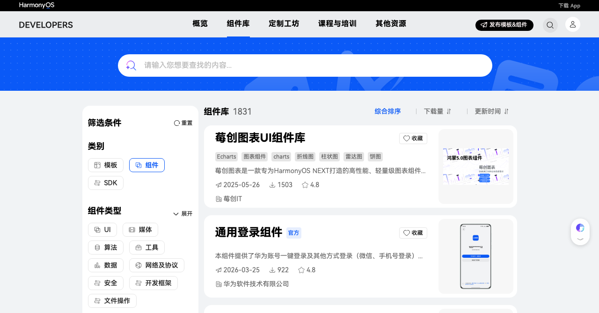

# 组件

UI 组件库为开发者提供开箱即用的界面组件，基于 ArkUI 框架开发，适配手机、平板、智慧屏等多种设备形态。

组件库还在持续增长中，社区开发者也可将自己的组件发布到生态市场供其他开发者使用。

> 更多组件请访问 [华为生态市场 - 组件](https://developer.huawei.com/consumer/cn/market/prod-list?fromNav=toolLibrary)。

