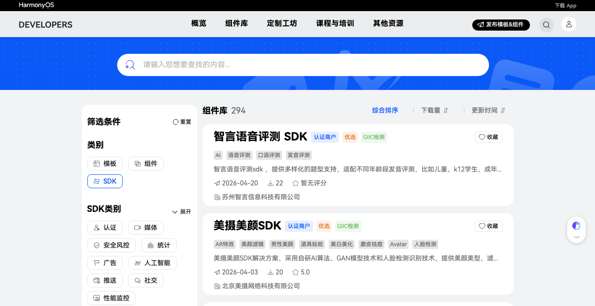
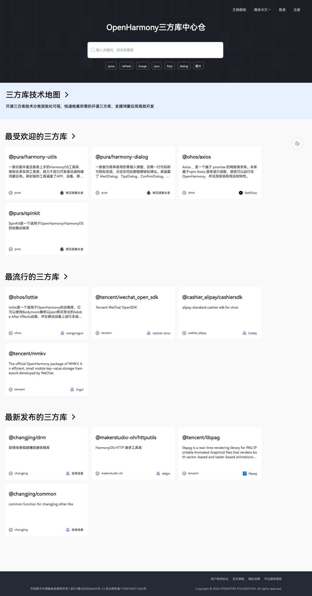

# SDK 库

## 华为生态市场SDK库

华为生态市场收录了丰富的 SDK 资源，覆盖支付、定位、推送、AI、多媒体等广泛技术领域。



SDK 的下载与安装均通过 **OpenHarmony 三方库中心仓（ohpm）** 完成。生态市场负责展示和发现，中心仓负责托管和分发。

## OpenHarmony 三方库中心仓

[OpenHarmony 三方库中心仓](https://ohpm.openharmony.cn/#/cn/home) 是 OpenHarmony 生态的官方包管理平台，开发者通过 `ohpm` 命令行工具安装所需的三方库。



### 热门三方库

| 库名 | 说明 | 维护方 |
|------|------|--------|
| `@pura/harmony-utils` | 功能丰富的 HarmonyOS 工具库，涵盖 APP、设备、屏幕、通知、加密等 | pura |
| `@ohos/axios` | 基于 promise 的网络请求库，适配 OpenHarmony | ohos |
| `@pura/harmony-dialog` | 零侵入弹窗库，一行代码即可弹出各种类型对话框 | pura |
| `@ohos/lottie` | After Effects 动画渲染库，解析 json 格式动画 | ohos |
| `@tencent/wechat_open_sdk` | 微信 OpenSDK，快速接入微信登录与分享 | tencent |
| `@cashier_alipay/cashiersdk` | 支付宝标准收银台 SDK | cashier_alipay |
| `@tencent/mmkv` | 微信开源的高性能 key-value 存储框架 | tencent |

### 使用方式

```bash
# 安装三方库
ohpm install @ohos/axios

# 在代码中导入
import axios from '@ohos/axios';
```
