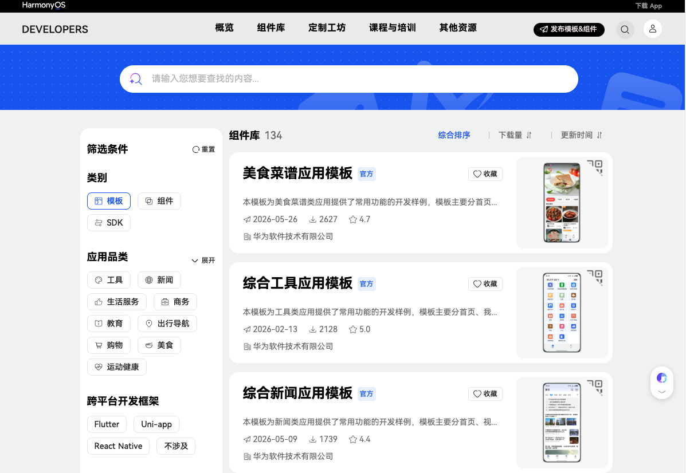

# 模板

应用模板为常见应用场景提供完整的开发样例和工程代码，开发者可直接下载使用，快速启动 HarmonyOS 应用项目。所有模板均由华为官方提供，涵盖美食、工具、新闻、商城、政务等多种行业场景。

> 更多模板请访问 [华为生态市场 - 模板](https://developer.huawei.com/consumer/cn/market/prod-list?fromNav=toolLibrary)。

## 热门模板

| 模板名称 | 下载量 | 评分 | 简介 |
|---------|--------|------|------|
| 美食菜谱应用模板 | 2,627 | 4.7 | 首页、分类、健康、我的四大模块，已集成华为账号服务 |
| 综合工具应用模板 | 2,128 | 5.0 | 首页、我的两大模块，含数字计算、日期查询、空调遥控、个税计算等 |
| 综合新闻应用模板 | 1,739 | 4.4 | 首页、视频、互动、我的四大模块，集成推送、广告、一多布局等 |
| 记账应用模板 | 1,486 | 5.0 | 首页、统计、资产三大模块 |
| 综合商城应用模板 | 1,190 | 5.0 | 首页、分类、购物车、我的四大模块，集成华为支付 |
| 笔记应用模板 | 1,041 | 3.8 | 首页、我的两大模块，集成华为账号一键登录 |
| 日历应用模板 | 1,038 | 5.0 | 万年历、黄历、我的三大模块 |
| 电子书阅读应用模板 | 1,027 | 4.2 | 阅读、书架、书城、分类、我的五大模块 |
| 政务应用模板 | 1,062 | 5.0 | 首页、办事、互动、我的四大模块，集成定位、推送 |
| 点餐元服务模板 | 782 | 5.0 | 点餐、订单、我的三大模块，集成地图、支付、预加载 |
| 智慧家居应用模板 | 798 | 2.8 | 首页、产品、我的三大模块，含蓝牙与 MQTT 设备交互 |

