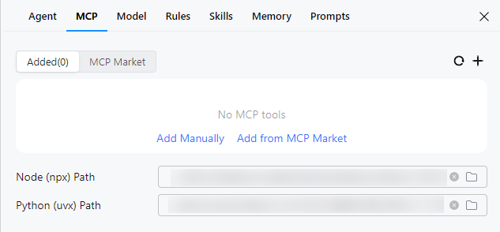
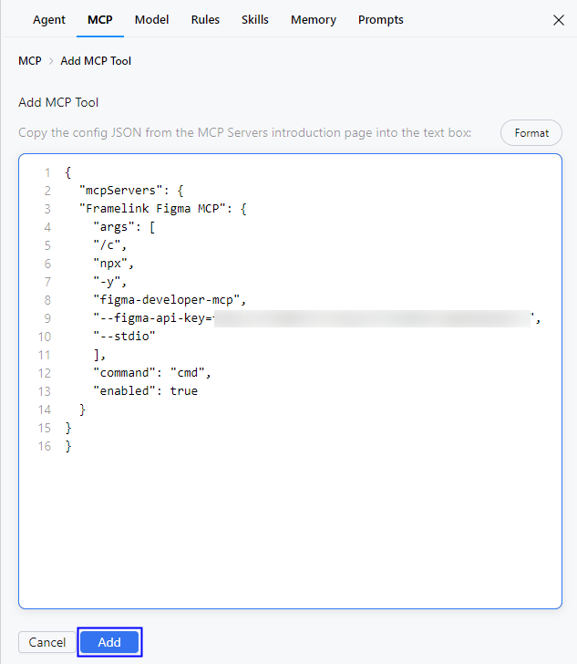
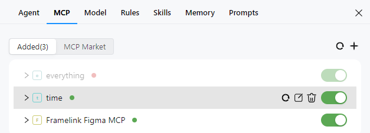

# 模型上下文协议（MCP）配置

## 功能介绍

模型上下文协议（Model Context Protocol，简称MCP）是一种开放协议，允许大型语言模型（LLMs）访问自定义的工具和服务，可以通过部署MCP Server并将其集成到自定义智能体中来使用。关于 MCP 的更多信息，请参考 [MCP 官方文档](https://modelcontextprotocol.io/introduction)。

从DevEco Studio 6.0.1 Beta1开始，CodeGenie支持配置MCP。

从DevEco Studio 6.1.0 Beta2开始，支持在MCP配置界面添加Node (npx) Path和Python (uvx) Path，以及支持从MCP市场添加MCP工具。

### 使用约束

为保证MCP Server正常启动，需要安装npx和uvx，可在配置MCP工具时在Node (npx) Path和Python (uvx) Path中添加。

* npx：依赖于Node.js，建议使用Node.js的LTS版本。
* uvx：基于Python的快速执行工具，建议安装Python 3.9 以上的版本。

## 操作步骤

1. 点击界面右上方按钮，或者点击界面右上方<strong>Settings</strong>按钮，选择<strong>MCP</strong>，进入配置页面。

   
2. 添加MCP工具。点击按钮或<strong>Add Manually</strong>手动添加，点击<strong>MCP Market</strong>或<strong>Add from MCP Market</strong>从MCP市场添加。

   

   * <strong>手动添加</strong>：在编辑框中填写MCP工具的配置信息，填写完成后点击<strong>Add</strong>。

     

     MCP Server支持三种通信方式：Stdio 、Server-Sent Events (SSE) 和Streamable HTTP。

     Stdio方式支持配置cmd、args和env字段，SSE和Streamable HTTP方式支持配置url字段。

     
   * <strong>从MCP市场添加</strong>：在搜索框中搜索目标MCP工具，点击按钮添加。

     
3. 在<strong>MCP Tools</strong>列表中，展示所有MCP工具信息，包括名称、连接状态、启用状态。同时，将鼠标悬浮在工具上会显示三个操作按钮：刷新、编辑和删除，方便开发者管理工具。

   
   * 名称：MCP工具名称，如time。
   * 连接状态：工具连接状态，包括“成功”、“失败”和“连接中”三种状态。
   * 启用状态：工具是否已启用。