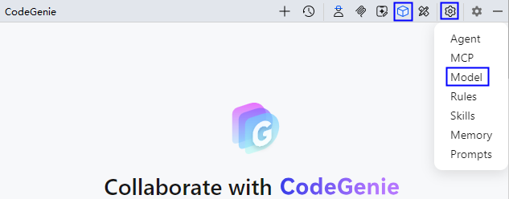
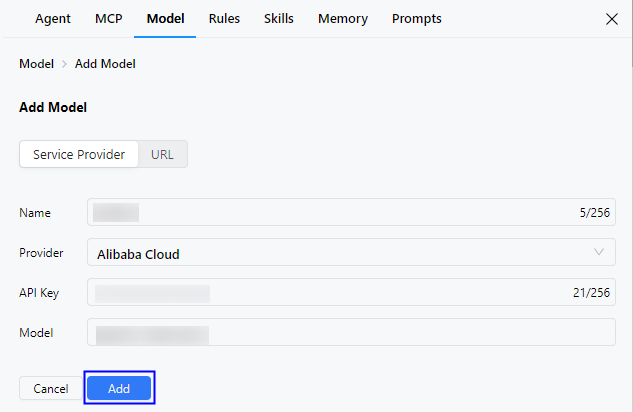
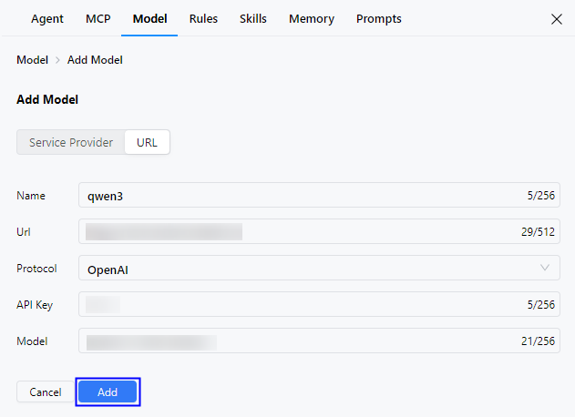

# 模型（Model）配置

CodeGenie支持通过Anthropic-API、Gemini-API和OpenAI-API协议接入第三方模型，为自定义Agent提供多样化的模型选择。

从DevEco Studio 6.0.1 Beta1开始，CodeGenie支持通过OpenAI-API协议接入第三方模型。

从DevEco Studio 6.0.2 Beta1开始，CodeGenie支持通过Anthropic-API、Gemini-API协议接入第三方模型，以及新增Built-in Models内置模型。

从DevEco Studio 6.0.2 Release（6.0.2.646）开始， 支持通过服务提供商接入三方模型，URL接入时支持使用Ollama协议的三方模型。

## 操作步骤

1. 点击界面右上方按钮，或者点击界面右上方<strong>Settings</strong>按钮，选择<strong>Model</strong>，进入配置页面。

   
2. 点击按钮添加模型，当前支持通过Service Provider（服务提供商）和URL两种方式添加，推荐优先使用Service Provider方式。
   * 通过服务提供商添加。填写<strong>Name</strong>、<strong>Provider</strong>、<strong>API Key</strong>、<strong>Model</strong>字段后，点击<strong>Add</strong>，校验成功后模型将被添加到列表中。
     + <strong>Name</strong>：模型名称。
     + <strong>Provider</strong>：模型的提供商，可选项包括OpenAI、Gemini、Anthropic、DeepSeek、Alibaba Cloud、Z.ai。
     + <strong>API Key</strong>：模型的访问密钥，在提供商网站申请。
     + <strong>Model</strong>：模型的标识。

     
   * 通过URL添加。填写<strong>Name</strong>、<strong>Protocol</strong>、<strong>Url</strong>、<strong>API Key</strong>、<strong>Model</strong>字段后，点击<strong>Add</strong>，校验成功后模型将被添加到列表中。
     + <strong>Name</strong>：模型名称。
     + <strong>Url</strong>：模型的访问地址。
     + <strong>Protocol</strong>：模型的协议，可选项包括OpenAI、Anthropic、Gemini、Ollama。
     + <strong>API Key</strong>：模型的访问密钥，在提供商网站申请。
     + <strong>Model</strong>：模型的标识。

     
3. 在<strong>All Models</strong>下展示所有添加成功的模型，Built-in Models为内置模型，Custom Models为三方模型（自定义模型）。将鼠标悬浮在三方模型上会显示两个操作按钮：编辑、删除，方便开发者管理三方模型。

   