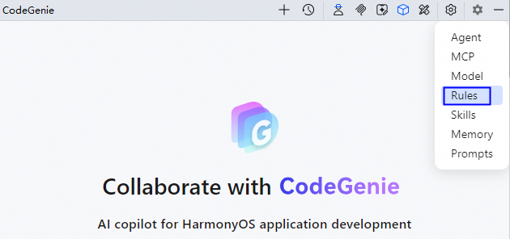
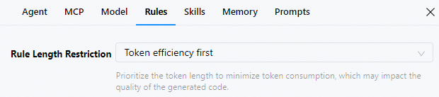
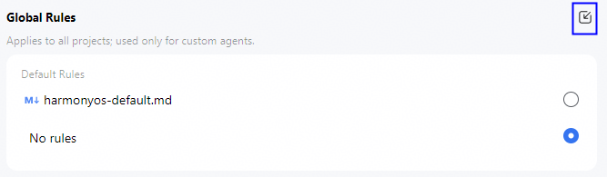
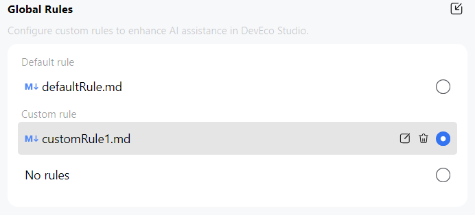
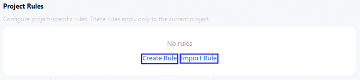
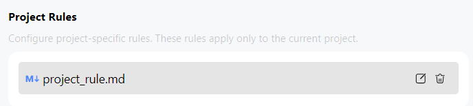

# 规则（Rules）配置

从DevEco Studio 6.0.2 Beta1开始，CodeGenie支持用户配置规则（Rules）。在自定义智能体模型下，智能问答时可生成更加符合Rules规范的代码。规则包括全局级别规则（Global Rules）和工程级别规则（Project Rules）。

* <strong>Global Rules</strong>：支持开发者自行导入规则文件（Custom rule），或使用默认规则（Default rule），或不使用规则（No rules）；规则与用户绑定，对当前用户下所有工程生效；支持添加多个自定义规则，添加后可选择是否生效。
* <strong>Project Rules</strong>：需开发者自行导入或创建规则；规则仅对当前工程有效；仅支持添加一个自定义规则，添加后即生效。

* 规则文件：扩展名为.md的Markdown文件，.md文件中仅二级标题及以下的规则内容生效。
* 默认规则（Default rule）需联网使用，无网络或网络故障时用户可选择Custom rule或No rules。

## Global Rules配置

1. 点击界面右上方按钮，或者点击界面右上方<strong>Settings</strong>按钮，选择<strong>Rules</strong>，进入配置页面。

   
2. 选择规则长度限制，包括<strong>Quality first</strong>、<strong>Token efficiency first</strong>，默认为Token efficiency first。DevEco Studio 6.1.0 Beta2版本新增。
   * Quality first：生成代码时遵循更多规则，帮助AI获取更准确答复。
   * Token efficiency first：生成代码时优先考虑Token长度，节省Token数量。

   
3. 以有网络为例，点击图标导入规则文件。无网络时操作界面可能存在差异，以实际为准。

   
4. 选择和管理规则文件。Global Rules列表全量展示了默认规则（Default rule）、自定义规则（Custom rule）和无规则（No rules），当前仅支持选择其中一个规则。若选择No rules，则全局规则不生效。
   * 将鼠标悬停在默认规则上，点击编辑图标，开发者可查看具体规则内容。
   * 将鼠标悬停在自定义规则上，会出现编辑和删除按钮，方便开发者管理自定义规则。

   

## Project Rules配置

1. 点击界面右上方按钮，或者点击界面右上方<strong>Settings</strong>按钮，选择<strong>Rules</strong>，进入配置页面。
2. 创建或导入Rule文件。
   * 创建Rule文件方法：点击<strong>Create Rule</strong>，工程目录中会新增/.codegenie/project\_rule.md文件，在project\_rule.md文件中输入规则内容。
   * 导入Rule文件方法：点击<strong>Import Rule</strong>，工程目录中会新增/.codegenie/project\_rule.md文件，project\_rule.md文件内容即为导入的规则文件内容。

   
3. 管理规则文件。将鼠标悬停在工程文件上，会出现编辑和删除按钮，方便开发者管理工程规则文件。

   