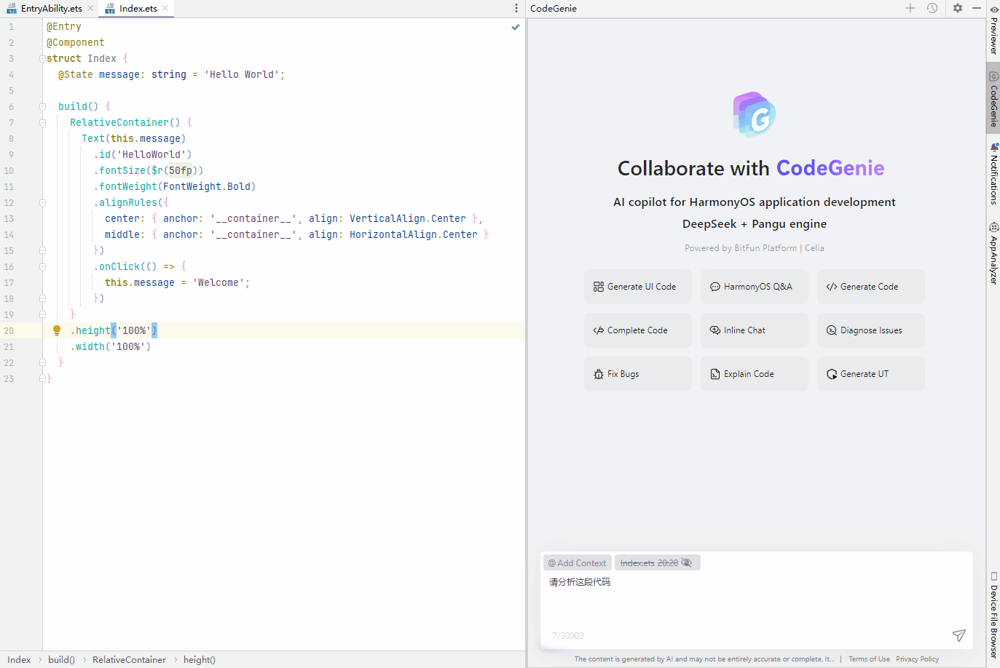

# 代码分析

CodeGenie支持在<strong>对话框中</strong>输入对代码段和代码文件分析要求，帮助开发者快速理解代码逻辑、代码功能、技术细节和潜在问题等，提升开发效率。

DevEco Studio 6.0.2 Beta1之前版本，分析代码文件时需要通过<strong>Files</strong>入口选中文件；分析代码片段时，选中代码段后需点击图标开启光标上下文功能。

在DevEco Studio 6.0.2 Beta1版本，分析代码文件时，支持在对话框输入要分析的代码文件或直接分析当前文件；分析代码片段时，选中代码段后直接分析，无需开启图标。

从DevEco Studio 6.0.2 Release版本开始，使用HarmonyOS Ask智能体分析代码文件。

以DevEco Studio 6.1.0 Release和DevEco Studio 6.0.1 Beta1版本为例说明，操作如下。

<strong>DevEco Studio 6.1.0 Release版本</strong>

1. 选择HarmonyOS Ask智能体，在对话框中输入<strong>@</strong>符号选择<strong>Files</strong>，或点击<strong>@Add Context</strong> > <strong>Files</strong>，选择需要分析的代码文件，或在对话框输入文件路径指定需要分析的代码文件，或分析当前代码文件。
2. 在对话框输入描述，点击发送后等待回复。

<strong>DevEco Studio 6.0.1 Beta1版本</strong>

分析代码文件：在对话框中输入<strong>@</strong>符号选择<strong>Files</strong>，或点击<strong>@Add Context</strong> > <strong>Files</strong>，可对单个或多个代码文件进行分析。

分析代码片段：选中代码段，点击图标开启光标上下文功能，在对话框内描述，开始分析。

