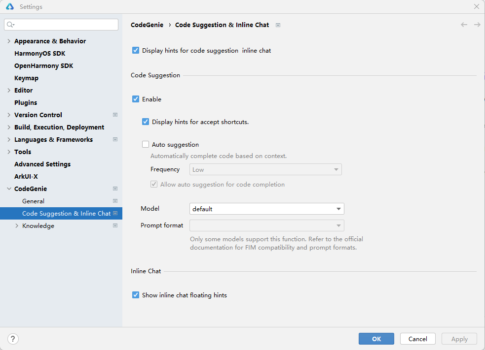
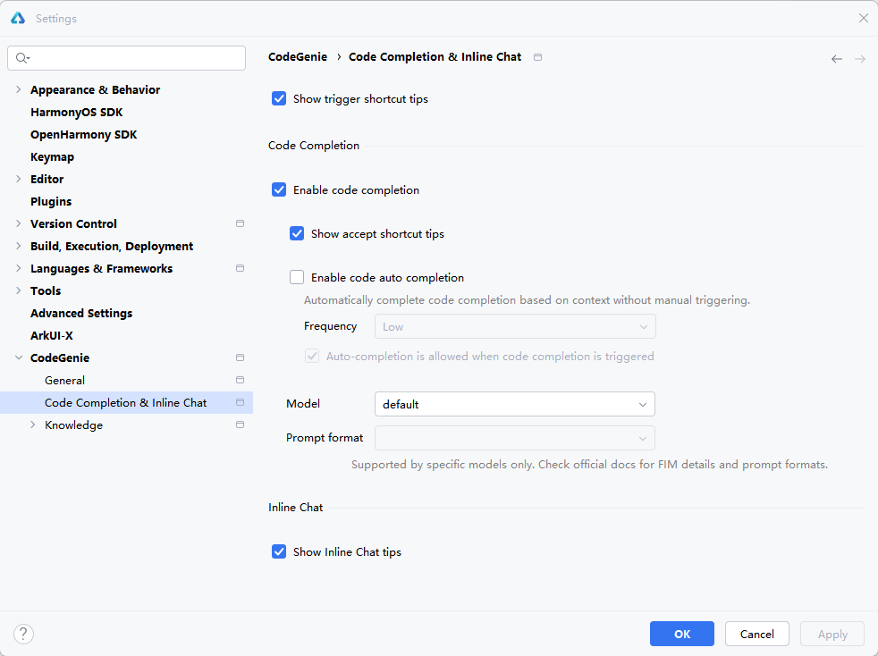
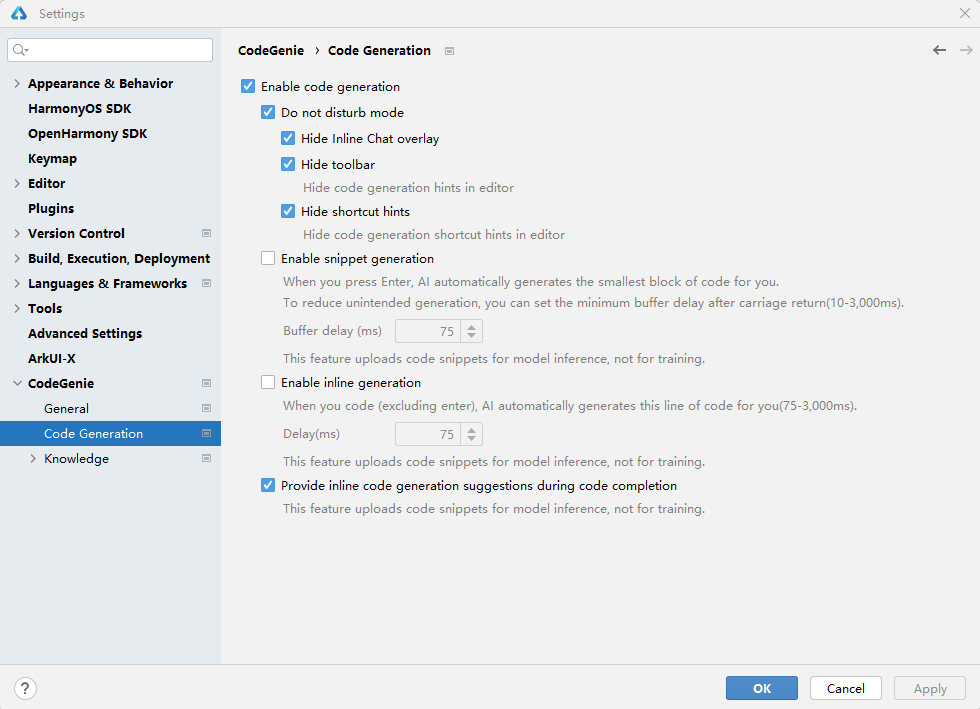
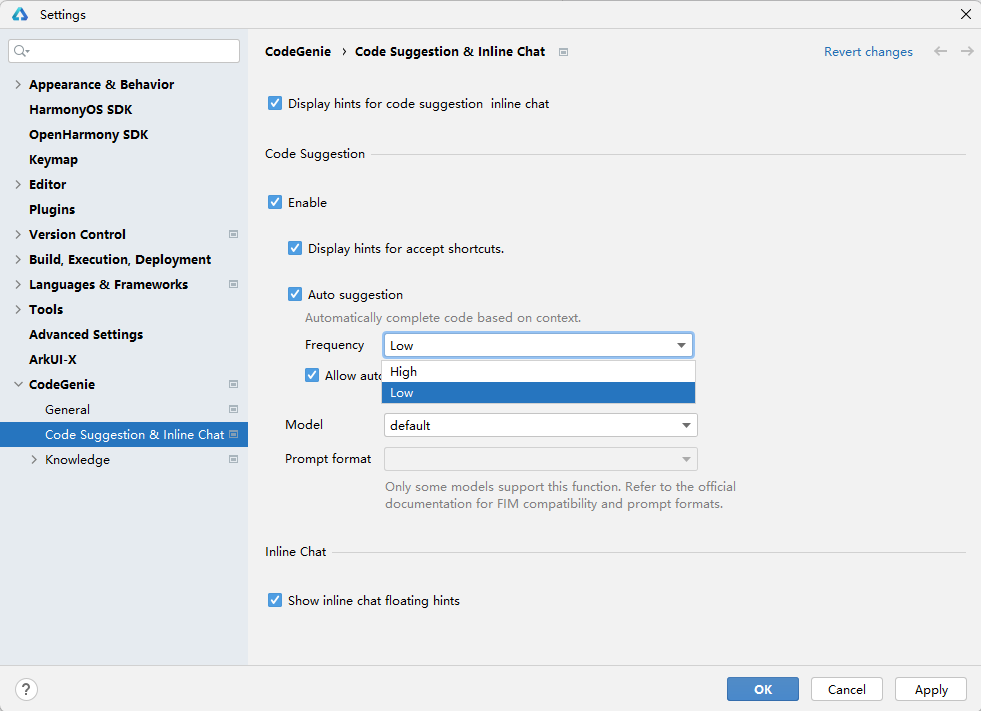
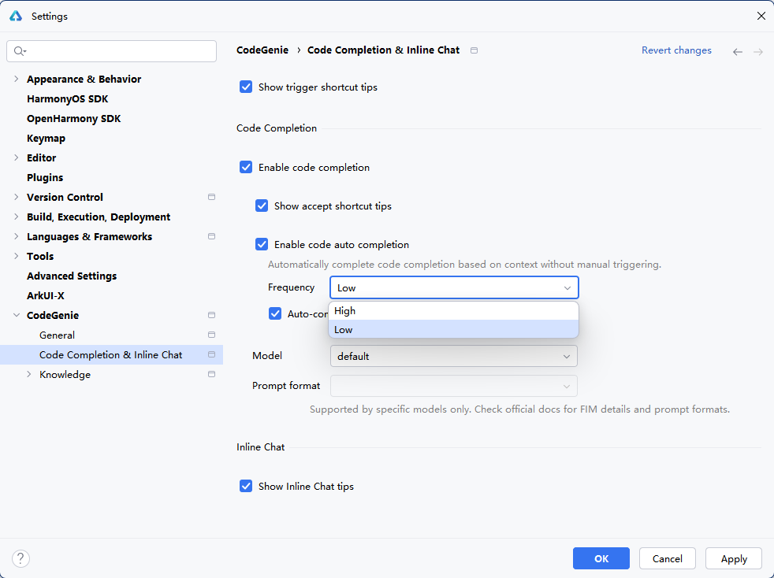
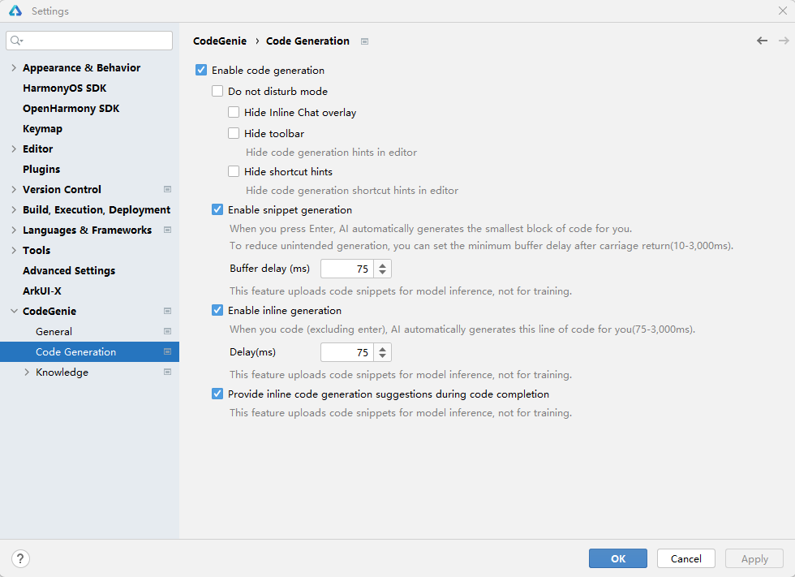
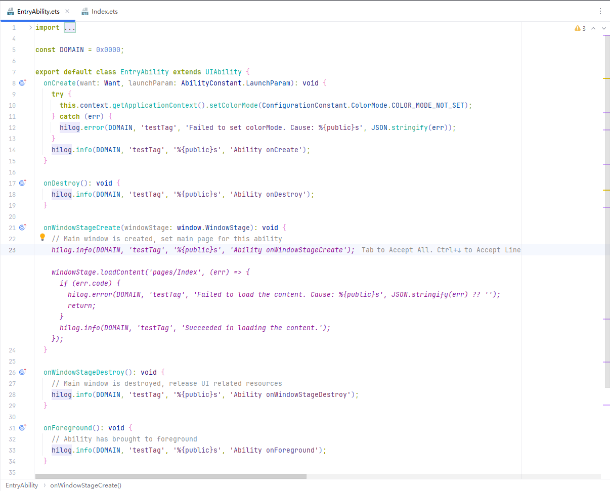

# 代码续写

利用AI大模型分析并理解开发者在代码编辑区的上下文信息或自然语言描述信息，智能续写符合上下文的ArkTS或C++代码片段，减少重复编码工作。

## 使用约束

* 建议编辑区已有较丰富上下文，能够使AI模型对编程场景有一定理解的情况下进行续写。若编辑器中内容较少，AI模型可能无法有效理解用户的意图并生成相应的代码。
* AI模型反馈需满足规则：光标上文10行内，有效代码行数超过5行（排除单独{}、（）、[]括号行、空行、纯注释行场景）。

## 续写设置

### <strong>DevEco Studio 6.1.0 Release及以上版本</strong>

进入<strong>File > Settings...</strong>（macOS为<strong>DevEco Studio > Preferences/Settings</strong>）<strong>></strong> <strong>CodeGenie > Code Suggestion</strong> <strong>& Inline Chat</strong>页面进行设置，若没登录华为开发者账号请先登录。

<strong>快捷键和续写开启设置</strong>选项<strong>：</strong>

* <strong>Display hints for code suggestion inline chat</strong>：在编辑区空行显示触发代码续写等功能的快捷键。
* <strong>Enable</strong>：启用代码续写能力。
* <strong>Display hints for accept shortcuts</strong>：在续写结果最后的位置显示采纳代码的快捷键。

<strong>自动续写设置</strong>选项<strong>：</strong>

* <strong>Auto Suggestion</strong>：自动续写开关，开启后将会根据代码上下文在合适位置自动触发代码续写。
* <strong>Frequency</strong>：控制自动续写的触发频率。
* <strong>Allow auto suggestion for code completion</strong>：是否允许自动续写与编辑器联想功能同时存在。取消勾选后，编辑器联想功能优先级更高。

<strong>续写模型设置</strong>选项<strong>：</strong>

CodeGenie为续写功能提供了内置的模型，也可使用三方模型和提示词进行续写。当前续写仅支持OpenAI和Ollama两种协议的模型，同时模型需支持FIM（Fill-in-Middle）补全能力。

* <strong>Model</strong>：选择代码续写的模型，模型内容请参考：[模型（Model）配置](./ide-agent-model.md)。
* <strong>Prompt format</strong>：提示词格式，此处列出了主流的FIM提示词格式，并自动与模型选项联动。设置时需要选择与模型匹配的提示词格式，续写才能正常工作，开发者可在模型官网或者模型技术报告获取提示词格式。

### <strong>DevEco Studio 6.1.0 Beta2</strong>

进入<strong>File > Settings...</strong>（macOS为<strong>DevEco Studio > Preferences/Settings</strong>）<strong>></strong> <strong>CodeGenie > Code Completion</strong> <strong>& Inline Chat</strong>页面进行设置，若没登录华为开发者账号请先登录。

<strong>快捷键和续写开启设置</strong>选项<strong>：</strong>

* <strong>Show trigger shortcut tips</strong>：在编辑区空行显示触发代码续写等功能的快捷键。
* <strong>Enable code completion</strong>：启用代码续写能力。
* <strong>Show accept shortcut tips</strong>：在续写结果最后的位置显示采纳代码的快捷键。

<strong>自动续写设置</strong>选项<strong>：</strong>

* <strong>Enable code auto completion</strong>：自动续写开关，开启后将会根据代码上下文在合适位置自动触发代码续写。
* <strong>Frequency</strong>：控制自动续写的触发频率。
* <strong>Auto-completion is allowed when code completion is triggerd</strong>：是否允许自动续写与编辑器联想功能同时存在。取消勾选后，编辑器联想功能优先级更高。

<strong>续写模型设置</strong>选项<strong>：</strong>

CodeGenie为续写功能提供了内置的模型，也可使用三方模型和提示词进行续写。当前续写仅支持OpenAI和Ollama两种协议的模型，同时模型需支持FIM（Fill-in-Middle）补全能力。

* <strong>Model</strong>：选择代码续写的模型，模型内容请参考：[模型（Model）配置](./ide-agent-model.md)。
* <strong>Prompt format</strong>：提示词格式，此处列出了主流的FIM提示词格式，并自动与模型选项联动。设置时需要选择与模型匹配的提示词格式，续写才能正常工作，开发者可在模型官网或者模型技术报告获取提示词格式。

### <strong>DevEco Studio 6.1.0 Beta2以下版本</strong>

进入<strong>File > Settings...</strong>（macOS为<strong>DevEco Studio > Preferences/Settings</strong>）<strong>></strong> <strong>CodeGenie > Code Generation</strong>页面勾选<strong>Enable code generation</strong>，开启代码续写功能。如果已经熟悉了CodeGenie常用的快捷键，想要更加沉浸的体验，可以在该页面勾选<strong>Do not disturb</strong> <strong>mode</strong>，隐藏代码生成工具栏及快捷键提示。

同时，根据编码习惯，选择<strong>Enable snippet generation</strong>（片段续写）和<strong>Enable inline generation</strong>（行内续写），以及设置续写时延。

## 续写触发和采纳

### 续写触发

<strong>DevEco Studio 6.1.0 Release及以上版本</strong>

Enable inline generation（行内续写）与Enable snippet generation（片段续写）合并为<strong>Auto Suggestion</strong>，取消了<strong>Delay</strong>设置项，通过设置<strong>Frequency</strong>调整自动续写的触发频次。

<strong>DevEco Studio 6.1.0 Beta2</strong>

Enable inline generation（行内续写）与Enable snippet generation（片段续写）合并为<strong>Enable code auto completion</strong>，取消了<strong>Delay</strong>设置项，通过设置<strong>Frequency</strong>调整自动续写的触发频次。

<strong>DevEco Studio 6.1.0 Beta2以下版本</strong>

* <strong>Enable inline generation</strong>（行内续写）：在编码时稍作停顿，CodeGenie将在当前代码行即时续写代码。
* <strong>Enable snippet generation</strong>（片段续写）：输入回车，CodeGenie将根据上下文生成代码片段。
* 在编辑区输入<strong>Alt+C</strong>快捷键（macOS上为<strong>Option+C</strong>）触发代码续写。

### 续写采纳

<strong>续写内容采纳方式：</strong>

* 可通过按<strong>Tab</strong>键采纳该内容。
* <strong>Ctrl + ↓（</strong>macOS中为<strong>Command + ↓）</strong>逐行采纳该内容。
* <strong>Ctrl + →（</strong>macOS中为<strong>Option + →）</strong>逐单词采纳该内容。
* 通过按<strong>ESC</strong>键忽略该内容。

<strong>CodeGenie续写常用快捷键如下：</strong>

|  |  |  |
| --- | --- | --- |
| <strong>操作</strong> | <strong>macOS</strong> | <strong>Windows</strong> |
| 触发多行代码续写 | Enter、Option+C | Enter、Alt+C |
| 触发单行代码续写 | Option+X | Alt+X |
| 采纳续写生成的代码 | Tab | Tab |
| 忽略续写生成的代码 | Esc | Esc |
| 查看上一个代码续写结果 | Option +[ | Alt + [ |
| 查看下一个代码续写结果 | Option + ] | Alt + ] |
| 重新生成代码内容（最多支持重新生成5次） | Option + R | Alt + R |
| 代码逐行采纳 | Command + ↓ | Ctrl + ↓ |
| 代码逐单词采纳 | Option + → | Ctrl + → |