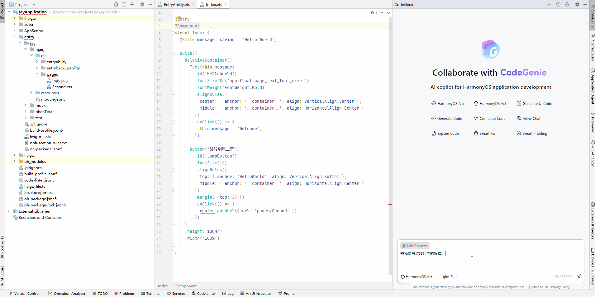
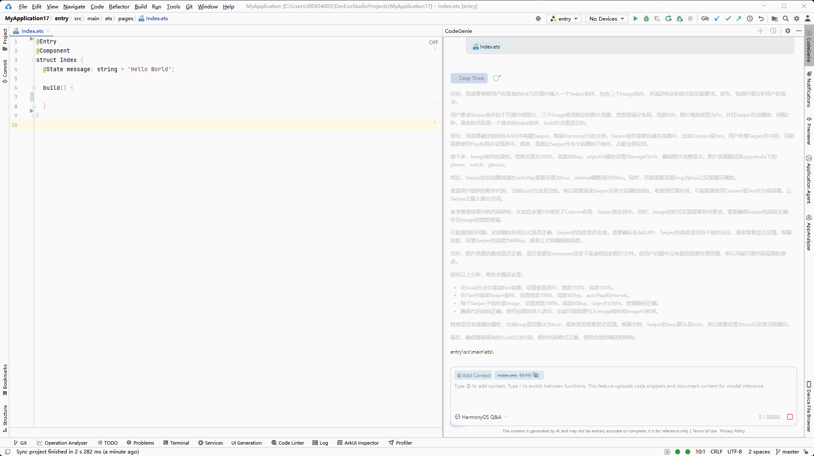

# 代码修改

CodeGenie提供代码修改能力，在<strong>对话框内</strong>输入需求描述，生成符合要求的代码，提升代码质量与开发效率。

在DevEco Studio 6.0.1 Beta1和Release版本，生成的代码与原文件代码可快速对比和采纳。

从DevEco Studio 6.0.2 Beta1开始，生成的内容直接被应用到代码文件中。

从DevEco Studio 6.0.2 Release开始，代码修改使用的是HarmonyOS Act智能体。

以DevEco Studio 6.0.2 Release和DevEco Studio 6.0.1 Beta1版本为例说明，如下。

<strong>DevEco Studio 6.0.2 Release</strong>

<strong>操作步骤</strong>

1. 选择HarmonyOS Act智能体，在对话框中输入<strong>@</strong>符号选择<strong>Files</strong>，或点击<strong>@Add Context</strong> > <strong>Files</strong>，选择需要修改的代码文件，或在对话框输入文件路径指定需要修改的代码文件，或修改当前代码文件。
2. 在对话框输入描述，点击发送。
3. 在问答区域的<strong>Changed Files</strong>可以查看被修改的文件；点击<strong>Accept All/Reject All</strong>按钮，接受或拒绝所有文件的修改；将鼠标悬浮在文件路径上，点击可接受或拒绝该文件的修改。
4. 点击问答区域中<strong>Run</strong>，可以编译验证；开启<strong>Auto Run</strong>开关，可以开启自动编译验证。Auto Run更多描述可参考[Agent配置](./ide-agent-use.md#section2075893021715)。

<strong>示例</strong>

<strong>DevEco Studio 6.0.1 Beta1</strong>

<strong>操作步骤</strong>

1. 点击<strong>@Add Context ></strong> <strong>Files</strong>选择需要修改的文件，在对话框输入代码修改描述。
2. 在对话问答区域，点击文件路径，打开代码对比页面。点击，快速采纳修改后的代码。

<strong>示例</strong>

