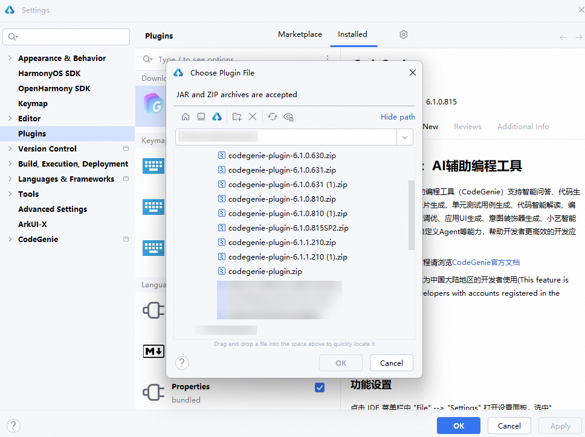
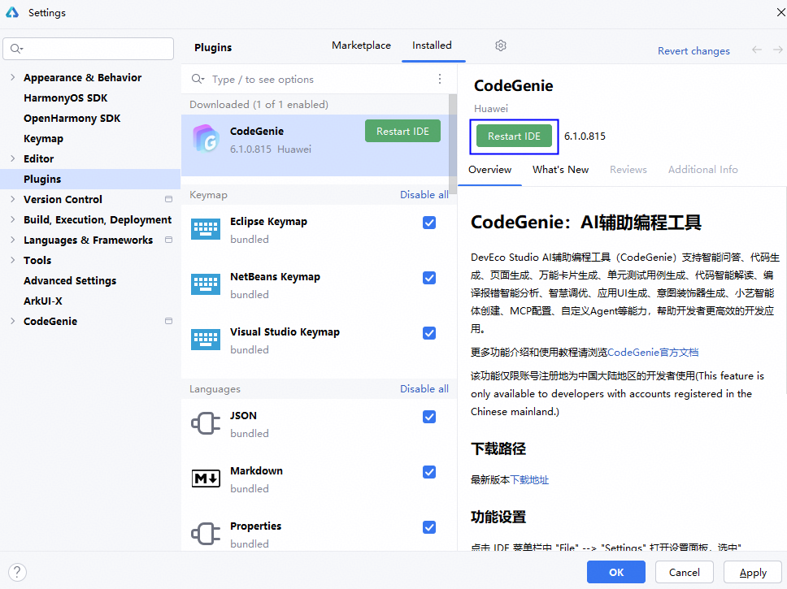

# 工具概述

DevEco CodeGenie是DevEco Studio AI辅助编程工具，支持智能问答、代码生成、页面生成、万能卡片生成、单元测试用例生成、代码智能解读、编译报错智能分析、智慧调优、应用UI生成、意图装饰器生成、小艺智能体创建、自定义Agent等能力，帮助开发者更高效地开发应用。

## 使用方式

在DevEco Studio右侧边栏点击<strong>CodeGenie</strong>或通过快捷键<strong>Alt/Option+U</strong>，进入或隐藏CodeGenie。点击<strong>Sign in</strong> ，跳转至华为账号登录页面。授权登录完成后返回DevEco Studio，提示登录成功后点击<strong>Agree</strong>，同意隐私安全政策及使用条款后开始体验。

若需使用最新版本的CodeGenie，可通过[下载中心](https://developer.huawei.com/consumer/cn/download/deveco-codegenie)获取并使用相关功能，具体请参考[插件获取及安装](#section18337533718)。

## 插件获取及安装

若在历史版本的DevEco Studio中使用最新版本的CodeGenie，可通过[下载中心](https://developer.huawei.com/consumer/cn/download/deveco-codegenie)获取最新的CodeGenie插件版本，并根据下载中心页面<strong>工具完整性</strong>指导进行完整性校验。插件安装包的存放路径不能包含中文字符。

下载完成后，插件安装包<strong>无需解压</strong>，依照下方步骤进行安装：

1. 在DevEco Studio菜单栏，点击<strong>File > Settings</strong>（macOS为<strong>DevEco Studio > Preferences/Settings</strong>）<strong>> Plugins</strong>，点击 <strong>> Install Plugin from Disk…</strong>安装本地插件。

   
2. 在弹出的文件选择窗口中，选择<strong>未解压的插件包</strong>的存放位置，点击<strong>OK</strong>确认安装插件。

   
3. 点击<strong>Restart IDE</strong>，重新启动DevEco Studio。

   
4. 在DevEco Studio右侧边栏点击<strong>CodeGenie</strong>，完成登录并开始体验。

进入<strong>File > Settings</strong>（macOS为<strong>DevEco Studio > Preferences/Settings</strong>） <strong>> CodeGenie> General</strong>页面，勾选<strong>Auto Update</strong>，可以自动升级插件配置。

若管理台配置的插件可以静默升级，且系统检测到插件需要更新时，插件会自动升级；不勾选时会有弹框提示用户手动升级。若管理台配置的插件不支持静默升级，均有弹框提示用户手动升级。