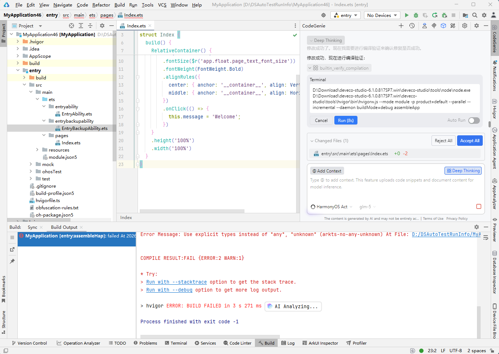
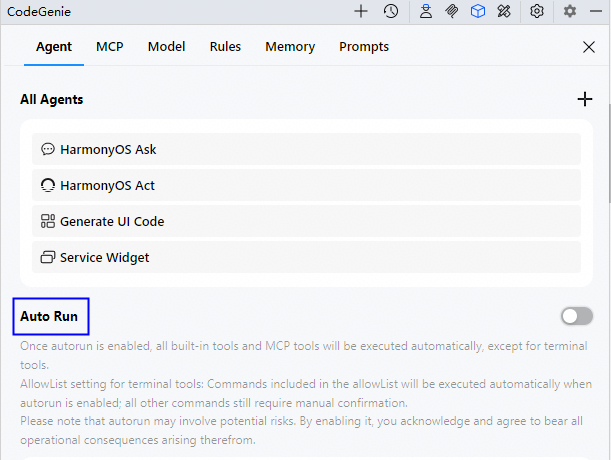

# 编译报错智能分析

当DevEco Studio构建ArkTS工程出现失败时，CodeGenie仅能够对ArkTS语法相关的错误进行智能分析，提供错误原因及修复方案，帮助开发者快速解决编译构建问题。

在DevEco Studio 6.0.2 Beta1版本，编译报错修复的交互过程进一步优化，支持编辑区显示修改前后的差异点，以及开启自动编译验证。

从DevEco Studio 6.0.2 Release版本开始，编译报错智能修复能力使用的是HarmonyOS Act智能体。

从DevEco Studio 6.1.0 Beta2开始，不支持在编辑区点击Accept/Reject来接受/拒绝AI提供的修复方案；支持使用和切换模型。

## 操作步骤

1. 如需开启编译报错智能分析和自动修复，进入<strong>File > Settings</strong>（macOS为<strong>DevEco Studio > Preferences/Settings</strong>） <strong>> CodeGenie> General</strong>页面，勾选<strong>Enable AI</strong> <strong>auto-fix for build errors</strong>和<strong>Allow AI to modify local files for auto-fix</strong>。

   
2. 当ArkTS工程出现构建报错时，点击报错信息后方<strong>Add To Chat</strong>图标，CodeGenie将自动引用构建报错信息。

   开发者可在输入框中选择对当前报错修复任务进行补充指令，帮助开发者进行定制化修复，使修复更准确，如“当前工程为API 24工程，注意兼容性”等，点击或回车发送对话后，CodeGenie会分析该报错及开发者输入信息，并提供可能的错误原因，针对语法错误问题将参考开发者诉求，提供恰当的修复方案。

   若弹窗提醒"Please sign in to access DevEco CodeGenie"，请先登录CodeGenie后，再次点击<strong>Add To Chat</strong>图标查看解决方案。

   
3. CodeGenie提供的修复方案被自动应用到代码中。
   * DevEco Studio 6.1.0 Beta2之前版本：
     + 点击编辑区<strong>Accept</strong>（或使用快捷键<strong>Ctrl+Shift+Y</strong>），确认和接受AI提供的修复方案；点击<strong>Reject</strong>（或使用快捷键<strong>Ctrl+Shift+N</strong>）拒绝。
     + 点击右侧对话框中的<strong>Accept All/Reject All</strong>按钮，接受或拒绝所有文件的修改；将鼠标悬浮在文件路径上，点击可接受或拒绝该文件的修改。
   * DevEco Studio 6.1.0 Beta2及之后版本：
     + 点击右侧对话框中的<strong>Accept All/Reject All</strong>按钮，接受或拒绝所有文件的修改；将鼠标悬浮在文件路径上，点击可接受或拒绝该文件的修改。

   
4. 点击<strong>Run</strong>编译验证，所需时间见提示，时间单位是秒。

   DevEco Studio 6.1.0 Beta2及之后版本，勾选对话问答结果中的<strong>Auto Run</strong>，或者Agent中<strong>Auto Run</strong>，开启自动编译验证开关。取消勾选Agent中<strong>Auto Run</strong>选项，关闭自动编译验证开关。

   DevEco Studio 6.1.0 Beta2之前版本，勾选对话问答结果中的<strong>Automatically compile and verify without prompting</strong>，或者<strong>File</strong> <strong>></strong> <strong>Settings> CodeGenie ></strong>General<strong>中的</strong>Allow AI to automatically run compilation verification during auto-fix<strong>，开启自动编译验证开关。取消勾选</strong>File<strong> </strong>><strong> </strong>Settings> CodeGenie ><strong>General</strong>中<strong>Allow AI to automatically run compilation verification during auto-fix</strong>选项，关闭自动编译验证开关。

   