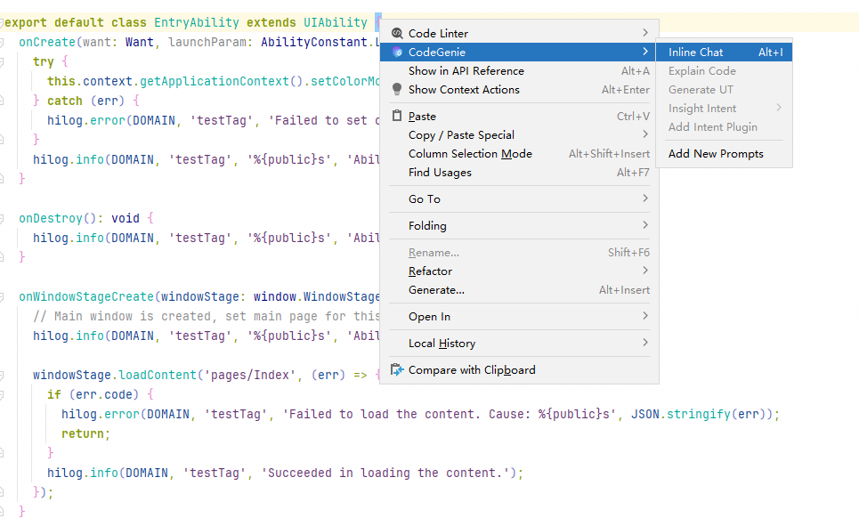
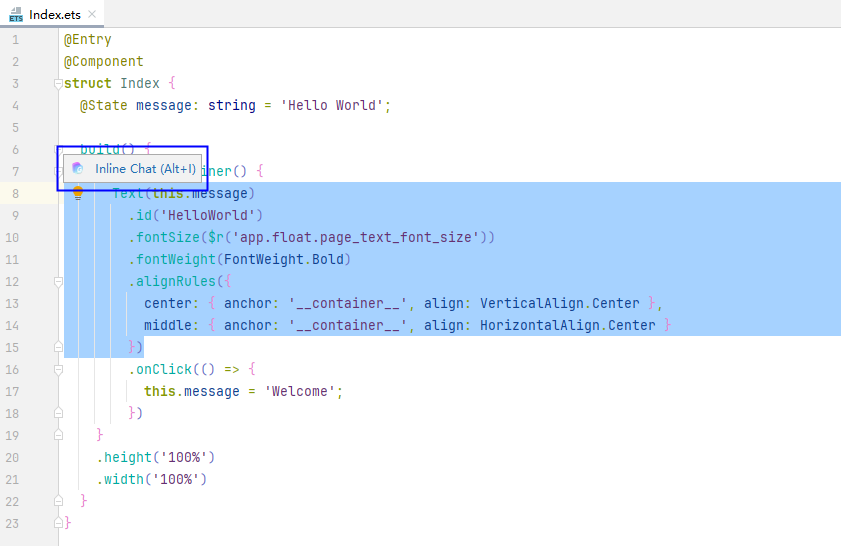
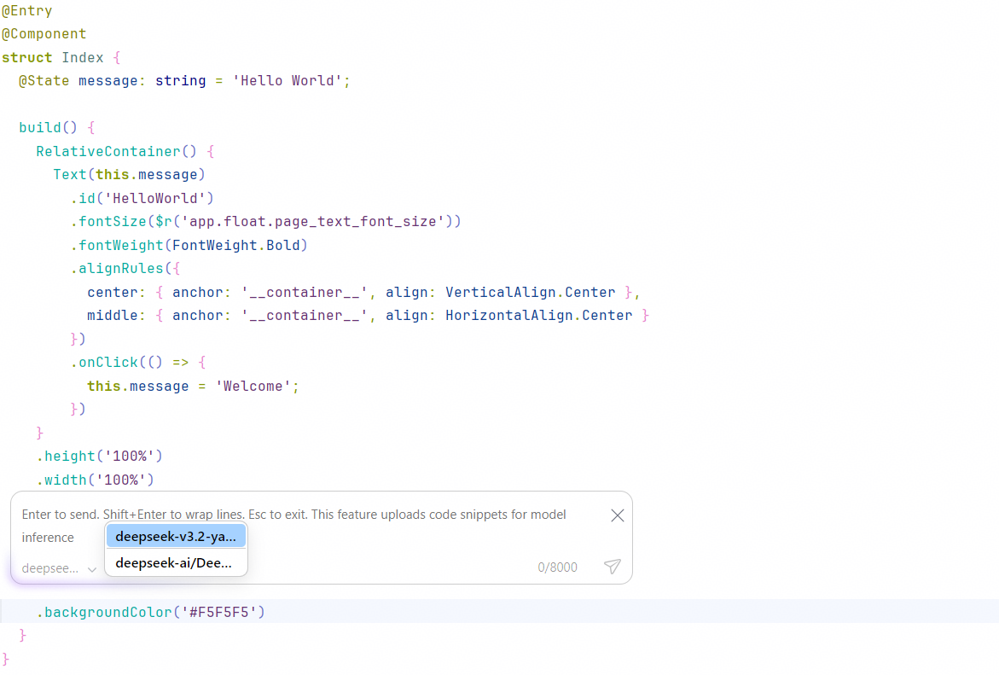
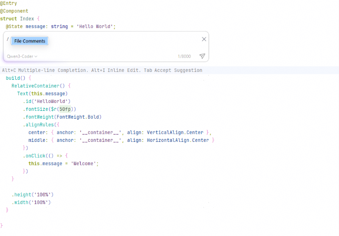
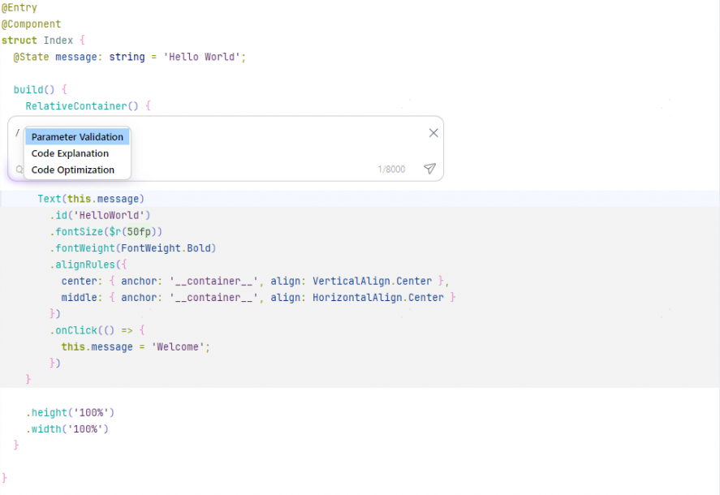
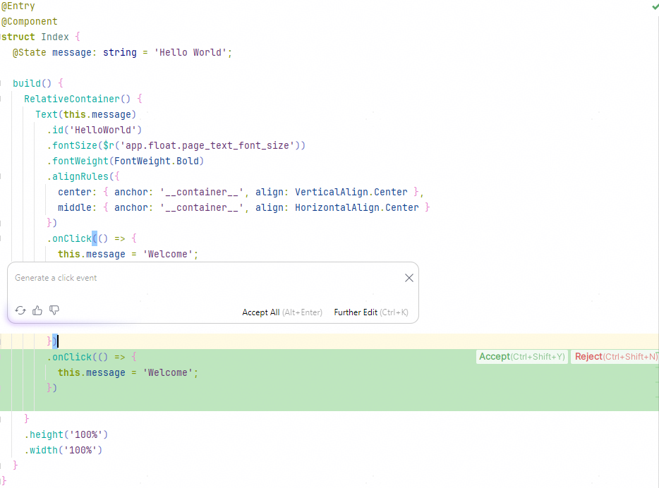

# 编辑区对话

CodeGenie提供Inline Edit能力，支持在ArkTS文件的编辑窗口中通过自然语言进行问答，基于上下文智能生成代码片段，提升代码可读性。

从DevEco Studio 6.0.2 Beta1开始，Inline Edit支持选择三方模型，根据指定的模型进行生成代码。

从DevEco Studio 6.1.0 Beta1开始，Inline Edit入口名称变更为Inline Chat。

1. 当前有以下两种方式唤醒Inline Chat对话框：
   * 若未选中代码片段，在代码编辑区域右键选择<strong>CodeGenie > Inline Chat</strong>（或使用快捷键<strong>Alt+I</strong>，macOS中为<strong>Command+I</strong>）。

     
   * 若选中一段代码，点击<strong>Inline Chat（</strong>或使用快捷键<strong>Alt+I</strong>，macOS中为<strong>Command+I）</strong>浮框。

     在DevEco Studio 6.1.0 Beta2之前版本，如未出现浮框，可在<strong>File</strong> > <strong>Settings</strong> > <strong>CodeGenie</strong> > <strong>Code Generation</strong>（macOS中为<strong>DevEco Studio</strong> > <strong>Preferences/Settings</strong> > <strong>CodeGenie</strong> > <strong>Code Generation</strong>）中取消勾选<strong>Hide Inline Chat Overlay</strong>选项。

     从DevEco Studio 6.1.0 Beta2版本开始，如未出现浮框，可在<strong>File</strong> > <strong>Settings</strong> > <strong>CodeGenie > Code Completion</strong> <strong>& Inline Chat</strong>（macOS中为<strong>DevEco Studio</strong> > <strong>Preferences/Settings</strong> > <strong>CodeGenie</strong> > <strong>Code Completion & Inline Chat</strong>）中勾选<strong>Show Inline Chat tips</strong>启用浮窗。

     从DevEco Studio 6.1.0 Release版本开始，如未出现浮框，可在<strong>File</strong> > <strong>Settings</strong> > <strong>CodeGenie > Code Suggestion</strong> <strong>& Inline Chat</strong>（macOS中为<strong>DevEco Studio</strong> > <strong>Preferences/Settings</strong> > <strong>CodeGenie</strong> > <strong>Code Suggestion & Inline Chat</strong>）中勾选<strong>Show inline chat floating hints</strong>启用浮窗。

     
2. 选择在CodeGenie中已配置的三方模型，或者使用默认模型。三方模型配置具体请参考[模型（Model）配置](./ide-agent-model.md)。

   
3. 若选择默认模型，在对话框中输入所需要的代码功能描述，在键盘输入回车或点击发送，开始生成代码。点击<strong>Stop Generation</strong>，中断本轮代码生成过程。

   若选择三方模型，支持分析当前代码文件和生成分析报告，以及进行参数校验（<strong>Parameter Validation</strong>）、代码注释（<strong>Code Explanation</strong>）、代码优化（<strong>Code Optimization</strong>），分析报告和参数校验等结果跟模型有关，具体操作如下：
   * 未选中代码片段，在对话框中输入"/"，在键盘输入回车或点击发送，对当前代码文件开始分析。点击<strong>Stop Generation</strong>，中断本轮代码生成过程。

     
   * 选中一段代码，在对话框中输入"/"，选择<strong>Parameter Validation</strong>/<strong>Code Explanation</strong>/<strong>Code Optimization</strong>，可输入或不输入所需的功能描述，在键盘输入回车或点击发送后开始生成。点击<strong>Stop Generation</strong>，中断本轮代码生成过程。

     
4. 生成完毕将在编辑区展示本轮生成的代码内容，并通过不同颜色体现与当前代码的对比差异。
   * 绿色区域：新生成的代码内容。
   * 蓝色区域：对现有代码进行修改的内容。
   * 红色区域：删除的代码内容。

   
   * 点击Inline Chat对话框中<strong>Accept All</strong>（或使用快捷键<strong>Alt+Enter</strong>），接受当前生成的全部内容；
   * 点击Inline Chat对话框中刷新按钮<strong>/Regenerate</strong>，将根据当前描述重新生成代码片段；
   * 点击编辑区中<strong>Accept</strong>（或使用快捷键<strong>Shift+Ctrl+Y</strong>，macOS上为<strong>Shift+Command+Y</strong>），分段逐一接受并保留生成内容；
   * 点击编辑区中<strong>Reject</strong>（或使用快捷键<strong>Shift+Ctrl+N</strong>，macOS上为<strong>Shift+Command+N</strong>），分段逐一拒绝并删除当前生成内容；
   * 点击<strong>Further Edit</strong>（或使用快捷键<strong>Ctrl+K</strong>，macOS上为<strong>Command+K</strong>），重新进行输入，开始新一轮问答。