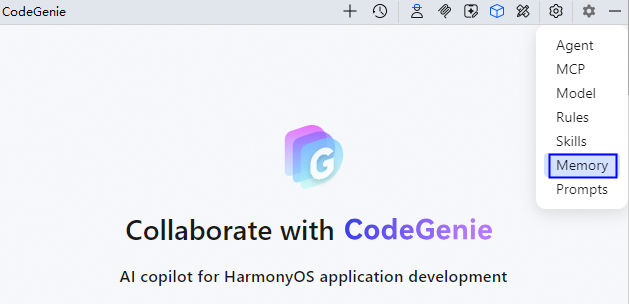
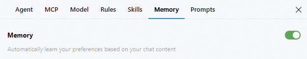
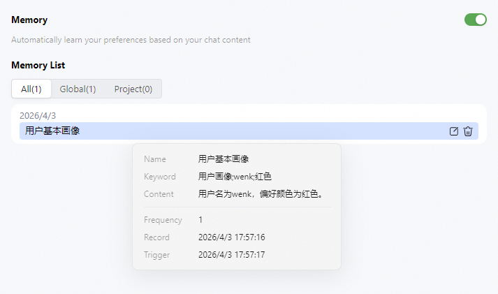

# 记忆（Memory）配置

## 功能介绍

CodeGenie搭载长期记忆功能，在应用开发过程中，会学习和提取个人偏好、项目细节等有价值的信息，进行主动记忆或自动记忆。伴随开发者的持续使用，逐步形成覆盖开发者信息、项目场景、问题沉淀的全域记忆体系。在长期交互中，记忆也会随时间更新。

依托这一核心能力，CodeGenie能够精准理解和生成符合开发者需求的代码、回答等，与开发者实现更高效的协作。

### 基本概念

* 主动记忆：开发者要求CodeGenie记住输入的内容，CodeGenie会保存这些信息。
* 自动记忆：自动提取对话中有价值的信息，记录任务执行进度，随时间推移学习开发者的编码风格和项目细节等。

### 使用约束

* 当前仅自定义Agent支持长期记忆检索和生成。
* 当CodeGenie记忆与[规则（Rules）](./ide-agent-rules.md)发生冲突时，以规则为准。
* Mac(64-bit)架构的MacOS操作系统不支持记忆能力。

## 操作步骤

1. 点击界面右上方<strong>Settings</strong>按钮，选择<strong>Memory</strong>，进入配置页面。

   
2. 点击Memory后开关，开启和关闭记忆。

   
3. 在<strong>Memory List</strong>（记忆列表）下展示所有记忆，包括<strong>Global</strong>（记录用户相关信息）、<strong>Project</strong>（记录项目相关信息）。将鼠标悬浮在记忆上会显示具体信息，以及出现编辑、删除按钮，方便开发者管理记忆。

   