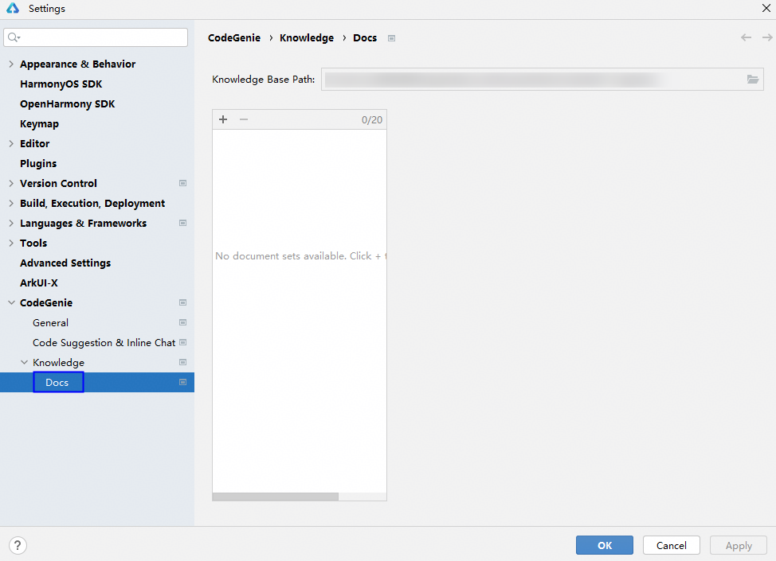
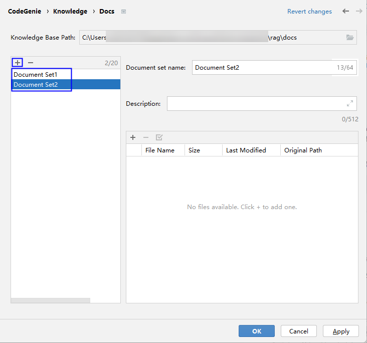
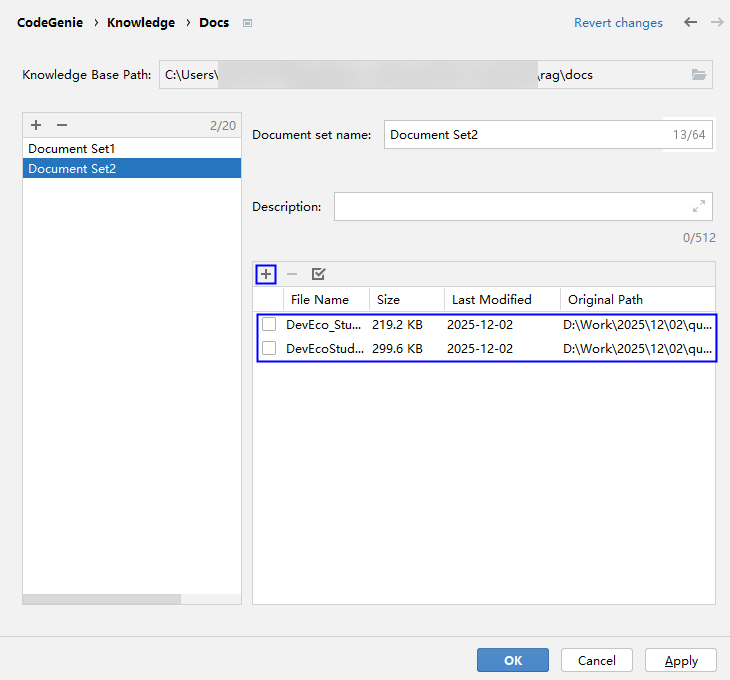
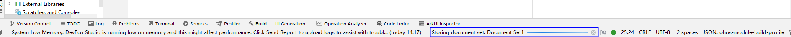
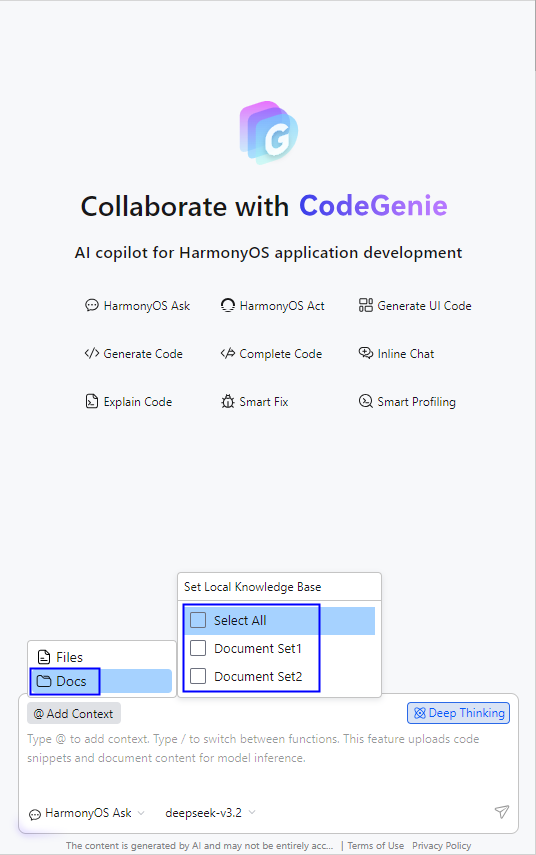

# 本地知识库配置

从DevEco Studio 6.0.0 Beta5开始，CodeGenie允许用户导入设计文档和代码等文件形成文档集，多个文档集组合成本地知识库。智能问答时，根据用户输入内容检索本地知识库以提升AI生成的能力。

## 操作步骤

1. 点击<strong>File > Settings</strong>（macOS为<strong>DevEco Studio > Preferences/Settings</strong>） <strong>> CodeGenie> Knowledge ></strong> <strong>Docs</strong>，或在DevEco Studio右侧边栏点击<strong>CodeGenie</strong>（或输入快捷键<strong>Alt/Option+U</strong>） <strong>></strong> <strong>@Add Context</strong> <strong>> Docs > Set Local Knowledge Base</strong>，进入配置页面。

   
2. 首次打开时，点击按钮，填写相关信息，创建文档集。
   * <strong>Knowledge Base Path</strong>：知识库保存路径。在同一个路径下保存的文档集，会形成一个知识库。
   * <strong>Document set name</strong>：文档集名称。
   * <strong>Description</strong>：可选，文档集描述。

   
3. 点击按钮，添加文档集中的文件，添加成功的文件在下方展示。

   

   1. 支持的文件格式：txt、md、json、html、cpp、ets、ts、js。
   2. 单个文档集中文件个数：不超过1000个。
   3. 单个文件大小：不超过10M。
   4. 单个知识库中文档集个数：不超过20个。
   5. 单个知识库大小：不超过50M。

   
4. 点击“<strong>OK</strong>”，完成本地知识库配置和同步，在DevEco Studio页面下方<strong>Storing document set</strong>可查看同步进度。

   
5. 同步完成后，在对话框中输入<strong>@</strong>符号选择<strong>Docs</strong> ，或点击上方<strong>@Add Context</strong> <strong>> Docs</strong> ，选择需要的文档集。

   
6. 选择代码文件进行问答，具体请参考[智能问答](./ide-harmonyos-ask.md)