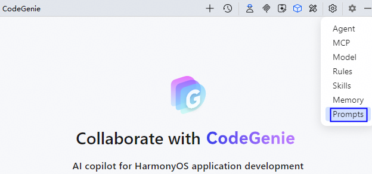
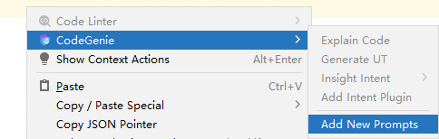
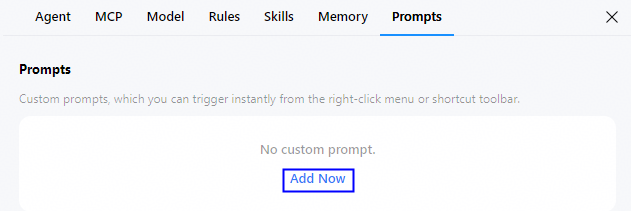
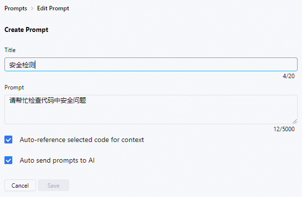
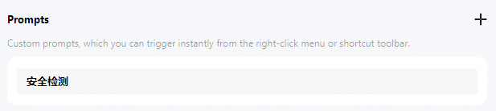
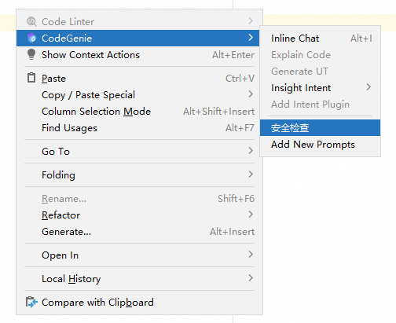

# 自定义提示词库（Prompts）配置

## 功能介绍

从DevEco Studio 6.1.0 Beta2开始，CodeGenie支持添加和管理提示词库。如果经常针对不同的文件或代码使用某个提示词向AI提问，可以将提示词添加到常用提示词库中，在需要时通过菜单栏快速触发，从而提高开发效率。

## 操作步骤

1. 点击页面右侧菜单栏CodeGenie图标完成登录后，可以通过如下两种方式打开Prompts配置界面：
   * 点击界面右上方<strong>Settings</strong>按钮，选择<strong>Prompts</strong>。

     
   * 在代码编辑区右键唤醒菜单栏，点击<strong>CodeGenie > Add New Prompts</strong>。

     
2. 点击<strong>Add Now</strong>进入Prompts配置页面。

   
3. 填写提示词名称、提示词内容等，点击<strong>Save</strong>进行保存。
   * <strong>Title</strong>：提示词名称，长度不超过20个字符。
   * <strong>Prompt</strong>：提示词的具体内容，长度不超过5000个字符。
   * <strong>Auto-reference selected code for context</strong>：是否自动引用所选代码作为上下文，勾选该选项后，会将选中代码和提示词一并发送给CodeGenie。
   * <strong>Auto send prompts to AI</strong>：是否自动发送给CodeGenie，不勾选该选项时需手动点击发送。

   

   将鼠标悬浮在自定义Prompts上，可出现编辑和删除按钮，方便开发者编辑或删除。

   
4. 选中代码片或在编辑区空白位置右键，点击CodeGenie下的提示词（如安全检查），发送提示词后等待AI解析回复。

   