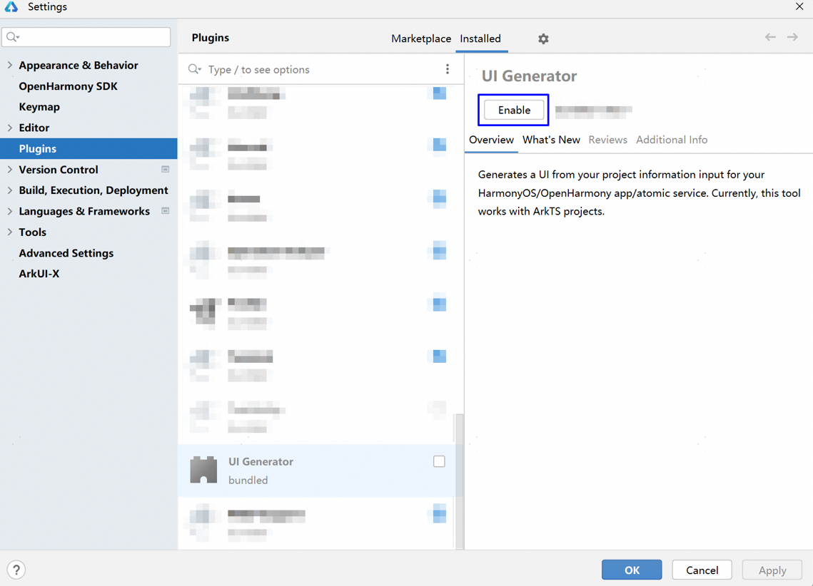
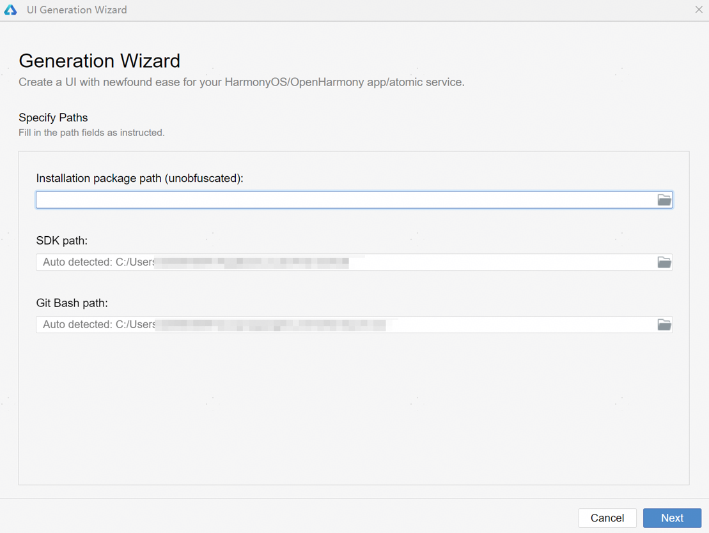
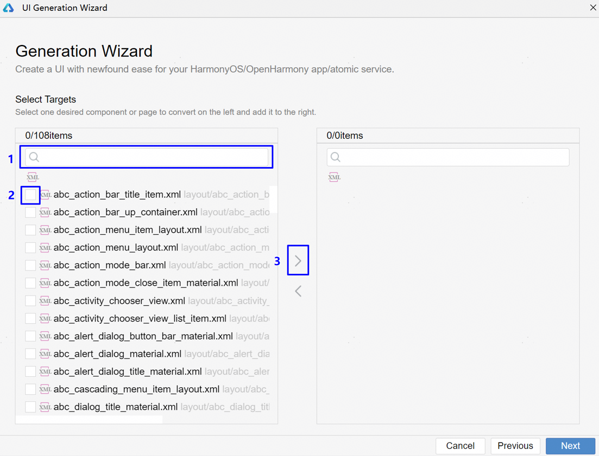
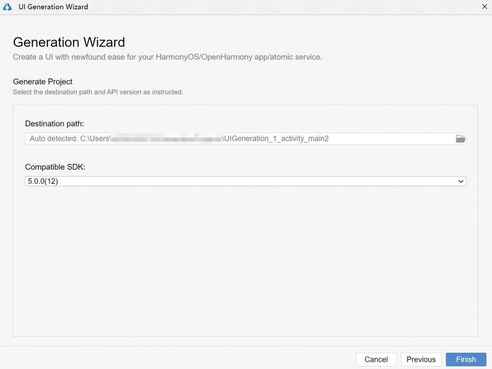
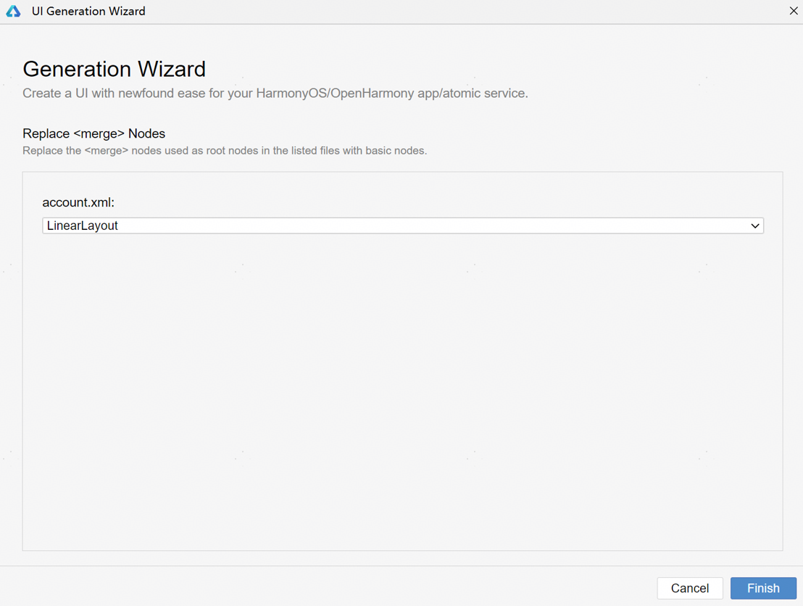
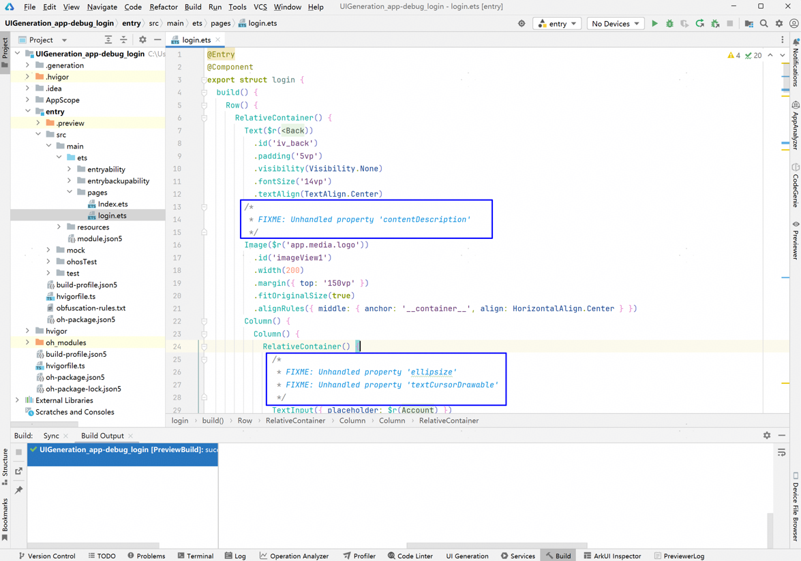
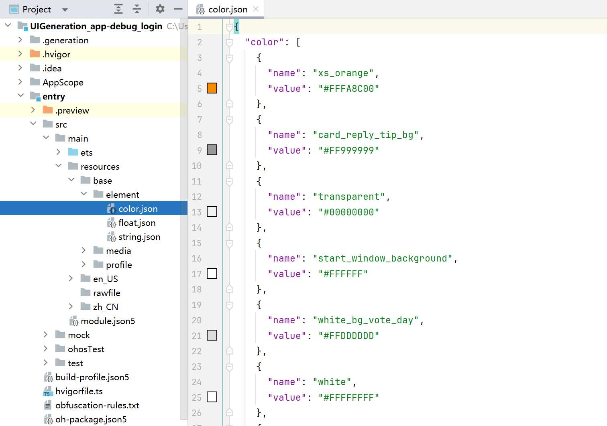

# 应用UI生成

UI Generator用于快速生成可编译、可运行的HarmonyOS UI工程，支持基于已有UI布局文件（XML），快速生成对应的HarmonyOS UI代码，其中包含HarmonyOS基础工程、页面布局、组件及属性和资源文件等。

## 使用约束

建议使用DevEco Studio 5.0.3.700及以上版本。

## 启用插件

1. 在DevEco Studio菜单栏，点击<strong>File > Settings...</strong>（macOS为<strong>DevEco Studio > Preferences/Settings</strong>）<strong>> Plugins</strong>，在Installed列表中找到UI Generator插件，点击<strong>Enable</strong>启用。

   
2. 单击OK并关闭设置窗口，插件启用成功。

## 开始使用

1. 在DevEco Studio菜单栏点击<strong>Tools > Generate Project From...</strong>打开UI Generator工具，首次使用需要阅读并确认用户协议，确认后可继续使用。
2. 输入待配置项路径，点击<strong>Next</strong>进入下一步。

   | 待配置项 | 说明 |
   | --- | --- |
   | Installation package path | 待转换的APK应用包的路径，请提供未混淆的Debug版本应用包。 |
   | SDK path | 等于或高于编译应用包所使用版本的SDK路径。 |
   | Git Bash path | Git Bash工具存放路径。若本地已下载安装Git Bash，插件将自动获取其路径。 |

   
3. 选择将要生成的XML页面（可在搜索框进行搜索），勾选后点击向右箭头将选中的XML导入至右侧。点击<strong>Next</strong>开始生成。

   
4. 配置输出工程待配置项，点击<strong>Finish</strong>进行生成。

   | 待配置项 | 说明 |
   | --- | --- |
   | Destination Path | 生成新工程的保存路径（默认生成到用户目录下UIGenerationProjects，用户可根据需要自行更改） |
   | Compatible SDK | 生成的新工程所使用的SDK版本 |

   
5. （可选）如果所选XML无有效根节点，需要选择根节点信息。

   
6. 点击<strong>Finish</strong>，在弹窗中点击确认，打开新工程。

   生成的页面位于entry > src > main > ets > pages目录下，可以点击Previewer查看页面预览效果。不支持生成的组件、属性会以注释的形式给出，方便后续定位修改。

   
7. 生成的新工程内的entry > src > main > resources目录包含文本、图像、颜色资源。

   

   更多操作指导，请参考视频课程：[毕方HarmonyOS UI代码生成工具](https://developer.huawei.com/consumer/cn/training/course/live/C101731322888995220)。