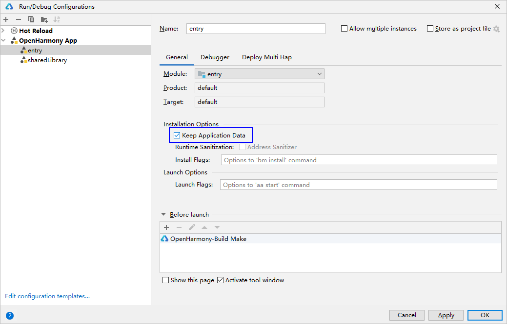
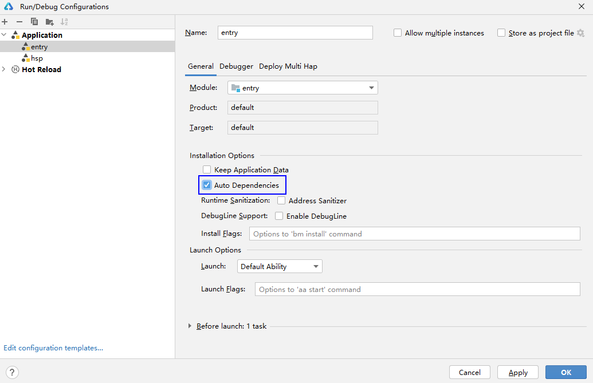
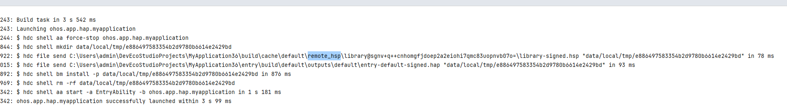
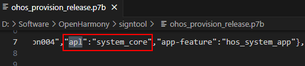
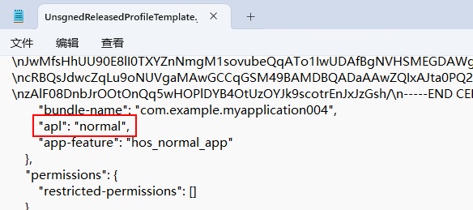

# bm工具

Bundle Manager（包管理工具，简称bm）是实现应用安装、卸载、更新、查询等功能的工具，bm为开发者提供基本的应用安装包的调试能力。

## 环境要求（hdc工具）

在使用本工具前，开发者需要先获取[hdc工具](./hdc.md#环境准备)，执行hdc shell。

## bm工具命令列表

| 命令 | 描述 |
| --- | --- |
| help | 帮助命令，用于查询bm支持的命令信息。 |
| install | 安装命令，用于安装应用。 |
| uninstall | 卸载命令，用于卸载应用。 |
| dump | 查询命令，用于查询应用的相关信息。 |
| clean | 清理命令，用于清理应用的缓存和数据。在user版本下打开开发者模式可用。 |
| get | 获取udid命令，用于获取设备的udid。 |
| quickfix | 快速修复相关命令，用于执行补丁相关操作，如补丁安装、补丁查询。 |
| compile | 应用执行编译AOT命令。 |
| copy-ap | 把应用的ap文件拷贝到/data/local/pgo目录下，供shell用户读取文件。 |
| dump-dependencies | 查询应用依赖的模块信息。 |
| dump-shared | 查询应用间HSP应用信息。 |
| dump-overlay | 打印overlay应用的overlayModuleInfo。 |
| dump-target-overlay | 打印目标应用的所有关联overlay应用的overlayModuleInfo。 |
| install-plugin | 安装插件命令，用于安装插件。 |
| uninstall-plugin | 卸载插件命令，用于卸载插件。 |

## 帮助命令（help）

```
# 显示帮助信息
bm help
```

## 参数说明

### userId

表示当前系统账号的编号，系统账号的相关接口请参考[系统账号管理模块](https://developer.huawei.com/consumer/cn/doc/harmonyos-references/js-apis-osaccount)，下面给出几种常见的系统账号。

* userId = 100，表示编号为100的系统账号，系统默认账号，在设备出厂首次启动时由系统账号管理模块创建，且创建完成后会在100账号下安装所有的预置应用。
* userId = 102，表示编号为102的系统账号，由系统账号管理模块创建，仅支持系统应用创建账号。在100账号下安装的应用，在102账号下不会显示，如有需求，需要在102账号下重新安装。在创建102账号过程中，系统会在102账号下安装预置系统应用。
* userId = 0，表示共有系统账号，也叫账号0，该共有系统账号和系统账号编号不同，不是系统账号管理模块创建的。在账号0下安装的应用，所有系统账号共享，会在每个系统账号下都会显示。所有三方应用都不能安装到账号0下。

## 安装命令（install）

```
bm install [-h] [-p filePath] [-r] [-w waitingTime] [-s hspDirPath] [-u userId] [-d] [-g]
```

<strong>安装命令参数列表</strong>

| 参数 | 参数说明 |
| --- | --- |
| -h | 帮助信息。 |
| -p | 可选参数，指定待安装的HAP/HSP路径，多HAP/HSP应用可指定多HAP/HSP所在文件夹路径。从API version 22开始，支持指定待安装的APP路径，也可指定只存在一个APP的文件夹路径。 |
| -r | 可选参数，覆盖安装一个HAP/HSP。默认缺省，缺省时表示覆盖安装。 |
| -s | 安装应用间HSP时为必选参数，其他场景为可选参数。用于指定待安装应用间HSP的路径。从API version 24开始，当指定目录时，路径目录下可以存在多个同包名、不同模块名的HSP。API version 23及之前版本，路径目录下只能存在一个HSP。  <strong>说明：</strong>  应用间HSP不对三方应用开放，三方无法安装应用间HSP。 |
| -w | 可选参数，安装HAP时指定bm工具等待时间，最小的等待时长为180s，最大的等待时长为600s, 默认缺省为180s。 |
| -u | 可选参数，指定[用户](#userid)，默认在当前活跃用户下安装应用。仅支持在当前活跃用户或0用户下安装。  <strong>说明：</strong>  如果当前活跃用户是100，使用命令bm install -p /data/local/tmp/ohos.app.hap -u 102安装时，只会在当前活跃用户100下安装应用。 |
| -d | 可选参数，允许应用降级安装，即设备已安装较高版本的应用，也可以覆盖安装较低版本的应用。仅支持签名证书分发类型为app\_gallery或者签名证书类型为debug的三方应用降级安装。从API version 23开始支持。 |
| -g | 可选参数，安装签名证书类型为debug的应用时自动授予[user\_grant](./app-permission-mgmt-overview.md#user_grant用户授权)和[manual\_settings](./app-permission-mgmt-overview.md#manual_settings手动设置授权)权限。  仅对[开发者模式](./ide-developer-mode.md#section530763213432)下的签名证书类型为debug的应用生效。可以通过[Profile签名文件](https://developer.huawei.com/consumer/cn/doc/app/agc-help-profile-overview-0000002283260125)中的type字段查看签名证书类型。  签名证书类型为debug的应用更新为签名证书类型为release的应用时取消已授予的[user\_grant](./app-permission-mgmt-overview.md#user_grant用户授权)和[manual\_settings](./app-permission-mgmt-overview.md#manual_settings手动设置授权)权限。从API version 24开始支持。 |

示例：

```
# 安装一个hap
bm install -p /data/local/tmp/ohos.app.hap
# 在100用户下安装一个hap
bm install -p /data/local/tmp/ohos.app.hap -u 100
# 覆盖安装一个hap
bm install -p /data/local/tmp/ohos.app.hap -r
# 安装一个应用间共享库
bm install -s xxx.hsp
# 同时安装使用方应用和其依赖的应用间共享库
bm install -p aaa.hap -s xxx.hsp yyy.hsp
# 同时安装HAP和应用内共享库
bm install -p /data/local/tmp/hapPath/
# 安装一个hap,等待时间为180s
bm install -p /data/local/tmp/ohos.app.hap -w 180
# 设备已安装了一个高版本的应用，覆盖安装一个同包名低版本的hap
bm install -p /data/local/tmp/ohos.app.hap -d
# 安装签名证书类型为debug的应用时自动授予user_grant权限和manual_settings权限
bm install -p /data/local/tmp/ohos.app.hap -g
```

## 卸载命令（uninstall）

```
bm uninstall [-h] [-n bundleName] [-m moduleName] [-k] [-s] [-v versionCode] [-u userId]
```

<strong>卸载命令参数列表</strong>

| 参数 | 参数说明 |
| --- | --- |
| -h | 帮助信息。 |
| -n | 必选参数，指定Bundle名称卸载应用。 |
| -m | 可选参数，应用模块名称，指定卸载应用的一个模块。默认卸载所有模块。 |
| -k | 可选参数，卸载应用时保存应用数据。默认卸载应用时不保存应用数据。 |
| -s | 根据场景判断，卸载应用间HSP时必选参数，其他场景为可选参数。卸载指定的共享库。 |
| -v | 可选参数，指定共享包的版本号。默认卸载同包名的所有共享包。 |
| -u | 可选参数，指定[用户](#userid)，默认在当前活跃用户下卸载应用。仅支持在当前活跃用户或0用户下卸载应用。  <strong>说明：</strong>  如果当前活跃用户是100，使用命令bm uninstall -n com.ohos.app -u 102卸载时，只会在当前活跃用户100下卸载应用。 |

示例：

```
# 卸载一个应用
bm uninstall -n com.ohos.app
# 在用户100下卸载一个应用
bm uninstall -n com.ohos.app -u 100
# 卸载应用的一个模块
bm uninstall -n com.ohos.app -m entry
# 卸载一个shared bundle
bm uninstall -n com.ohos.example -s
# 卸载一个shared bundle的指定版本
bm uninstall -n com.ohos.example -s -v 100001
# 卸载一个应用，并保留用户数据
bm uninstall -n com.ohos.app -k
```

## 查询应用信息命令（dump）

```
bm dump [-h] [-a] [-g] [-n bundleName] [-s shortcutInfo] [-d deviceId] [-l label] [-u userId]
```

<strong>查询命令参数列表</strong>

| 参数 | 参数说明 |
| --- | --- |
| -h | 帮助信息。 |
| -a | 可选参数，查询系统已经安装的所有应用。 |
| -g | 可选参数，查询系统中签名为调试类型的应用包名。 |
| -n | 可选参数，查询指定Bundle名称的详细信息。 |
| -s | 可选参数，查询指定Bundle名称下的快捷方式信息。 |
| -d | 可选参数，查询指定设备中的包信息。默认查询当前设备。 |
| -l | 可选参数，用于查询指定Bundle名称的label值（应用的名称），需要与-n或-a参数组合使用。  <strong>说明</strong>：  从API version 20开始支持该命令。如果在Windows环境下输出结果包含特殊字符或中文乱码，需在cmd控制台中手动执行命令chcp 65001，将cmd控制台编码修改为UTF-8。 |
| -u | 可选参数，查询指定[用户](#userid)下的应用信息，默认在当前活跃用户下查询应用信息。仅支持在当前活跃用户或0用户下查询。  <strong>说明：</strong>  如果当前活跃用户是100，使用命令bm dump -n com.ohos.app -u 102查询时，只会在当前活跃用户100下查询应用。 |

示例：

```
# 显示所有已安装的Bundle名称
bm dump -a
# 查询系统中签名为调试类型的应用包名
bm dump -g
# 查询该应用的详细信息
bm dump -n com.ohos.app
# 在用户100下查询该应用的详细信息
bm dump -n com.ohos.app -u 100
# 查询该应用的快捷方式信息
bm dump -s -n com.ohos.app
# 查询跨设备应用信息
bm dump -n com.ohos.app -d xxxxx
# 查询该应用的label值（应用的名称）
bm dump -n com.ohos.app -l
# 显示所有已安装应用的bundle名称和label值（应用的名称）
bm dump -a -l
```

## 清理命令（clean）

```
bm clean [-h] [-c] [-n bundleName] [-d] [-i appIndex] [-u userId]
```

<strong>清理命令参数列表</strong>

| 参数 | 参数说明 |
| --- | --- |
| -h | 帮助信息。 |
| -c -n | -n为必选参数，-c为可选参数。清除指定Bundle名称的缓存数据。 |
| -d -n | -n为必选参数，-d为可选参数。清除指定Bundle名称的数据目录。 |
| -i | 可选参数，清除分身应用的数据目录。默认为0。 |
| -u | 可选参数，清理指定[用户](#userid)下的数据，默认在当前活跃用户下清理数据。仅支持在当前活跃用户或0用户下清理数据。  <strong>说明：</strong>  如果当前活跃用户是100，使用命令bm clean -c -n com.ohos.app -u 102清理数据时，只会在当前活跃用户100下清理。 |

示例：

```
# 清理该应用下的缓存数据
bm clean -c -n com.ohos.app
# 在用户100下清理该应用下的缓存数据
bm clean -c -n com.ohos.app -u 100
# 清理该应用下的用户数据
bm clean -d -n com.ohos.app
# 执行结果
clean bundle data files successfully.
```

## 获取udid命令（get）

```
bm get [-h] [-u]
```

<strong>获取udid命令参数列表</strong>

| 参数 | 参数说明 |
| --- | --- |
| -h | 帮助信息。 |
| -u | 必选参数，获取设备的udid。 |

示例：

```
# 获取设备的udid
bm get -u
# 执行结果
udid of current device is :
23CADE0C
```

## 快速修复命令（quickfix）

```
bm quickfix [-h] [-a -f filePath [-t targetPath] [-d] [-o]] [-q -b bundleName] [-r -b bundleName]
```

注：hqf文件制作方式可参考[HQF打包指令](./packing-tool.md#hqf打包指令)。

<strong>快速修复命令参数列表</strong>

| 参数 | 参数说明 |
| --- | --- |
| -h | 帮助信息。 |
| -a -f | -a为可选参数，指定-a后，-f为必选参数。执行快速修复补丁安装命令，file-path对应hqf文件，支持传递1个或多个hqf文件，或传递hqf文件所在的目录。 |
| -q -b | -q为可选参数，指定-q后，-b为必选参数。根据包名查询补丁信息。 |
| -r -b | -r为可选参数，指定-r后，-b为必选参数。根据包名卸载未使能的补丁。 |
| -t | 可选参数，快速修复应用到指定目标路径。 |
| -d | 可选参数，应用快速修复调试模式。 |
| -o | 可选参数，应用快速修复覆盖模式，该模式下so将被解压覆盖到应用的so目录中。 |

示例：

```
# 根据包名查询补丁包信息
bm quickfix -q -b com.ohos.app
# 执行结果
# Information as follows:
# ApplicationQuickFixInfo:
#  bundle name: com.ohos.app
#  bundle version code: xxx
#  bundle version name: xxx
#  patch version code: x
#  patch version name:
#  cpu abi:
#  native library path:
#  type:

# 快速修复补丁安装
bm quickfix -a -f /data/app/
# 执行结果
apply quickfix succeed.
# 快速修复补丁卸载
bm quickfix -r -b com.ohos.app
# 执行结果
delete quick fix successfully
```

## 共享库查询命令（dump-shared）

```
bm dump-shared [-h] [-a] [-n bundleName]
```

<strong>共享库查询命令参数列表</strong>

| 参数 | 参数说明 |
| --- | --- |
| -h | 帮助信息。 |
| -a | 可选参数，查询系统中所有已安装的共享库。 |
| -n | 可选参数，查询指定包名的共享库详细信息。 |

示例：

```
# 显示所有已安装共享库包名
bm dump-shared -a
# 显示该共享库的详细信息
bm dump-shared -n com.ohos.lib
```

## 共享库依赖关系查询命令（dump-dependencies）

```
bm dump-dependencies [-h] [-n bundleName] [-m moduleName]
```

<strong>共享库依赖关系查询命令参数列表</strong>

| 参数 | 参数说明 |
| --- | --- |
| -h | 帮助信息。 |
| -n | 必选参数，查询指定应用依赖的共享库信息。 |
| -m | 必选参数，查询指定应用指定模块依赖的共享库信息。 |

示例：

```
# 查询指定应用指定模块依赖的共享库信息
bm dump-dependencies -n com.ohos.app -m entry
```

## 应用执行编译AOT命令（compile）

```
bm compile [-h] [-m mode] [-r bundleName] [-a]
```

<strong>compile命令参数列表</strong>

| 参数 | 参数说明 |
| --- | --- |
| -h | 帮助信息。 |
| -a | 可选参数，编译所有应用。 |
| -m | 可选参数，可选值为partial或者full。根据包名编译应用。 |
| -r | 可选参数，移除应用的结果。 |

示例：

```
# 根据包名编译应用
bm compile -m partial com.example.myapplication
```

## 拷贝ap文件命令（copy-ap）

拷贝ap文件到指定应用的/data/local/pgo路径。

```
bm copy-ap [-h] [-a] [-n bundleName]
```

<strong>copy-ap命令参数列表</strong>

| 参数 | 参数说明 |
| --- | --- |
| -h | 帮助信息。 |
| -a | 可选参数，默认所有包相关ap文件。拷贝所有包相关ap文件。 |
| -n | 可选参数，默认当前应用包名。根据包名拷贝对应包相关的ap文件。 |

示例：

```
# 根据包名移动对应包相关的ap文件
bm copy-ap -n com.example.myapplication
```

## 查询overlay应用信息命令（dump-overlay）

```
bm dump-overlay [-h] [-b bundleName] [-m moduleName] [-t targetModuleName] [-u userId]
```

<strong>dump-overlay命令参数列表</strong>

| 参数 | 参数说明 |
| --- | --- |
| -h | 帮助信息。 |
| -b | 必选参数，获取指定Overlay应用的所有OverlayModuleInfo信息。 |
| -m | 可选参数，根据指定Overlay特征module的名称查询OverlayModuleInfo信息，默认当前Overlay应用主模块名。 |
| -t | 可选参数，根据指定目标module的名称查询OverlayModuleInfo信息，默认参数为空。 |
| -u | 可选参数，在指定[用户](#userid)下查询OverlayModuleInfo信息，默认在当前活跃用户下查询。仅支持在当前活跃用户或0用户下查询。  <strong>说明：</strong>  如果当前活跃用户是100，使用命令bm dump-overlay -b com.ohos.app -u 102查询OverlayModuleInfo信息，只会返回当前活跃用户100下的OverlayModuleInfo信息。 |

示例：

```
# 根据包名来获取overlay应用com.ohos.app中的所有OverlayModuleInfo信息
bm dump-overlay -b com.ohos.app

# 在用户100下，根据包名来获取overlay应用com.ohos.app中的所有OverlayModuleInfo信息
bm dump-overlay -b com.ohos.app -u 100

# 根据包名和module来获取overlay应用com.ohos.app中overlay module为libraryModuleName的所有OverlayModuleInfo信息
bm dump-overlay -b com.ohos.app -m libraryModuleName

# 根据目标包名和module来获取overlay应用com.ohos.app中目标module为entryModuleName的所有OverlayModuleInfo信息
bm dump-overlay -b com.ohos.app -t entryModuleName
```

## 查询应用的overlay相关信息命令（dump-target-overlay）

查询目标应用的所有关联overlay应用的overlayModuleInfo信息。

```
bm dump-target-overlay [-h] [-b bundleName] [-m moduleName] [-u userId]
```

<strong>dump-target-overlay命令参数列表</strong>

| 参数 | 参数说明 |
| --- | --- |
| -h | 帮助信息。 |
| -b | 必选参数，获取指定应用的所有OverlayBundleInfo信息。 |
| -m | 可选参数，默认当前应用主模块名。根据指定的包名和module名查询OverlayModuleInfo信息。 |
| -u | 可选参数，在指定[用户](#userid)下查询OverlayModuleInfo信息，默认在当前活跃用户下查询。仅支持在当前活跃用户或0用户下查询。  <strong>说明：</strong>  如果当前活跃用户是100，使用命令bm dump-target-overlay -b com.ohos.app -u 102查询目标应用com.ohos.app中的所有关联的OverlayBundleInfo信息，只会返回当前活跃用户100下的OverlayModuleInfo信息。 |

示例：

```
# 根据包名来获取目标应用com.ohos.app中的所有关联的OverlayBundleInfo信息
bm dump-target-overlay -b com.ohos.app

# 在用户100下，根据包名来获取目标应用com.ohos.app中的所有关联的OverlayBundleInfo信息
bm dump-target-overlay -b com.ohos.app -u 100

# 根据包名和module来获取目标应用com.ohos.app中目标module为entry的所有关联的OverlayModuleInfo信息
bm dump-target-overlay -b com.ohos.app -m entry
```

## 安装插件命令（install-plugin）

```
bm install-plugin [-h] [-n hostBundleName] [-p filePath]
```

<strong>install-plugin命令参数列表</strong>

| 参数 | 参数说明 |
| --- | --- |
| -h | 帮助信息。 |
| -n | 必选参数，指定待安装插件的应用包名。 |
| -p | 必选参数，指定插件文件路径。 |

示例：

```
# 安装一个插件
bm install-plugin -n com.ohos.app -p /data/plugin.hsp
```


在同一个应用中安装同一个插件，则视作插件版本更新，插件不支持降级安装；插件版本更新后，需要重启应用插件才能生效。

不推荐安装与宿主应用模块同名的插件，目前运行态暂不支持。

## 卸载插件命令（uninstall-plugin）

```
bm uninstall-plugin [-h] [-n hostBundleName] [-p pluginBundleName]
```

<strong>uninstall-plugin命令参数列表</strong>

| 参数 | 参数说明 |
| --- | --- |
| -h | 帮助信息。 |
| -n | 必选参数，指定应用包名。 |
| -p | 必选参数，指定插件的包名。 |

示例：

```
# 卸载一个插件
bm uninstall-plugin -n com.ohos.app -p com.ohos.plugin
```

## bm工具错误码

### 301 系统账号不存在

<strong>错误信息</strong>

error: user not exist.

<strong>错误描述</strong>

系统账号不存在。

<strong>可能原因</strong>

安装应用时，系统账号ID不存在。

<strong>处理步骤</strong>

1. 重启手机后再次尝试安装应用。
2. 重复上述步骤3到5次后依旧安装失败，请导出日志文件提[在线工单](https://developer.huawei.com/consumer/cn/support/feedback/#/)获取帮助。

   ```
   hdc file recv /data/log/hilog/
   ```

### 304 当前系统账号没有安装HAP包

<strong>错误信息</strong>

error: user does not install the hap.

<strong>错误描述</strong>

卸载操作时，当前系统账号没有安装HAP包。

<strong>可能原因</strong>

当前系统账号下未安装任何HAP包。

<strong>处理步骤</strong>

当前系统账号下未安装任何HAP包，请不要执行卸载应用操作。

### 9568319 签名文件异常

<strong>错误信息</strong>

error: cannot open signature file.

<strong>错误描述</strong>

安装应用过程中，出现签名文件打开异常，导致安装失败。

<strong>可能原因</strong>

HAP包签名文件存在异常。

<strong>处理步骤</strong>

方法一. 使用[自动签名](./ide-signing.md#section18815157237)。在连接设备后，重新为应用进行签名。

方法二. 使用手动签名，请参考[手动签名](./ide-signing.md#section297715173233)。

### 9568320 签名文件不存在

<strong>错误信息</strong>

error: no signature file.

<strong>错误描述</strong>

用户安装未签名的HAP/HSP包。

<strong>可能原因</strong>

HAP/HSP包没有签名。

<strong>处理步骤</strong>

请开发者根据实际场景选择自动签名或者手动签名，例如无法连接互联网的情况下推荐使用手动签名方式，详情参考[使用场景说明](./ide-signing.md#section54361623194519)。

方法一. 使用[自动签名](./ide-signing.md#section18815157237)。在连接设备后，重新为应用进行签名。

方法二. 使用手动签名，请参考[手动签名](./ide-signing.md#section297715173233)。

方法三. 如果安装APP时报这个错误码，需要在[工程级build-profile.json5文件](./ide-hvigor-build-profile-app.md)里配置[packOptions](./ide-hvigor-build-profile-app.md#section03812484215)的appWithSignedPkg属性为true，保证APP里的HAP/HSP有签名。

### 9568321 签名文件解析失败

<strong>错误信息</strong>

error: fail to parse signature file.

<strong>错误描述</strong>

用户安装时签名文件解析失败。

<strong>可能原因</strong>

HAP包签名文件存在异常。

<strong>处理步骤</strong>

方法一. 使用[自动签名](./ide-signing.md#section18815157237)。在连接设备后，重新为应用进行签名。

方法二. 使用手动签名，请参考[手动签名](./ide-signing.md#section297715173233)。

### 9568323 签名摘要验证未通过

<strong>错误信息</strong>

error: signature verification failed due to not bad digest.

<strong>错误描述</strong>

用户安装时签名验证失败。

<strong>可能原因</strong>

HAP包签名不正确。

<strong>处理步骤</strong>

方法一. 使用[自动签名](./ide-signing.md#section18815157237)。在连接设备后，重新为应用进行签名。

方法二. 使用手动签名，请参考[手动签名](./ide-signing.md#section297715173233)。

### 9568324 签名完整性校验未通过

<strong>错误信息</strong>

error: signature verification failed due to out of integrity.

<strong>错误描述</strong>

用户安装时签名验证失败。

<strong>可能原因</strong>

HAP包签名不正确。

<strong>处理步骤</strong>

方法一. 使用[自动签名](./ide-signing.md#section18815157237)。在连接设备后，重新为应用进行签名。

方法二. 使用手动签名，请参考[手动签名](./ide-signing.md#section297715173233)。

### 9568326 签名公钥存在异常

<strong>错误信息</strong>

error: signature verification failed due to bad public key.

<strong>错误描述</strong>

用户安装时签名验证失败，签名公钥存在异常。

<strong>可能原因</strong>

HAP包签名不正确。

<strong>处理步骤</strong>

方法一. 使用[自动签名](./ide-signing.md#section18815157237)。在连接设备后，重新为应用进行签名。

方法二. 使用手动签名，请参考[手动签名](./ide-signing.md#section297715173233)。

### 9568327 签名获取异常

<strong>错误信息</strong>

error: signature verification failed due to bad bundle signature.

<strong>错误描述</strong>

用户安装时签名验证失败，签名获取异常。

<strong>可能原因</strong>

HAP包签名不正确。

<strong>处理步骤</strong>

方法一. 使用[自动签名](./ide-signing.md#section18815157237)。在连接设备后，重新为应用进行签名。

方法二. 使用手动签名，请参考[手动签名](./ide-signing.md#section297715173233)。

### 9568328 未找到配置文件区块

<strong>错误信息</strong>

error: signature verification failed due to no profile block.

<strong>错误描述</strong>

用户安装时签名验证失败，未找到配置文件区块。

<strong>可能原因</strong>

HAP包签名不正确。

<strong>处理步骤</strong>

方法一. 使用[自动签名](./ide-signing.md#section18815157237)。在连接设备后，重新为应用进行签名。

方法二. 使用手动签名，请参考[手动签名](./ide-signing.md#section297715173233)。

### 9568330 初始化签名源失败

<strong>错误信息</strong>

error: signature verification failed due to init source failed.

<strong>错误描述</strong>

用户安装时签名验证失败，初始化签名源失败。

<strong>可能原因</strong>

HAP包签名不正确。

<strong>处理步骤</strong>

方法一. 使用[自动签名](./ide-signing.md#section18815157237)。在连接设备后，重新为应用进行签名。

方法二. 使用手动签名，请参考[手动签名](./ide-signing.md#section297715173233)。

### 9568257 签名文件Pkcs7校验失败

<strong>错误信息</strong>

error: fail to verify pkcs7 file.

<strong>错误描述</strong>

用户安装应用时签名Pkcs7校验失败。

<strong>可能原因</strong>

1. 证书链不完整或不受信任。
2. 签名算法不匹配。
3. 数据被篡改或签名文件损坏。
4. 签名格式不匹配。
5. 私钥不匹配。

<strong>处理步骤</strong>

方法一. 使用[自动签名](./ide-signing.md#section18815157237)。在连接设备后，重新为应用进行签名。

方法二. 使用手动签名，请参考[手动签名](./ide-signing.md#section297715173233)。

### 9568344 解析配置文件失败

<strong>错误信息</strong>

error: install parse profile prop check error.


<strong>错误描述</strong>

在启动调试或运行应用/服务时，安装HAP出现错误，提示“error: install parse profile prop check error”错误信息。

<strong>可能原因</strong>

1. [app.json5配置文件](./app-configuration-file.md#配置文件标签)中的bundleName、[module.json5配置文件](./module-configuration-file.md#配置文件标签)中name不符合命名规则。

<strong>处理步骤</strong>

1. 根据命名规则调整app.json5配置文件中bundleName、module.json5文件中的name字段。

### 9568305 依赖的模块不存在

<strong>错误信息</strong>

error: Failed to install the HAP or HSP because the dependent module does not exist.

<strong>错误描述</strong>

在启动调试或运行应用/服务时，安装HAP出现错误，提示“error: Failed to install the HAP or HSP because the dependent module does not exist.”错误信息。

<strong>可能原因</strong>

运行/调试的应用依赖的动态共享包（HSP）模块未安装导致安装报错。

<strong>处理步骤</strong>

场景一：依赖的HSP与HAP在同一工程内：

* 方法一：先通过[bm install -p](#安装命令install)命令安装依赖的动态共享包（HSP）模块，再在应用运行配置页勾选Keep Application Data，点击OK保存配置，再运行/调试。

  
* 方法二：在运行配置页，选择Deploy Multi Hap标签页，勾选Deploy Multi Hap Packages，选择依赖的模块，点击OK保存配置，再进行运行/调试。

  
* 方法三：单击Run &gt; Edit Configurations，在General中，勾选Auto Dependencies。点击OK保存配置，再运行/调试。

  

场景二：依赖的HSP与HAP不在同一工程内：

在安装HAP前，使用[bm install](#安装命令install)命令安装依赖的HSP。

场景三：依赖集成态HSP：

如果依赖集成态HSP，通过hdc工具安装应用时，需要同时或提前安装集成态HSP编译后的包。是否依赖集成态HSP，可以通过如下方法查询：

DevEco Studio自动安装运行应用时，查看Run中的日志，如果存在remote\_hsp目录，说明依赖集成态HSP，remote\_hsp目录下的HSP文件就是集成态HSP编译后的包。



### 9568259 安装解析配置文件缺少字段

<strong>错误信息</strong>

error: install parse profile missing prop.


<strong>错误描述</strong>

在启动调试或运行应用/服务时，安装HAP出现错误，提示“error: install parse profile missing prop”错误信息。

<strong>可能原因</strong>

配置文件app.json5和module.json5中必填字段缺失。

<strong>处理步骤</strong>

* 方法1：请参考[app.json5配置文件](https://developer.huawe

... [OUTPUT TRUNCATED - 16624 chars omitted out of 66624 total] ...

t.bms.supportIsolationMode
   # 配置设备persist.bms.supportIsolationMode值
   hdc shell
   param set persist.bms.supportIsolationMode [true|false]
   ```

### 9568310 兼容策略不同

<strong>错误信息</strong>

error: compatible policy not same.

<strong>错误描述</strong>

新包与已安装包兼容策略不同。

<strong>可能原因</strong>

1. 应用已安装，再安装一个同包名的应用间共享库。
2. 应用间共享库已安装，再安装一个同包名的应用。

<strong>处理步骤</strong>

1. 卸载已安装的应用（PC/2in1设备需要确保所有用户下都卸载完成，手机/平板侧需要关注隐私空间和主用户下是否卸载完成）或应用间共享库，再安装新包。

### 9568391 包管理服务已停止

<strong>错误信息</strong>

error: bundle manager service is died.

<strong>错误描述</strong>

包管理服务已停止。

<strong>可能原因</strong>

系统出现未知的异常，导致包管理服务已停止或者异常退出。

<strong>处理步骤</strong>

1. 重启手机后再次尝试安装应用。
2. 重复上述步骤3到5次后依旧安装失败，请查询设备的/data/log/faultlog/faultlogger/目录下是否存在包含foundation字样的crash文件。

   ```
   hdc shell
   cd /data/log/faultlog/faultlogger/
   ls -ls
   ```
3. 导出crash文件和日志文件提[在线工单](https://developer.huawei.com/consumer/cn/support/feedback/#/)获取帮助。

   ```
   hdc file recv /data/log/faultlog/faultlogger/
   hdc file recv /data/log/hilog/
   ```

### 9568393 验证代码签名失败

<strong>错误信息</strong>

error: verify code signature failed.

<strong>错误描述</strong>

验证代码签名失败。

<strong>可能原因</strong>

包没有代码签名信息。

<strong>处理步骤</strong>

1. 安装最新版本DevEco Studio，重新签名。
2. 应用当前使用的签名不符合HarmonyOS应用签名的要求，应该替换为HarmonyOS应用的签名。

### 9568399 拷贝文件失败

<strong>错误信息</strong>

error: copy file failed.

<strong>错误描述</strong>

安装应用过程中，拷贝文件失败。

<strong>可能原因</strong>

1. 拷贝源文件路径或目标路径为无效路径。
2. 源文件打开失败。
3. 获取源文件状态失败。
4. 源文件的大小无效。
5. 源文件拷贝失败。
6. 源文件没有访问权限。
7. 更改文件权限失败。

<strong>处理步骤</strong>

1. 重启手机后再次尝试安装应用。
2. 重复上述步骤3到5次后依旧安装失败，请导出日志文件提[在线工单](https://developer.huawei.com/consumer/cn/support/feedback/#/)获取帮助。

   ```
   hdc file recv /data/log/hilog/
   ```

### 9568401 调试包仅支持运行在开发者模式设备

<strong>错误信息</strong>

error: debug bundle can only be installed in developer mode.

<strong>错误描述</strong>

调试包仅支持运行在开发者模式设备。

<strong>可能原因</strong>

终端设备未开启“开发者模式”。

<strong>处理步骤</strong>

1. 终端系统查看“设置 > 系统”中是否有“开发者选项”，如果不存在，可在“设置 > 关于本机”连续七次单击“版本号”，直到提示“开启开发者模式”，点击“确认开启”后输入PIN码（如果已设置），设备将自动重启。
2. USB数据线连接终端和PC，在“设置 > 系统 > 开发者选项”中，打开“USB调试”开关，弹出的“允许USB调试”的弹框，点击“允许”。
3. 启动调试或运行应用。

### 9568404 传递签名配置文件失败

<strong>错误信息</strong>

error: delivery sign profile failed.

<strong>错误描述</strong>

安装过程中，传递代码签名配置文件出现异常，导致安装失败。

<strong>可能原因</strong>

1. 文件路径不存在。
2. 创建文件路径失败。
3. 更改文件目录模式失败。
4. 写配置文件数据失败。
5. 更改配置文件模式失败。
6. 添加配置文件数据失败。

<strong>处理步骤</strong>

1. 重启手机后再次尝试安装应用。
2. 重复上述步骤3到5次后依旧安装失败，请导出日志文件提[在线工单](https://developer.huawei.com/consumer/cn/support/feedback/#/)获取帮助。

   ```
   hdc file recv /data/log/hilog/
   ```

### 9568405 删除签名配置文件失败

<strong>错误信息</strong>

error: remove sign profile failed.

<strong>错误描述</strong>

应用卸载过程中，删除签名配置文件出现异常，导致卸载应用失败。

<strong>可能原因</strong>

1. 文件路径不存在。
2. 加载配置文件数据失败。
3. 文件权限不是可写的。

<strong>处理步骤</strong>

1. 重启手机后再次尝试卸载应用（PC/2in1设备需要确保所有用户下都卸载完成，手机/平板侧需要关注隐私空间和主用户下是否卸载完成）。
2. 重复上述步骤3到5次后依旧卸载失败，请导出日志文件提[在线工单](https://developer.huawei.com/consumer/cn/support/feedback/#/)获取帮助。

   ```
   hdc file recv /data/log/hilog/
   ```

### 9568381 应用进程删除失败

<strong>错误信息</strong>

error: uninstall killing app error.

<strong>错误描述</strong>

卸载应用时应用进程删除失败。

<strong>可能原因</strong>

进程号错误导致应用进程删除失败。

<strong>处理步骤</strong>

设备重启之后再尝试卸载应用。

### 9568382 卸载应用时包名或者模块名称为空

<strong>错误信息</strong>

error: uninstall invalid name.

<strong>错误描述</strong>

卸载应用时bundleName为空或者moduleName为空。

<strong>可能原因</strong>

卸载应用时，参数bundleName和moduleName异常为空。

<strong>处理步骤</strong>

设备重启之后再尝试卸载应用。

### 9568384 卸载应用时bm工具进程权限异常

<strong>错误信息</strong>

error: uninstall permission denied.

<strong>错误描述</strong>

卸载应用时bm工具进程权限异常。

<strong>可能原因</strong>

bm工具进程异常或者权限丢失，导致卸载应用时无权限。

<strong>处理步骤</strong>

1. 设备重启之后再尝试卸载应用。
2. 重复上述步骤3到5次后依旧安装失败，请导出日志文件提[在线工单](https://developer.huawei.com/consumer/cn/support/feedback/#/)获取帮助。

   ```
   # 导出日志文件
   hdc file recv /data/log/hilog/
   ```

### 9568385 卸载服务异常

<strong>错误信息</strong>

error: uninstall bundle mgr service error.

<strong>错误描述</strong>

卸载服务异常。

<strong>可能原因</strong>

系统出现未知的异常，导致卸载服务已停止或者异常退出。

<strong>处理步骤</strong>

1. 重启手机后再次尝试卸载应用。
2. 重复上述步骤3到5次后依旧安装失败，请查询设备的/data/log/faultlog/faultlogger/目录下是否存在包含foundation字样的crash文件。

   ```
   hdc shell
   cd /data/log/faultlog/faultlogger/
   ls -ls
   ```
3. 导出crash文件和日志文件提[在线工单](https://developer.huawei.com/consumer/cn/support/feedback/#/)获取帮助。

   ```
   hdc file recv /data/log/faultlog/faultlogger/
   hdc file recv /data/log/hilog/
   ```

### 9568386 卸载的应用不存在

<strong>错误信息</strong>

error: uninstall missing installed bundle.

<strong>错误描述</strong>

卸载的应用不存在。

<strong>可能原因</strong>

要卸载的应用没有安装。

<strong>处理步骤</strong>

1. 确认要卸载的应用是否已经安装。

### 9568388 企业设备管理不允许卸载该应用

<strong>错误信息</strong>

error: Failed to uninstall the HAP because the uninstall is forbidden by enterprise device management.

<strong>错误描述</strong>

企业设备管理不允许卸载该应用。

<strong>可能原因</strong>

应用被设置为不允许被卸载。

<strong>处理步骤</strong>

1. 由设置方取消该应用的卸载管控。

### 9568389 未知错误导致安装失败

<strong>错误信息</strong>

error: unknown.

<strong>错误描述</strong>

未知的错误。

<strong>可能原因</strong>

系统未知的错误导致安装失败。

<strong>处理步骤</strong>

1. 重启手机后再次尝试安装应用。
2. 重复上述步骤3到5次后依旧安装失败，请导出日志文件提[在线工单](https://developer.huawei.com/consumer/cn/support/feedback/#/)获取帮助。

   ```
   # 导出日志文件
   hdc file recv /data/log/hilog/
   ```

### 9568284 安装版本不匹配

<strong>错误信息</strong>

error: install version not compatible.

<strong>错误描述</strong>

安装版本不匹配。

<strong>可能原因</strong>

当前安装HSP的版本信息与已安装HAP的版本信息不匹配。

安装HSP时会做如下校验：

1. bundleName和HAP的一致。
2. version和HAP的一致。
3. 签名和HAP的一致。

<strong>处理步骤</strong>

1. 卸载版本信息不匹配的HAP（PC/2in1设备需要确保所有用户下都卸载完成，手机/平板侧需要关注隐私空间和主用户下是否卸载完成），再安装HSP。
2. 修改HSP版本信息与HAP一致，再安装HSP。

### 9568287 安装包entry模块数量不合规

<strong>错误信息</strong>

error: install invalid number of entry hap.

<strong>错误描述</strong>

安装包entry模块数量不合规。

<strong>可能原因</strong>

安装包中entry模块有多个。一个应用只能有一个entry模块，可以有多个feature模块。

<strong>处理步骤</strong>

1. 保留一个entry模块，其余entry模块修改为feature（修改module.json5中type字段）。

### 9568281 安装包vendor不一致

<strong>错误信息</strong>

error: install vendor not same.

<strong>错误描述</strong>

安装包vendor不一致。

<strong>可能原因</strong>

app.json5文件中app的vendor字段配置不一致。

<strong>处理步骤</strong>

1. 若只有一个HAP，要求与已安装应用vendor字段一致，卸载重装即可（PC/2in1设备需要确保所有用户下都卸载完成，手机/平板侧需要关注隐私空间和主用户下是否卸载完成）。
2. 若包含集成态HSP，要求集成态HSP与使用方HAP的vendor字段保持一致。

### 9568272 安装包体积大小无效

<strong>错误信息</strong>

error: install invalid hap size.

<strong>错误描述</strong>

安装包大小超出限制。

<strong>可能原因</strong>

安装包体积超过4GB大小。

<strong>处理步骤</strong>

拆分包，保证每个安装包体积不超过4GB。

### 9568273 应用生成UID失败，导致安装失败

<strong>错误信息</strong>

error: install generate uid error.

<strong>错误描述</strong>

应用生成UID失败，导致安装失败。

<strong>可能原因</strong>

该设备上已安装的应用数量已超过65535，导致应用安装时分配UID失败。

<strong>处理步骤</strong>

卸载不必要的应用后重试（PC/2in1设备需要确保所有用户下都卸载完成，手机/平板侧需要关注隐私空间和主用户下是否卸载完成）。

### 9568274 安装服务错误

<strong>错误信息</strong>

error: install installd service error.

<strong>错误描述</strong>

安装服务错误。

<strong>可能原因</strong>

安装服务异常。

<strong>处理步骤</strong>

1. 清除缓存，重启设备。

### 9568275 包管理服务错误

<strong>错误信息</strong>

error: install bundle mgr service error.

<strong>错误描述</strong>

包管理服务错误。

<strong>可能原因</strong>

包管理服务异常，如出现空指针导致异常等。

<strong>处理步骤</strong>

重启设备或稍后重试。

### 9568277 包名不一致，导致安装失败

<strong>错误信息</strong>

error: install bundle name not same.

<strong>错误描述</strong>

包名不一致，导致安装失败。

<strong>可能原因</strong>

待安装的路径下的多个安装包包名不一致。

<strong>处理步骤</strong>

检查待安装路径下的安装包包名，确保所有安装包的app.json5配置文件中bundleName一致。

### 9568279 版本不一致，导致安装失败

<strong>错误信息</strong>

error: install version name not same.

<strong>错误描述</strong>

版本（versionName字段）不一致，导致安装失败。

<strong>可能原因</strong>

待安装的路径下的多个安装包的versionName不一致。

<strong>处理步骤</strong>

检查待安装路径下的安装包版本，确保所有安装包的app.json5配置文件中versionName一致。

### 9568280 minCompatibleVersionCode不一致，导致安装失败

<strong>错误信息</strong>

error: install min compatible version code not same.

<strong>错误描述</strong>

minCompatibleVersionCode字段不一致，导致安装失败。

<strong>可能原因</strong>

待安装的路径下的多个安装包的minCompatibleVersionCode不一致。

<strong>处理步骤</strong>

检查待安装路径下的安装包，确保所有安装包的app.json5配置文件中minCompatibleVersionCode一致。

### 9568282 targetAPIVersion不一致，导致安装失败

<strong>错误信息</strong>

error: install releaseType target not same.

<strong>错误描述</strong>

targetAPIVersion字段不一致，导致安装失败。

<strong>可能原因</strong>

待安装的路径下的多个安装包的targetAPIVersion不一致。

<strong>处理步骤</strong>

检查待安装路径下的安装包，确保所有安装包的app.json5配置文件中targetAPIVersion一致。

### 9568314 安装应用间共享库失败

<strong>错误信息</strong>

error: Failed to install the HSP because installing a shared bundle specified by hapFilePaths is not allowed.

<strong>错误描述</strong>

安装应用间共享库失败。

<strong>可能原因</strong>

安装应用间共享HSP时使用“hdc app install \*\*\*”指令。

<strong>处理步骤</strong>

1. 安装应用间HSP时使用“hdc install -s \*\*\*”指令。

### 9568349 操作文件时传入参数异常

<strong>错误信息</strong>

error: installd param error.

<strong>错误描述</strong>

操作文件时传入参数异常，导致安装失败。

<strong>可能原因</strong>

安装过程中，传入参数无效或者传入目录路径为空。

<strong>处理步骤</strong>

1. 重启手机后再次尝试安装应用。
2. 重复上述步骤3到5次后依旧安装失败，请导出日志文件提[在线工单](https://developer.huawei.com/consumer/cn/support/feedback/#/)获取帮助。

   ```
   # 导出日志文件
   hdc file recv /data/log/hilog/
   ```

### 9568351 创建文件目录异常导致安装失败

<strong>错误信息</strong>

error: installd create dir failed.

<strong>错误描述</strong>

创建文件目录异常，导致安装失败。

<strong>可能原因</strong>

创建文件目录时没有写权限。

<strong>处理步骤</strong>

1. 重启手机后再次尝试安装应用。
2. 重复上述步骤3到5次后依旧安装失败，请导出日志文件提[在线工单](https://developer.huawei.com/consumer/cn/support/feedback/#/)获取帮助。

   ```
   # 导出日志文件
   hdc file recv /data/log/hilog/
   ```

### 9568354 删除文件目录异常导致安装失败

<strong>错误信息</strong>

error: installd remove dir failed.

<strong>错误描述</strong>

删除文件目录失败，导致安装失败。

<strong>可能原因</strong>

删除文件目录不存在，或者当前目录没有可写权限。

<strong>处理步骤</strong>

1. 重启手机后再次尝试安装应用。
2. 重复上述步骤3到5次后依旧安装失败，请导出日志文件提[在线工单](https://developer.huawei.com/consumer/cn/support/feedback/#/)获取帮助。

   ```
   # 导出日志文件
   hdc file recv /data/log/hilog/
   ```

### 9568355 安装包中提取文件失败

<strong>错误信息</strong>

error: installd extract files failed.

<strong>错误描述</strong>

安装包中提取文件失败，导致安装失败。

<strong>可能原因</strong>

安装过程中，解压so的目录创建失败，导致HAP包中提取so失败。

<strong>处理步骤</strong>

1. 重启手机后再次尝试安装应用。
2. 重复上述步骤3到5次后依旧安装失败，请导出日志文件提[在线工单](https://developer.huawei.com/consumer/cn/support/feedback/#/)获取帮助。

   ```
   # 导出日志文件
   hdc file recv /data/log/hilog/
   ```

### 9568356 安装过程中重命名目录名失败

<strong>错误信息</strong>

error: installd rename dir failed.

<strong>错误描述</strong>

重命名目录名失败，导致安装失败。

<strong>可能原因</strong>

安装过程中，重命名目录，目录名称超出260字符，或者当前目录没有可写权限。

<strong>处理步骤</strong>

1. 重启手机后再次尝试安装应用。
2. 重复上述步骤3到5次后依旧安装失败，请导出日志文件提[在线工单](https://developer.huawei.com/consumer/cn/support/feedback/#/)获取帮助。

   ```
   # 导出日志文件
   hdc file recv /data/log/hilog/
   ```

### 9568357 清理文件失败

<strong>错误信息</strong>

error: installd clean dir failed.

<strong>错误描述</strong>

清理文件失败，导致安装失败。

<strong>可能原因</strong>

安装过程中，待清理的文件无可写权限导致清理文件失败。

<strong>处理步骤</strong>

1. 重启手机后再次尝试安装应用。
2. 重复上述步骤3到5次后依旧安装失败，请导出日志文件提[在线工单](https://developer.huawei.com/consumer/cn/support/feedback/#/)获取帮助。

   ```
   # 导出日志文件
   hdc file recv /data/log/hilog/
   ```

### 9568359 安装设置selinux失败

<strong>错误信息</strong>

error: installd set selinux label failed.

<strong>错误描述</strong>

安装设置selinux失败。

<strong>可能原因</strong>

签名配置文件中APL字段错误。APL有“normal”、“system\_basic”和“system\_core”三种等级。

<strong>处理步骤</strong>

1. 确认签名文件p7b中apl字段是否有误。

   
2. 若apl字段有误，修改UnsgnedReleasedProfileTemplate.json文件中apl字段，并重新签名。

   

### 9568360 安装overlay应用出现错误

<strong>错误信息</strong>

error: internal error of overlay installation.

<strong>错误描述</strong>

安装overlay应用出现错误。

<strong>可能原因</strong>

解析overlay安装包失败或者安装内部出现异常导致安装失败。

<strong>处理步骤</strong>

方法一：重新编译overlay应用再尝试安装。

方法二：设备重启之后，再尝试安装。

### 9568361 overlay应用中目标包名为空导致安装失败

<strong>错误信息</strong>

error: invalid bundle name of overlay installation.

<strong>错误描述</strong>

overlay应用中目标包名为空导致安装失败。

<strong>可能原因</strong>

overlay应用中targetBundleName为空。

<strong>处理步骤</strong>

检查overlay应用中的[app.json5配置文件](./app-configuration-file.md)的targetBundleName字段是否配置。

### 9568362 overlay应用中目标模块名称为空导致安装失败

<strong>错误信息</strong>

error: invalid module name of overlay installation.

<strong>错误描述</strong>

overlay应用中目标模块名称为空导致安装失败。

<strong>可能原因</strong>

overlay应用中targetModuleName为空。

<strong>处理步骤</strong>

检查overlay应用中的[module.json5配置文件](./module-configuration-file.md)的targetModuleName字段是否配置。

### 9568398 企业MDM应用/普通企业应用不允许安装

<strong>错误信息</strong>

error: Failed to install the HAP because an enterprise normal/MDM bundle cannot be installed on non-enterprise device.

<strong>错误描述</strong>

当前设备禁止安装企业MDM应用或普通企业应用。

<strong>可能原因</strong>

当前设备不允许安装[Profile签名文件](https://developer.huawei.com/consumer/cn/doc/app/agc-help-profile-overview-0000002283260125)中如下两种类型的应用：enterprise\_mdm（企业MDM应用）、enterprise\_normal（普通企业应用）。Profile签名文件类型的取值及含义请参考[ApplicationInfo.appDistributionType](https://developer.huawei.com/consumer/cn/doc/harmonyos-references/js-apis-bundlemanager-applicationinfo#applicationinfo-1)。

<strong>处理步骤</strong>

更换Profile签名文件中的类型。

### 9568402 禁止安装签名证书profile文件中的类型为app\_gallery的release应用

<strong>错误信息</strong>

error: Release bundle can not be installed.

<strong>错误描述</strong>

禁止通过bm命令安装[Profile签名文件](https://developer.huawei.com/consumer/cn/doc/app/agc-help-profile-overview-0000002283260125)中的类型为app\_gallery并且签名证书类型为release的应用。

<strong>可能原因</strong>

安装应用[Profile签名文件](https://developer.huawei.com/consumer/cn/doc/app/agc-help-profile-overview-0000002283260125)中的类型为app\_gallery并且签名证书类型为release。

<strong>处理步骤</strong>

1. 使用[Profile签名文件](https://developer.huawei.com/consumer/cn/doc/app/agc-help-profile-overview-0000002283260125)中的类型非app\_gallery的文件对应用重新签名。
2. 使用debug类型证书对应用重新签名。

### 9568403 安装加密校验失败

<strong>错误信息</strong>

error: check encryption failed.

<strong>错误描述</strong>

安装加密校验失败。

<strong>可能原因</strong>

可能是镜像版本较老；或者HAP包lib目录内非so文件导致。

<strong>处理步骤</strong>

1. 安装新版本镜像。
2. 删除HAP工程中lib目录内非so文件，重新签名打包。

### 9568407 安装失败，native软件包安装失败

<strong>错误信息</strong>

error: Failed to install the HAP because installing the native package failed.

<strong>错误描述</strong>

安装HAP时，native软件包安装失败。

<strong>可能原因</strong>

HAP包中需要安装的native软件包损坏。

<strong>处理步骤</strong>

1. 检查HAP包中的native软件包，替换正确的native软件包并重新签名打包。参考[Native软件包开发指南](https://gitcode.com/openharmony/startup_appspawn/blob/master/service/hnp/README_zh.md)。

### 9568408 卸载应用失败，native软件包卸载失败

<strong>错误信息</strong>

error: Failed to uninstall the HAP because uninstalling the native package failed.

<strong>错误描述</strong>

卸载应用时，native软件包卸载失败。

<strong>可能原因</strong>

应用对应的需要卸载的native软件包被占用。

<strong>处理步骤</strong>

1. 检查是否存在进程占用相应的native软件包，若存在则结束进程后重新卸载。参考[Native软件包开发指南](https://gitcode.com/openharmony/startup_appspawn/blob/master/service/hnp/README_zh.md)。

### 9568409 安装失败，native软件包提取失败

<strong>错误信息</strong>

error: Failed to install the HAP because the extract of the native package failed.

<strong>错误描述</strong>

安装HAP时，提取native软件包失败。

<strong>可能原因</strong>

HAP包中native软件包目录下不存在module.json5中配置的native软件包。

<strong>处理步骤</strong>

1. 检查HAP包中的native软件包目录，重新打入需要安装的native软件包并完成签名或删除module.json5中缺失的native软件包配置信息。参考[Native软件包开发指南](https://gitcode.com/openharmony/startup_appspawn/blob/master/service/hnp/README_zh.md)。

### 9568410 安装失败，设备受管控

<strong>错误信息</strong>

error: failed to install because the device be controlled.

<strong>错误描述</strong>

因为设备受管控导致HAP安装失败。

<strong>可能原因</strong>

设备通过非法渠道激活等原因。

<strong>处理步骤</strong>

1. 确认设备是否是非法渠道获取的。
2. 走正常设备激活流程。

### 9568412 卸载请求被应用程序拒绝

<strong>错误信息</strong>

error: The uninstall request is rejected by the application.

<strong>错误描述</strong>

卸载请求被应用程序拒绝。

<strong>可能原因</strong>

目标应用不允许卸载。

<strong>处理步骤</strong>

暂无处理方案，可以提[在线工单](https://developer.huawei.com/consumer/cn/support/feedback/#/)获取帮助。

### 9568413 应用设备类型不支持当前设备

<strong>错误信息</strong>

error: check syscap filed and device type is not supported.

<strong>错误描述</strong>

应用配置的[设备类型](./module-configuration-file.md#devicetypes标签)或者[requiredDeviceFeatures标签](./module-configuration-file.md#requireddevicefeatures标签)配置的设备特性不支持安装。

<strong>可能原因</strong>

应用配置的设备类型或者requiredDeviceFeatures标签配置的设备特性和安装设备不一致。

<strong>处理步骤</strong>

调整正确的设备类型，如果设备类型配置准确，请确保requiredDeviceFeatures标签符合设置要求。

### 9568415 禁止安装签名证书为debug或者配置文件debug为true的加密应用

<strong>错误信息</strong>

error: debug encrypted bundle is not allowed to install.

<strong>错误描述</strong>

禁止安装签名证书为debug类型或者配置文件debug属性值为true的加密应用。

<strong>可能原因</strong>

1. 安装了签名证书为debug类型的加密应用。
2. 安装了配置文件中debug属性值为true的加密应用。

<strong>处理步骤</strong>

1. 不支持安装签名证书为debug类型或者配置文件debug属性值为true的加密应用，可以修改为非加密应用进行安装调试。

### 9568416 加密应用不允许安装

<strong>错误信息</strong>

error: Encrypted bundle cannot be installed.

<strong>错误描述</strong>

加密应用不允许通过bm命令安装。

<strong>可能原因</strong>

安装的应用为加密应用。

<strong>处理步骤</strong>

1. 使用[自动签名](./ide-signing.md#section18815157237)或者[手动签名](./ide-signing.md#section297715173233)重新签名后安装调试。

### 9568417 签名校验失败

<strong>错误信息</strong>

error: bundle cannot be installed because the appId is not same with preinstalled bundle.

<strong>错误描述</strong>

预置应用卸载后安装同bundleName的应用，由于应用的签名信息不一致禁止安装。

<strong>可能原因</strong>

虽然已卸载预置应用，但在安装新应用之前，系统仍会先安装预置应用包，随后再安装新应用包。这是因为预置应用的安装签名信息中的密钥和[APP ID](https://developer.huawei.com/consumer/cn/doc/app/agc-help-create-app-0000002247955506#section16423184171915)，与新安装的应用对应信息不一致。

<strong>处理步骤</strong>

方法一：重新签名。

通过重新签名，确保应用签名信息中的[密钥](./ide-signing.md#section462703710326)和[APP ID](https://developer.huawei.com/consumer/cn/doc/app/agc-help-create-app-0000002247955506#section16423184171915)至少有一项与预置应用保持一致。

如果直接使用DevEco Studio自动签名，由于生成的签名信息均为随机值，与预置应用不匹配，将导致应用安装失败。因此，您需要用之前[申请发布Profile](https://developer.huawei.com/consumer/cn/doc/app/agc-help-release-profile-0000002248341090)的账号，重新[申请调试Profile](https://developer.huawei.com/consumer/cn/doc/app/agc-help-debug-profile-0000002248181278)或直接使用发布Profile对应用重新签名，完成签名后，重新安装应用。

方法二：更换bundleName。

修改安装应用的[bundleName](./app-configuration-file.md#配置文件标签)，确保与预置应用的bundleName不一致。

### 9568418 应用设置了卸载处置规则，不允许直接卸载

<strong>错误信息</strong>

error: Failed to uninstall the app because the app is locked.

<strong>错误描述</strong>

卸载应用时，应用存在卸载处置规则，不允许直接卸载。

<strong>可能原因</strong>

应用存在卸载处置规则，不允许直接卸载。

<strong>处理步骤</strong>

1. 检查应用是否设置了卸载处置规则，由设置方取消卸载处置规则。

### 9568420 禁止通过bm安装release的预置应用

<strong>错误信息</strong>

error: os\_integration Bundle is not allowed to install for shell.

<strong>错误描述</strong>

禁止通过bm安装release的预置应用。

<strong>可能原因</strong>

通过bm安装release的预置应用。

<strong>处理步骤</strong>

检查应用是否为预置的release版本。如果是，需要替换应用的[Profile签名文件](https://developer.huawei.com/consumer/cn/doc/app/agc-help-profile-overview-0000002283260125)的类型，重新签名并安装。

### 9568278 安装包的版本号不一致

<strong>错误信息</strong>

error: install version code not same.

<strong>可能原因</strong>

1. 设备上安装的应用和安装报错的应用包版本号（versionCode）不一致。
2. 安装多个包中存在版本号（versionCode）不一致。

<strong>处理步骤</strong>

1. 调整安装包的版本和设备中已存在的应用包的版本号（versionCode）一致，或者卸载设备中的应用（PC/2in1设备需要确保所有用户下都卸载完成，手机/平板侧需要关注隐私空间和主用户下是否卸载完成），再去安装新的应用包。
2. 调整安装的多个包的版本号（versionCode），所有的包都需要保持版本号（versionCode）一致。

### 9568421 签名证书profile文件中的类型被限制，不允许安装到当前设备中，导致安装失败

<strong>错误信息</strong>

error: Failed to install the HAP or HSP because the app distribution type is not allowed.

<strong>错误描述</strong>

签名证书profile文件中的类型被限制，不允许安装到当前设备中。

<strong>可能原因</strong>

该[Profile签名文件](https://developer.huawei.com/consumer/cn/doc/app/agc-help-profile-overview-0000002283260125)中的类型被限制，禁止安装到当前设备中。

<strong>处理步骤</strong>

更换签名证书profile文件中的类型。

### 9568423 签名证书profile文件中缺少当前设备的udid配置，不允许安装到当前设备中

<strong>错误信息</strong>

error: Failed to install the HAP because the device is unauthorized, make sure the UDID of your device is configured in the signing profile.

<strong>错误描述</strong>

签名证书profile文件中缺少当前设备的UDID配置，不允许安装到当前设备中。

<strong>可能原因</strong>

该应用的[Profile签名文件](https://developer.huawei.com/consumer/cn/doc/app/agc-help-profile-overview-0000002283260125)为调试类型，且未配置当前设备的UDID。

<strong>处理步骤</strong>

方式一：根据[指导](https://developer.huawei.com/consumer/cn/doc/app/agc-help-debug-profile-0000002248181278)将当前设备添加到调试类型证书或使用[发布类型证书](https://developer.huawei.com/consumer/cn/doc/app/agc-help-release-profile-0000002248341090)重新签名。

方式二：重新[自动签名](./ide-signing.md#section18815157237)。

### 9568380 卸载系统应用失败

<strong>错误信息</strong>

error: uninstall system app error.

<strong>错误描述</strong>

卸载系统应用失败。

<strong>可能原因</strong>

部分系统应用设置为不可卸载，不支持卸载此类应用。

<strong>处理步骤</strong>

不能卸载不可卸载的应用。

### 9568387 卸载未安装的模块，导致卸载失败

<strong>错误信息</strong>

error: uninstall missing installed module.

<strong>错误描述</strong>

卸载未安装的模块。

<strong>可能原因</strong>

卸载未安装的模块。

<strong>处理步骤</strong>

使用[bm dump -n](#查询应用信息命令dump)命令查看应用配置，确认要卸载的模块已经安装。

### 9568432 插件与应用之间的 pluginDistributionIDs 校验失败，导致安装失败

<strong>错误信息</strong>

error: Check pluginDistributionID between plugin and host application failed.

<strong>错误描述</strong>

应用与插件的 pluginDistributionIDs 之间校验失败。

<strong>可能原因</strong>

应用与插件的 pluginDistributionIDs 没有共同值，导致校验失败。

<strong>处理步骤</strong>

重新配置应用或者插件[Profile签名文件](https://developer.huawei.com/consumer/cn/doc/app/agc-help-profile-overview-0000002283260125)中的 pluginDistributionIDs。配置格式如下：

```
"app-services-capabilities":&#123;
    "ohos.permission.kernel.SUPPORT_PLUGIN":&#123;
        "pluginDistributionIDs":"value-1,value-2,···"
    &#125;
&#125;
```

### 9568433 应用缺少ohos.permission.kernel.SUPPORT\_PLUGIN权限

<strong>错误信息</strong>

error: Failed to install the plugin because host application check permission failed.

<strong>错误描述</strong>

应用安装插件时，应用的权限校验失败。

<strong>可能原因</strong>

应用缺少ohos.permission.kernel.SUPPORT\_PLUGIN权限。

<strong>处理步骤</strong>

1. 参考[权限申请指导](./declare-permissions.md)申请[ohos.permission.kernel.SUPPORT\_PLUGIN权限](./restricted-permissions.md#ohospermissionkernelsupport_plugin)。

### 9568333 模块名称为空

<strong>错误信息</strong>

error: Install failed due to hap moduleName is empty.

<strong>错误描述</strong>

模块名称为空，导致安装失败。

<strong>可能原因</strong>

模块名称为空。

<strong>处理步骤</strong>

检查[module.json5](./module-configuration-file.md)的name字段是否为空。

### 9568331 签名信息不一致

<strong>错误信息</strong>

error: Install incompatible signature info.

<strong>错误描述</strong>

签名信息不一致，导致安装失败。

<strong>可能原因</strong>

安装多HAP包的应用时，HAP包的签名信息不一致。

<strong>处理步骤</strong>

重新签名，使多个HAP包签名信息一致。参考[应用/元服务签名](./ide-signing.md)。

### 9568334 模块名称重复

<strong>错误信息</strong>

error: Install failed due to hap moduleName duplicate.

<strong>错误描述</strong>

模块名称重复，导致安装失败。

<strong>可能原因</strong>

一个应用同时安装多个模块时，模块名称存在重复。

<strong>处理步骤</strong>

同一个应用多个模块的名称要保证唯一性。

### 9568340 配置文件缺失

<strong>错误信息</strong>

error: Install parse no profile.

<strong>错误描述</strong>

HAP包没有配置文件，导致安装失败。

<strong>可能原因</strong>

[module.json](./module-configuration-file.md)、[pack.info](./ide-compile-build.md#section43931054115513)等配置文件缺失。

<strong>处理步骤</strong>

使用DevEco Studio重新构建、打包、安装。

### 9568341 安装时解析配置文件失败

<strong>错误信息</strong>

error: Install parse bad profile.

<strong>错误描述</strong>

安装时解析配置文件失败。

<strong>可能原因</strong>

[module.json](./module-configuration-file.md)、[pack.info](./ide-compile-build.md#section43931054115513)等配置文件格式异常。

<strong>处理步骤</strong>

使用DevEco Studio重新构建、打包、安装。

### 9568342 配置文件数据类型错误

<strong>错误信息</strong>

error: Install parse profile prop type error.

<strong>错误描述</strong>

安装解析配置文件时，数据类型错误，导致安装失败。

<strong>可能原因</strong>

[module.json](./module-configuration-file.md)、[pack.info](./ide-compile-build.md#section43931054115513)等配置文件存在数据类型错误的字段。

<strong>处理步骤</strong>

使用DevEco Studio重新构建、打包、安装。

### 9568345 配置文件中的字符串长度或者数组大小过大

<strong>错误信息</strong>

error: too large size of string or array type element in the profile.

<strong>错误描述</strong>

安装解析配置文件时，字符串长度或者数组大小过大，导致安装失败。

<strong>可能原因</strong>

[module.json](./module-configuration-file.md)、[pack.info](./ide-compile-build.md#section43931054115513)等配置文件存在字符串长度或者数组大小过大的字段。

<strong>处理步骤</strong>

使用DevEco Studio重新构建、打包、安装。

### 9568346 解析安装包获取SysCap信息失败

<strong>错误信息</strong>

error: install parse syscap error.

<strong>错误描述</strong>

安装过程中，解析安装包获取[SysCap](https://developer.huawei.com/consumer/cn/doc/harmonyos-references/syscap)信息失败。

<strong>可能原因</strong>

HAP/HSP包损坏。

<strong>处理步骤</strong>

尝试重新安装，如果还是失败，请重新编译签名打包出新的包，再安装新编译的HAP/HSP。

### 9568347 解析本地so文件失败

<strong>错误信息</strong>

error: install parse native so failed.

<strong>错误描述</strong>

在启动调试或运行C++应用/服务时，安装HAP包出现错误，提示“error: install parse native so failed”错误信息。

<strong>可能原因</strong>

设备支持的Abi类型与C++工程中配置的Abi类型不匹配。


* 如果工程有依赖HSP或者HAR模块，请确保所有包含C++代码的模块配置的Abi类型包含设备支持的Abi类型。
* 如果工程依赖的三方库包含so文件，请确保oh\_modules/三方库/libs目录包含有设备支持的Abi目录，如libs/arm64-v8a、/libs/x86\_64。

  对于HarmonyOS应用，在DevEco Studio NEXT Developer Beta1（5.0.3.200）及以上版本不支持编译armeabi-v7a架构的so文件。

<strong>处理步骤</strong>

1. 将设备或模拟器与DevEco Studio进行连接，具体指导及要求可查看[运行应用/元服务](./ide-run-device.md)。
2. 在命令行执行如下[hdc命令](#环境要求hdc工具)，查询设备支持的Abi列表。

   ```
   hdc shell
   param get const.product.cpu.abilist
   ```
3. 根据查询返回结果，检查[模块级build-profile.json5](./ide-hvigor-build-profile.md)文件中的[“abiFilters”参数](./ohos-abi.md#在编译架构中指定abi)中的配置，规则如下：

   * 若返回结果为armeabi-v7a/armeabi/arm64-v8a/x86/x86\_64中的一个或多个，需要在“abiFilters”参数中至少包含返回结果中的一个Abi类型。

### 9568348 解析 ark native SO文件失败

<strong>错误信息</strong>

error: Install parse ark native file failed.

<strong>错误描述</strong>

安装时，解析 ark native SO文件失败。

<strong>可能原因</strong>

安装多HAP时，存在Abi不一致，且与当前设备支持的Abi不匹配。

<strong>处理步骤</strong>

检查多HAP的Abi是否一致，请参考[错误码9568347](#section9568347-解析本地so文件失败)的处理步骤。

### 9568350 安装时获取代理对象失败

<strong>错误信息</strong>

error: Installd get proxy error.

<strong>错误描述</strong>

安装时获取代理对象失败。

<strong>可能原因</strong>

包管理或其他服务异常，导致获取代理失败。

<strong>处理步骤</strong>

1. 重启手机后再次尝试安装应用。
2. 重复上述步骤3到5次后依旧安装失败，请导出日志文件提[在线工单](https://developer.huawei.com/consumer/cn/support/feedback/#/)获取帮助。

   ```
   # 导出日志文件
   hdc file recv /data/log/hilog/
   ```

### 9568434 设备不具备插件能力

<strong>错误信息</strong>

error: Failed to install the plugin because current device does not support plugin.

<strong>错误描述</strong>

当前设备不具备插件能力，导致安装插件失败。

<strong>可能原因</strong>

设备不具备插件能力。

<strong>处理步骤</strong>

使用[param工具](./param-tool.md)设置const.bms.support\_plugin的值为true，即执行hdc shell param set const.bms.support\_plugin true。

### 9568435 应用包名不存在

<strong>错误信息</strong>

error: Host application is not found.

<strong>错误描述</strong>

传入的应用包名不存在。

<strong>可能原因</strong>

应用没有安装。

<strong>处理步骤</strong>

检查传入的应用是否存在。

### 9568436 多个HSP包信息不一致

<strong>错误信息</strong>

error: Failed to install the plugin because they have different configuration information.

<strong>错误描述</strong>

多HSP之间的包信息不一致，导致安装失败。

<strong>可能原因</strong>

安装的插件为多HSP时，多个HSP文件的包信息不一致。

<strong>处理步骤</strong>

检查多HSP之间的包信息是否一致，包括[app.json5配置文件](./app-configuration-file.md#配置文件标签)中bundleName、bundleType、versionCode、apiReleaseType字段。

### 9568437 插件的 pluginDistributionIDs 解析失败

<strong>错误信息</strong>

error: Failed to install the plugin because the plugin id failed to be parsed.

<strong>错误描述</strong>

插件的 pluginDistributionIDs 解析失败，导致安装失败。

<strong>可能原因</strong>

插件签名信息中的 pluginDistributionIDs 配置不符合规范，导致解析失败。

<strong>处理步骤</strong>

参考如下格式，重新配置插件[Profile签名文件](https://developer.huawei.com/consumer/cn/doc/app/agc-help-profile-overview-0000002283260125)中的"app-services-capabilities"字段。

```
"app-services-capabilities":&#123;
    "ohos.permission.kernel.SUPPORT_PLUGIN":&#123;
        "pluginDistributionIDs":"value-1,value-2,···"
    &#125;
&#125;
```

### 9568438 插件包名不存在

<strong>错误信息</strong>

error: The plugin is not found.

<strong>错误描述</strong>

插件不存在。

<strong>可能原因</strong>

当前应用没有安装该插件。

<strong>处理步骤</strong>

使用[bm dump -n 命令](#查询应用信息命令dump)查询应用的信息，检查传入的插件是否安装。

### 9568439 插件与应用包名一致

<strong>错误信息</strong>

error: The plugin name is same as host bundle name.

<strong>错误描述</strong>

插件的包名与应用包名相同。

<strong>可能原因</strong>

插件包名与应用包名一致，导致插件安装失败。

<strong>处理步骤</strong>

重新配置插件的包名。

### 9568441 应用不能变更U1Enabled

<strong>错误信息</strong>

error: install failed due to U1Enabled can not change.

<strong>错误描述</strong>

签名信息中U1Enabled变更导致安装失败。

<strong>可能原因</strong>

应用[Profile签名文件](https://developer.huawei.com/consumer/cn/doc/app/agc-help-profile-overview-0000002283260125)中allowed-acls字段的U1Enabled配置发生变更，例如：

1. 已安装应用在allowed-acls中配置了U1Enabled，待安装应用在allowed-acls中没有配置U1Enabled。
2. 已安装应用在allowed-acls中没有配置U1Enabled，待安装应用在allowed-acls中配置了U1Enabled。

<strong>处理步骤</strong>

方案一：重新签名，签名过程中，请参考[自动签名](./ide-signing.md#section18815157237)的支持ACL权限、或者[手动签名](./ide-signing.md#section297715173233)的使用ACL的签名配置指导进行配置，确保待安装应用与已安装应用配置一致。

方案二：先卸载设备上已安装的应用（PC/2in1设备需要确保所有用户下都卸载完成，手机/平板侧需要关注隐私空间和主用户下是否卸载完成），再尝试安装待安装应用。

### 9568442 U1Enable配置不一致

<strong>错误信息</strong>

error: Install failed due to the U1Enabled is not same in all haps.

<strong>错误描述</strong>

签名信息中U1Enabled配置不一致，导致安装失败。

<strong>可能原因</strong>

多HAP包签名时使用的[Profile签名文件](https://developer.huawei.com/consumer/cn/doc/app/agc-help-profile-overview-0000002283260125)不一致导致签名信息中allowed-acls的U1Enabled配置不一致。

<strong>处理步骤</strong>

重新签名，签名过程中，请参考[自动签名](./ide-signing.md#section18815157237)的支持ACL权限、或者[手动签名](./ide-signing.md#section297715173233)的使用ACL的签名配置指导进行配置，使多个HAP包签名信息中allowed-acls的U1Enabled信息一致。

### 9568445 一次仅支持安装一个APP包

<strong>错误信息</strong>

error: only one app can be installed at a time.

<strong>错误描述</strong>

安装APP时，每次只允许安装一个APP，安装多个APP会导致安装失败，且不允许HAP/HSP和APP一起安装。

<strong>可能原因</strong>

通过bm install -p命令安装应用时，

1. -p指定了多个APP路径。
2. -p传入的路径下包含多个APP包。
3. -p传入的路径下既包含APP包又包含了HAP/HSP。
4. -p指定了APP包路径的同时，又通过-s指定了应用间HSP路径。

<strong>处理步骤</strong>

每次只指定一个APP路径，或传入路径下仅包含一个APP。如果通过-p指定了APP包路径，不再使用-s。

### 9568446 解压APP失败

<strong>错误信息</strong>

error: decompress app failed.

<strong>错误描述</strong>

用户安装APP时，解压APP失败。

<strong>可能原因</strong>

APP包的格式不正确。

<strong>处理步骤</strong>

重新[打包APP](./packing-tool.md#app打包指令)。

### 9568447 APP中没有能在当前设备安装的包

<strong>错误信息</strong>

error: no suitable haps or hsps in the app.

<strong>错误描述</strong>

要安装的APP包不适用于当前设备。

<strong>可能原因</strong>

APP中没有适合当前设备的HAP包或者HSP包。

<strong>处理步骤</strong>

如需要适配当前设备，请在应用设备类型配置中增加当前[设备类型](./module-configuration-file.md#devicetypes标签)，然后重新[打包APP](./packing-tool.md#app打包指令)。

### 9568448 验证APP签名失败

<strong>错误信息</strong>

error: verify app signature failed.

<strong>错误描述</strong>

用户安装APP时签名验证失败。

<strong>可能原因</strong>

APP包签名不正确或没有签名。

<strong>处理步骤</strong>

方法一. 使用[自动签名](./ide-signing.md#section18815157237)。在连接设备后，重新为应用进行签名。

方法二. 使用手动签名，请参考[手动签名](./ide-signing.md#section297715173233)。

### 9568449 二进制文件校验失败

<strong>错误信息</strong>

error: check bin file failed.

<strong>错误描述</strong>

用户安装应用时，二进制文件校验失败。

<strong>可能原因</strong>

1. 在应用的module.json5配置文件中配置了[executableBinaryPaths标签](./module-configuration-file.md#executablebinarypaths标签)，但是应用未配置解压模式。
2. 该设备不支持安装配置了[executableBinaryPaths标签](./module-configuration-file.md#executablebinarypaths标签)的应用。

<strong>处理步骤</strong>

1. 配置应用为解压模式，即在应用的[module.json5配置文件](./module-configuration-file.md#配置文件标签)中设置compressNativeLibs标签为true。
2. 更换为PC/2in1设备。

### 9568450 安装失败，应用包需为签名证书类型为debug的应用

<strong>错误信息</strong>

error: Failed to install because the bundle must be debug type.

<strong>错误描述</strong>

应用包需为签名证书类型为debug的应用。

<strong>可能原因</strong>

[开发者模式](./ide-developer-mode.md#section530763213432)下使用[-g参数](#安装命令install)授权签名证书类型为非debug的应用。可以通过[Profile签名文件](https://developer.huawei.com/consumer/cn/doc/app/agc-help-profile-overview-0000002283260125)中的type字段来查看签名证书类型。

<strong>处理步骤</strong>

使用debug类型证书对应用重新签名。