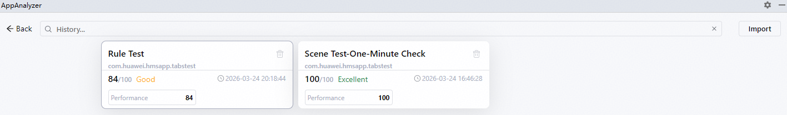
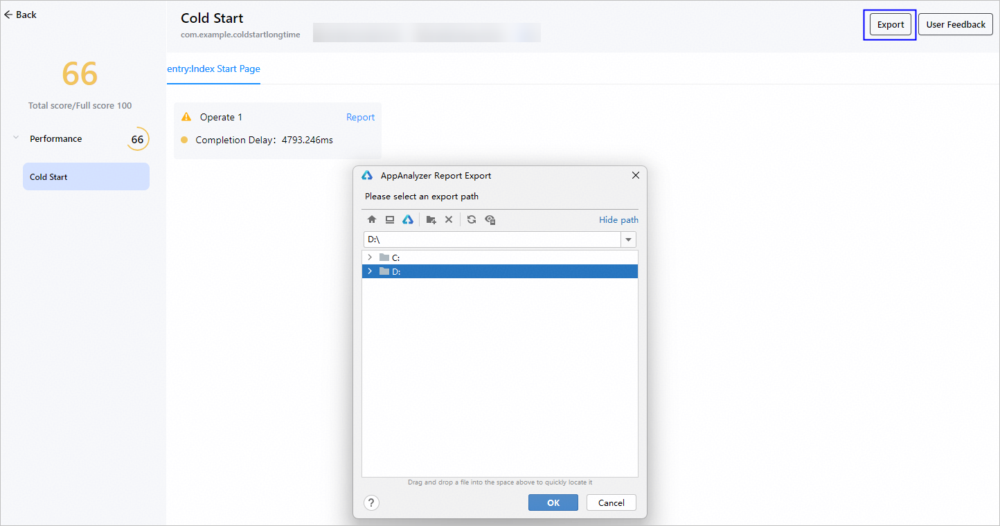
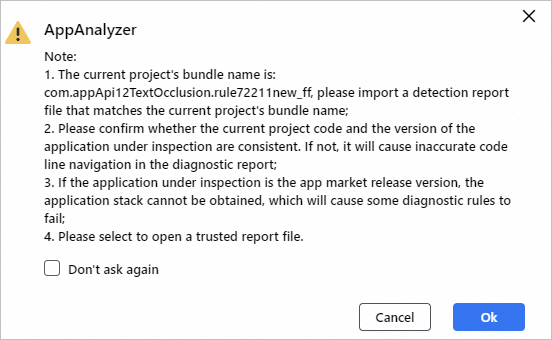

# 管理体检报告

AppAnalyzer支持查看、导出、导入体检报告，具体如下。

#### 查看报告

#### DevEco Studio 6.0.1 Beta1及以上版本

1. 在DevEco Studio中，点击菜单栏<strong>Tools &gt;</strong> <strong>AppAnalyzer</strong>，弹出AppAnalyzer页面。
2. 点击底部<strong>History</strong>按钮，可查看最近15次的体检报告卡片，点击卡片可跳转至详细的体检报告。

   

#### DevEco Studio 6.0.1 Beta1以下版本

1. 在DevEco Studio中，点击菜单栏<strong>Tools &gt;</strong> <strong>AppAnalyzer</strong>，弹出AppAnalyzer页面。
2. 点击底部<strong>历史记录</strong>按钮，可查看最近15次的体检报告记录，点击时间戳可跳转至详细的体检报告。

   

#### 导出报告

从DevEco Studio 6.1.0 Release版本开始，AppAnalyzer支持导出体检报告，以实现报告的共享。使用该功能，需要满足以下条件。

* 支持导出场景化体检、规则体检、上架前体检这三种体检方式的报告。
* 历史版本生成的体检报告不支持导出，仅DevEco Studio 6.1.0 Release及以上版本生成的体检报告才支持导出。

操作步骤如下：

1. 点击AppAnalyzer底部的<strong>History</strong>按钮，选择符合条件的报告卡片进入报告页面，点击右上角的<strong>Export</strong>按钮，选择需要保存的路径，点击<strong>OK</strong>后，等待报告导出。

   
2. 报告导出成功后，在DevEco Studio右下角会弹框提示，点击<strong>View the report</strong>可打开报告保存的路径。

   

#### 导入报告

从DevEco Studio 6.1.0 Release版本开始，如需查看他人的体检报告，可使用导入报告功能，需要满足以下条件。

* 支持导入场景化体检、规则体检、上架前体检这三种体检方式的报告。如需导入DevEco Testing的报告，请查看[导入DevEco Testing的检测报告进行诊断](`https://`developer.huawei.com/consumer/cn/doc/harmonyos-guides/ide-app-analyzer-testing)。
* 导入报告使用的DevEco Studio版本，要求不低于导出报告时使用的版本，仅校验版本号前两位，例如6.1.x.x导出的报告，可以在6.1.x.x及以上版本中导入。

操作步骤如下：

1. 点击AppAnalyzer底部的<strong>History</strong>按钮，点击右上角的<strong>Import</strong>按钮，根据界面提示，确保即将导入的报告满足相关要求。

   
2. 选择本地的体检报告zip文件，点击<strong>OK</strong>后，等待报告导入。导入成功后，AppAnalyzer会自动打开报告。

   
