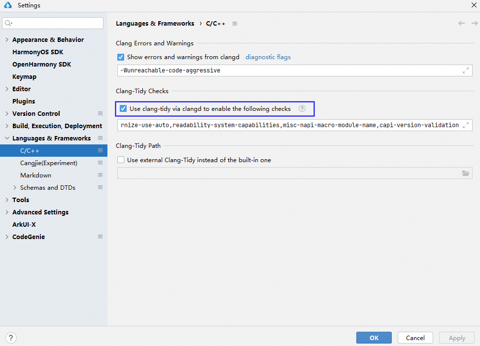
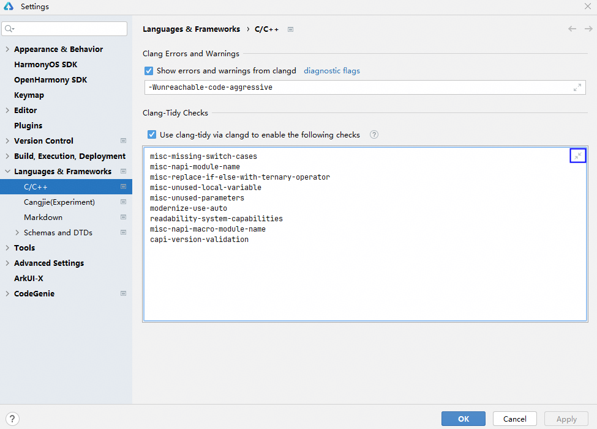
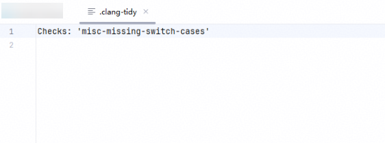
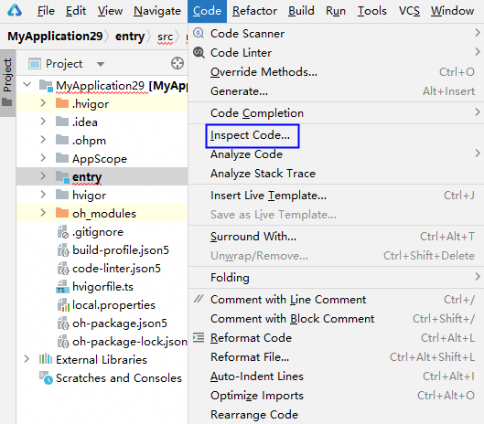
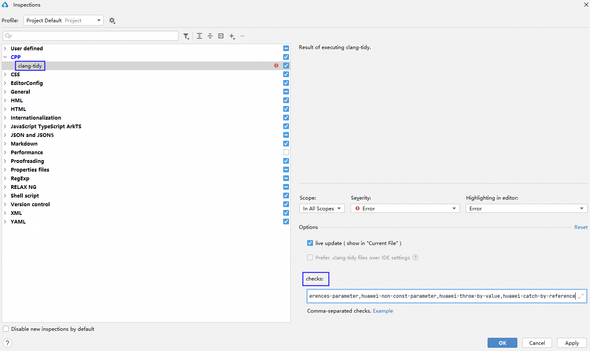
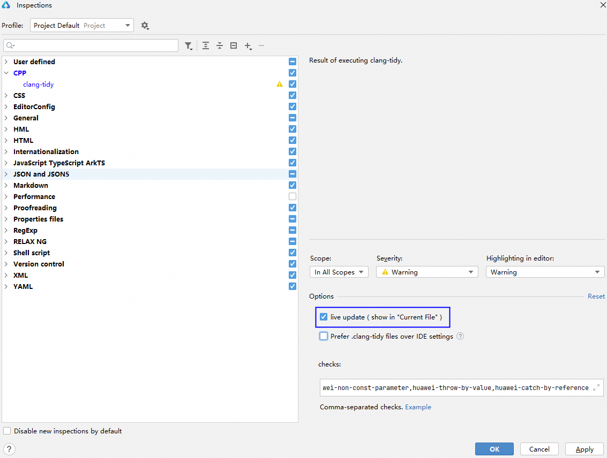
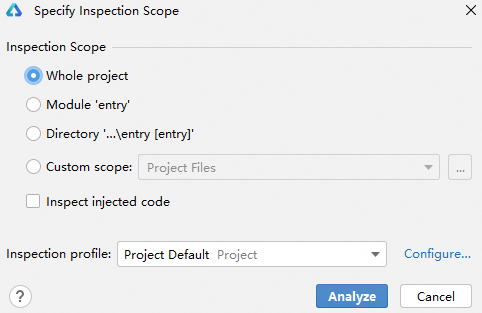
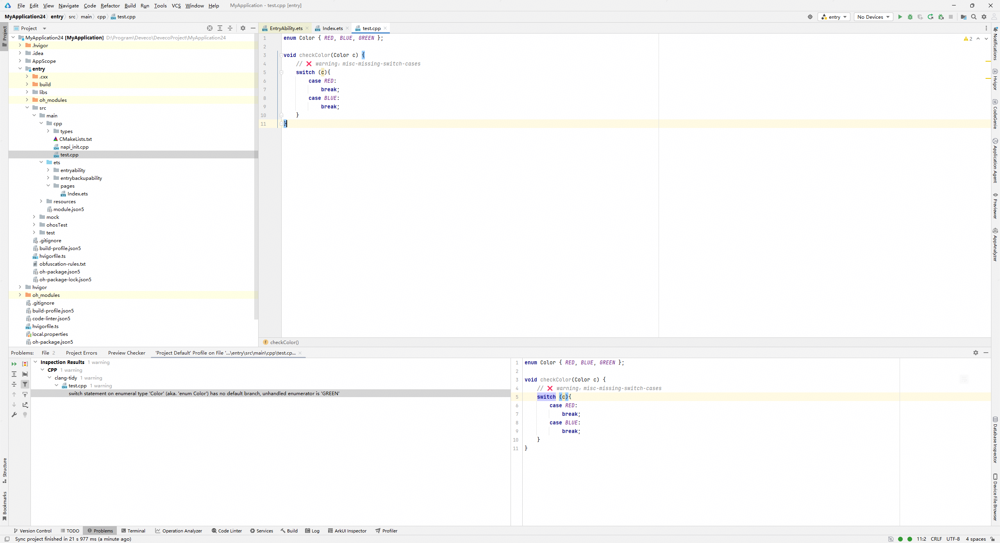

# Clang-Tidy代码检查

DevEco Studio支持通过内置的Clang-Tidy对C/C++代码进行静态检查，以及支持配置检查规则，帮助开发者快速发现C++编码的问题。

#### 检查规则配置

当前支持通过三种方式配置检查规则。

#### 方式一：在Clang-Tidy Checks中配置

1. 在菜单栏进入<strong>File &gt; Settings...</strong>（macOS系统为<strong>DevEco Studio &gt; Preferences/Settings...</strong>）&gt; <strong>Languages & Frameworks</strong> &gt; <strong>C/C++</strong>，勾选<strong>Use clang-tidy via calngd to enable the following checks</strong>选项。

   
2. 在选项下方添加检查规则，多条规则用英文逗号隔开，检查规则具体请参考[Clang-Tidy Checks网站](`https://`releases.llvm.org/19.1.0/tools/clang/tools/extra/docs/clang-tidy/checks/list.html)。

   添加检查规则时，可点击按钮展开规则填写框，在不同行添加规则。添加完成后点击按钮，多条规则会自动用英文逗号隔开。

   

#### 方式二：在 .clang-tidy文件中配置

1. 在工程根目录中或在编辑器中搜索找到和打开 .clang-tidy文件。
2. 在<strong>Checks</strong>字段中添加检查规则，多条规则使用英文逗号隔开，检查规则具体请参考[Clang-Tidy Checks网站](`https://`releases.llvm.org/19.1.0/tools/clang/tools/extra/docs/clang-tidy/checks/list.html)。

   

#### 方式三：在Inspection-checks中配置

1. 通过如下两种方法进入Inspect Code。
   * 方法在工程目录顶部或工程目录中任意文件，单击鼠标右键选择<strong>Inspect Code</strong>...。
   * 在菜单栏点击<strong>Code &gt;</strong> <strong>Inspect Code</strong>...。

   
2. 点击<strong>Configure...</strong> <strong>&gt; CPP &gt; clang-tidy</strong>，在<strong>checks</strong>中添加检查规则，多条规则使用英文逗号隔开，检查规则具体请参考[Clang-Tidy Checks网站](`https://`releases.llvm.org/19.1.0/tools/clang/tools/extra/docs/clang-tidy/checks/list.html)。

   添加检查规则时，可点击按钮展开规则填写框，在不同行添加规则。添加完成后点击按钮，多条规则会自动用英文逗号隔开。

   

#### 代码检查

使用内置Clang-Tidy进行代码自动实时检查和手动检查。

#### 自动实时检查

<strong>生效规则</strong>

若勾选了<strong>live update（show in “Current File”）</strong>，自动实时检查时，[Clang-Tidy Checks](#section386618116187)、[.clang-tidy文件](#section158716295189)和[Inspection-checks中](#section841663417181)配置的规则均生效；若不勾选<strong>live update（show in “Current File”）</strong>，[内置Clang-Tidy的手动检查](#section9609111202012)自动实时检查时，[Clang-Tidy Checks](#section386618116187)和 [.clang-tidy文件](#section158716295189)中配置的规则生效。

<strong>操作步骤</strong>

代码编辑时，工具自动提示语法错误等，将标放置在错误代码处会显示详细的错误信息。

#### 手动检查

<strong>生效规则</strong>

手动检查时，仅[Inspection-checks中配置的规则](#section841663417181)生效。

<strong>操作步骤</strong>

1. 通过如下两种方法，进入手动检查入口。
   * 方法在工程目录顶部或工程目录中任意文件，单击鼠标右键选择<strong>Inspect Code</strong>...。
   * 在菜单栏点击<strong>Code &gt;</strong> <strong>Inspect Code</strong>...。

   
2. 指定检查范围，如整个工程、某个模块或者具体文件，单击<strong>Analyze</strong>按钮执行代码检查。

   
3. 检查完成后在界面左下方可查看告警文件和告警信息，点击告警信息可跳转至具体代码位置，开发者可在界面右下方代码区和上方代码区编辑修改。

   
