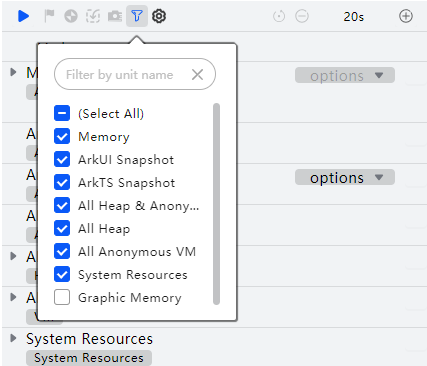
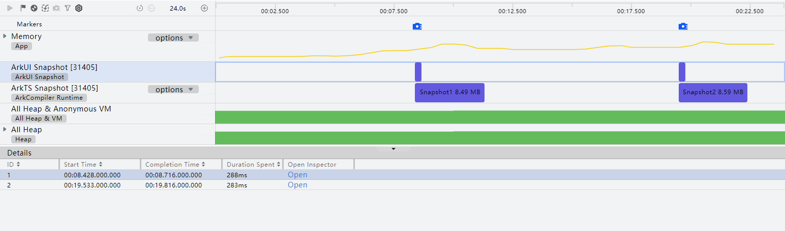
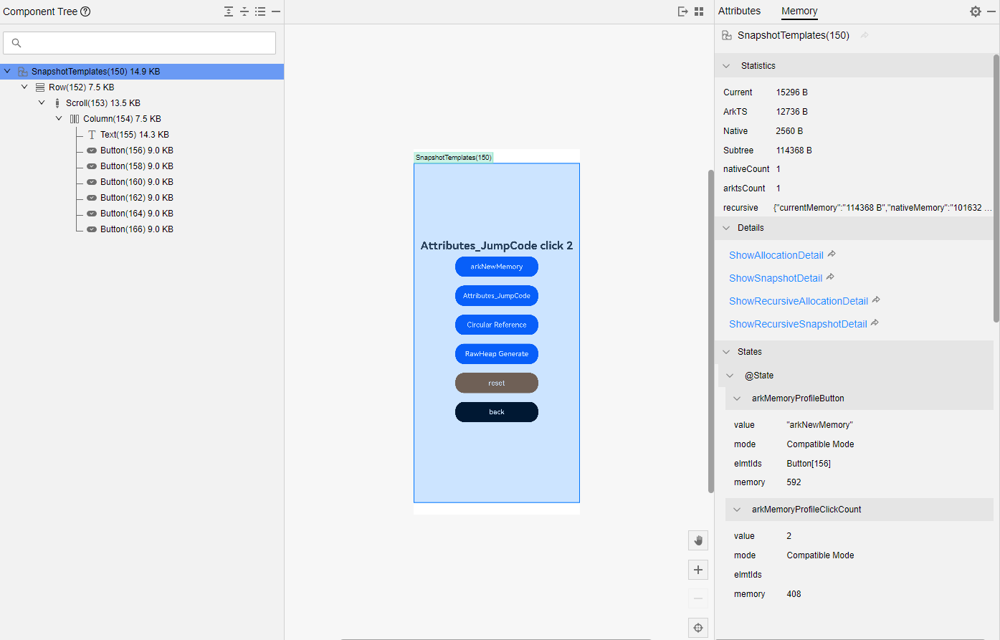
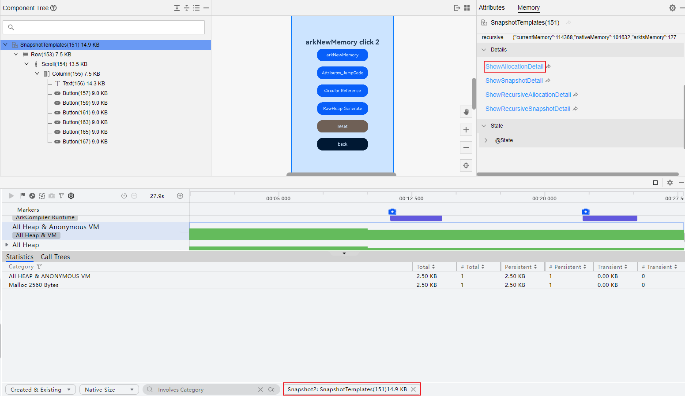

# UI组件内存：ComMemory分析

从DevEco Studio 6.1.1 Beta1版本开始，DevEco Profiler新增ComMemory模板，可以分析UI界面各组件内存的分配情况，帮助定位UI组件内存泄漏问题。

#### 操作步骤

1. 创建ComMemory分析任务并录制相关数据，操作方法可参考[性能问题定位：深度录制](https://developer.huawei.com/consumer/cn/doc/harmonyos-guides/deep-recording)，在录制前单击指定要录制的泳道；或者在[会话区](https://developer.huawei.com/consumer/cn/doc/harmonyos-guides/ide-profiler-session)选择<strong>Open File</strong>，导入历史数据。

   
2. 开始录制后可观察Memory泳道的内存使用情况，在需要定位的时刻单击启动一次快照，“ArkUI Snapshot”泳道的紫色区块表示一次快照完成。

   在“Details”页签中显示当前快照的详细信息；点击Open按钮，将在[ArkUI Inspector](https://developer.huawei.com/consumer/cn/doc/harmonyos-guides/ide-arkui-inspector)中打开相应的.arkli文件。

   
3. 在ArkUI Inspector中查看组件树。

   默认勾选“Show Component Size”，显示各组件的内存占用情况。点击，可勾选“Show Recursive Size”，显示各组件为根的子树的内存占用情况。

   
4. 在ArkUI Inspector的<strong>Memory</strong> &gt;<strong>Statistics</strong>中，查看组件的内存统计信息。
   * Current：当前组件ArkTS内存和Native内存的占用情况。
   * ArkTS：当前组件对应的ArkTS堆快照对象的[Retained Size](https://developer.huawei.com/consumer/cn/doc/harmonyos-guides/ide-snapshot-basic-operations#li19851458524)。
   * Native：当前组件新增占用的Native内存。
   * Subtree：当前组件及其子组件的Current内存之和。
   * nativeCount：当前组件存活的Native分配内存个数。
   * arktsCount：当前组件的ArkTS堆快照对象个数。
   * recursive：递归统计信息。

   
5. 在ArkUI Inspector的<strong>Memory</strong> &gt; <strong>Details</strong>中，点击Details中任一项后，打开DevEco Profiler查看显示组件的详情。
   * ShowAllocationDetail：显示当前组件的Allocation详情。
   * ShowSnapshotDetail：显示当前组件的Snapshot详情，系统组件不显示该项。
   * ShowRecursiveAllocationDetail：显示当前组件及其子组件的Allocation详情。
   * ShowRecursiveSnapshotDetail：显示当前组件及其子组件的Snapshot详情。

   
6. 在ArkUI Inspector的<strong>Memory</strong> &gt; <strong>States</strong>中，查看UI组件的状态变量内存。memory字段表示该状态变量在对应组件的ArkTS堆快照中的Retained Size，更多请参考[查看UI组件的状态变量](https://developer.huawei.com/consumer/cn/doc/harmonyos-guides/ide-arkui-inspector#section19923158103412)。

   
7. 在中间栏点击可以将包含内存信息的组件树快照导出到本地。
