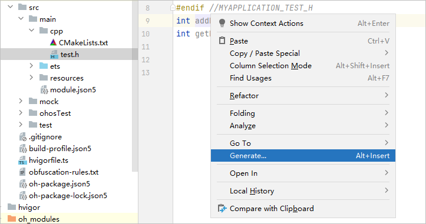
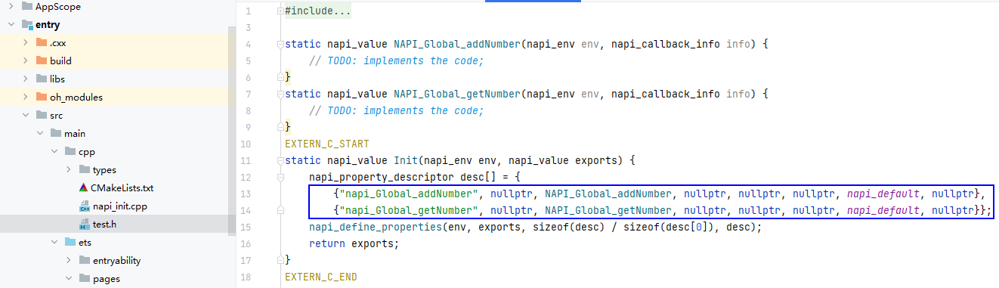
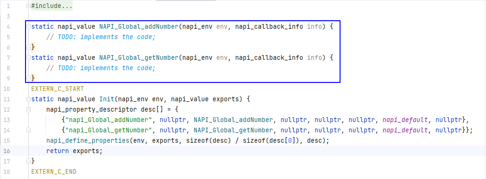

# 跨语言代码编辑

#### 生成胶水代码函数框架

DevEco Studio提供跨语言代码编辑功能。当开发者需要使用NAPI封装暴露给ArkTS/JS的接口时，在C++头文件内，通过右键Generate &gt; NAPI，快速生成当前函数或类的胶水代码函数框架。

1. 检查当前C++的entry &gt; src &gt; main &gt; cpp路径下，是否已包含napi\_init.cpp文件。如不存在该文件，请在头文件（头文件支持类型：.hpp，.hxx，.hh，.h）中，将光标放置在任意函数名/类名处（当前支持bool，int，string，void，float，double，std::array，std::vector等参数类型），单击右键选择Generate &gt; NAPI，生成胶水代码框架文件napi\_init.cpp。

   
2. 若工程中已存在或创建完成napi\_init.cpp文件，请在头文件中需要被调用的函数/类名处，单击右键选择Generate &gt; NAPI，将在napi\_init.cpp文件napi\_property\_descriptor字段中分别注册对应的函数/类的信息。

   
3. 在napi\_init.cpp文件中TODO位置，补充相应的功能实现代码。

   

#### 跨语言快速生成函数定义

当前支持在跨语言的d.ts文件中，通过Generate native implementation功能，一键生成C++文件中对应函数定义。

将光标悬浮在未定义的函数名处，在悬浮窗中点击<strong>Generate native implementation</strong>，或点击页面上出现的红色灯泡图标，选择<strong>Generate native implementation</strong>，生成函数定义。

