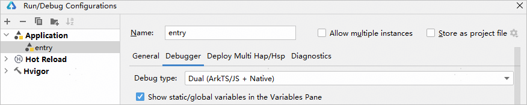
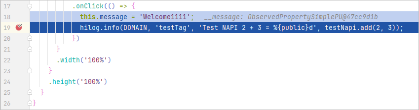
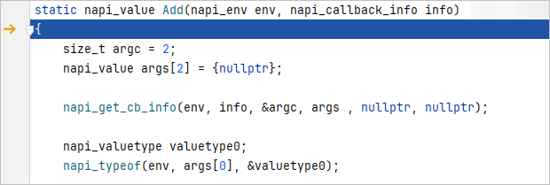
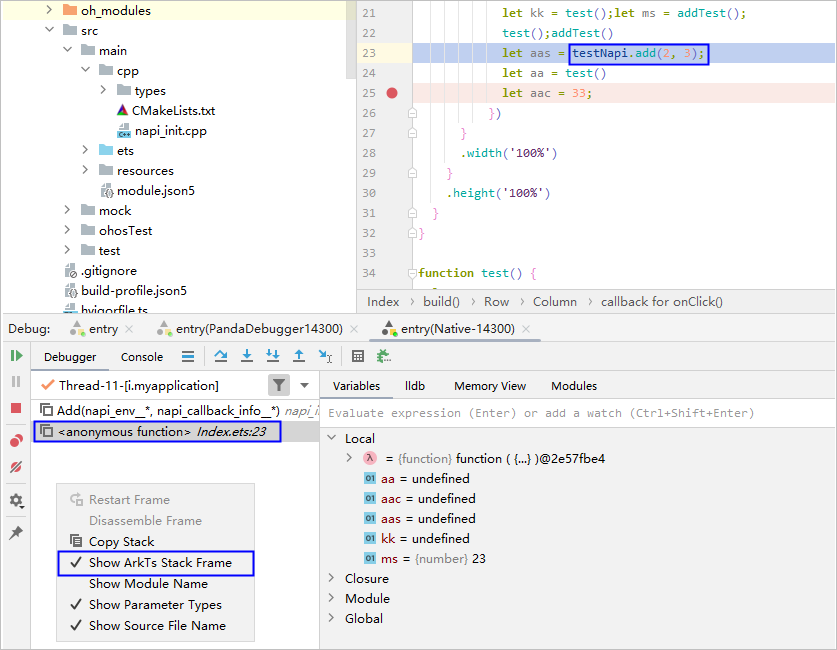
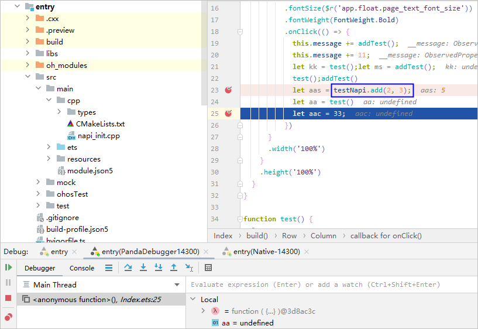

# 跨语言调试

DevEco Studio支持C++和ArkTS的跨语言调试，可以同时调试这两种语言。整体操作体验与单一语言调试一致，无需额外在对应语言去手动添加断点，提升了使用两种语言混合开发的调试效率。

1. 将DevEco Studio与设备进行连接。如果使用真机设备，请先对应用/元服务进行签名，具体请参考[为应用/元服务进行签名](`https://`developer.huawei.com/consumer/cn/doc/harmonyos-guides/ide-signing)。
2. 在菜单栏单击<strong>Run &gt; Edit Configurations</strong>，选择<strong>Application</strong>下的模块名（如entry），然后在右侧窗口中选择<strong>Debugger</strong>，将<strong>Debug type</strong>设置为“Dual(ArkTS/JS + Native)”。

   
3. 代码调试执行到ArkTS调用C++方法处，点击Step Into可以进入到对应的C++方法的第一行代码处。

   

   
4. 进入到C++代码后，可以从左下角Frames区域查看C++的调用栈，如需查看对应的ArkTS调用栈，在Frames区域中单击鼠标右键，勾选<strong>Show ArkTs Stack Frame。</strong>点击调用栈可以跳转到对应的代码行。

   

   从DevEco Studio 6.0.0 Beta3版本开始，支持查看ArkTS变量，其他变量相关的操作暂不支持。

   
5. ArkTS调用C++方法之后的代码存在断点时，点击Resume可以回到下一个ArkTS断点处，继续进行ArkTS代码调试。

   
