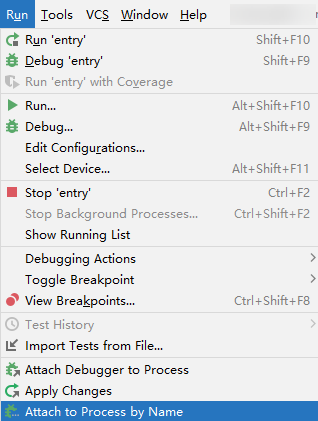
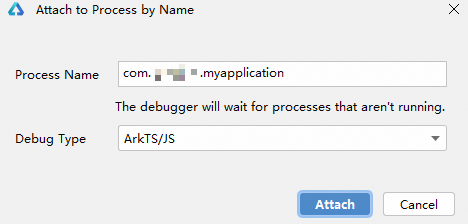

# 等待调试

开发者可以通过将某个应用设置为“等待调试模式”，然后当开发者需要对应用进行调试时，拉起应用即可快速进入调试。

* 应用设置为“等待调试模式”后，此时如果启动普通的debug调试，将会取消当前的等待调试模式。
* 设置“等待调试模式”前，需要将应用安装到设备上。

#### 操作步骤

1. 在设备选择框中选择调试的设备，并单击Run &gt; Attach to Process by Name。

   
2. 选择需要设置为“等待调试模式”的应用（默认为当前工程），选择需要进行调试的调试类型。然后单击<strong>Attach</strong>，即可将该应用设置为“等待调试模式”。

   

   此时会在DevEco Studio底部显示一个等待进度条，在应用被拉起之前，将一直处于等待状态。可通过进度条右侧的取消按钮进行取消。

   
3. 拉起设备端应用，此时将会进入调试。

   
