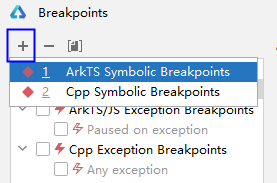
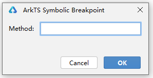
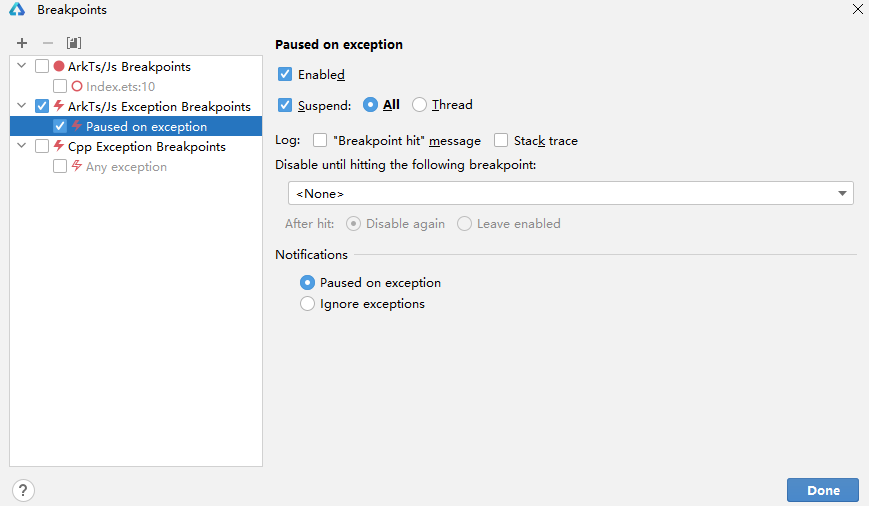

# 使用断点

DevEco Studio ArkTS支持行断点、日志断点等多种不同类型的断点，这些断点可以触发不同的操作。

#### 行断点

行断点是最常见的类型，用于在指定的代码行暂停应用的执行，在暂停时，您可以检查变量，对表达式求值，然后逐行执行，以确定运行时错误的原因。

如需添加行断点，请按以下步骤操作：

1. 找到您要暂停执行的代码行。
2. 点击该代码行的左侧边线，或将光标置于该行上并按<strong>Ctrl + F8</strong>（macOS为<strong>Command+F8</strong>）。

   当您设置断点时，相应的代码行旁边会出现一个红点，如图。

   

   在设置的断点红点处，单击鼠标右键，在Condition中可以设置条件断点，此类断点仅会在满足特定条件时才会暂停应用。

   
3. 点击Debug图标，开始调试。如果您的应用已经在运行，请点击Attach Debugger to Process图标。

   当应用运行到代码处，会在代码处停住，并高亮显示。

   

#### 日志断点

在[BreakPoints](#section168791742202819)某个断点的配置中，勾选以下类型的Log，可以使进程运行到断点时在Console窗口打印相应日志。

* 勾选<strong>"Breakpoint hit"message</strong>，程序运行到断点时，打印“Breakpoint reached”。
* 勾选<strong>Stack trace</strong>，程序运行到断点时，打印当前线程的堆栈。
* 勾选<strong>Evaluate and log</strong>，并添加表达式，程序运行到断点时，打印表达式的值。

未勾选Enable的断点不会打印日志，未勾选Suspend execution的断点会打印日志，不满足所设置的Condition的断点不会打印日志。

#### 临时断点

在[BreakPoints](#section168791742202819)某个断点的配置中，勾选<strong>Remove once hit</strong>，该断点只生效一次，生效后该断点会被删除。

#### 函数断点

从DevEco Studio 6.0.0 Beta2版本开始，支持在ArkTS代码中设置函数断点。

函数断点也叫方法断点或符号断点，使用函数名设置断点，当程序运行到对应函数时，中断进程。

在[BreakPoints](#section168791742202819)中，点击<strong>+ &gt; ArkTS Symbolic Breakpoints</strong>，在弹出窗口中填写函数名，添加函数断点。

 

DevEco Studio 6.0.1 Release及以下版本，调试过程中如果命中在C++断点，则无法添加和移除ArkTS函数断点，6.0.2 Beta1及以上版本，支持添加和移除。

#### 异常断点

异常断点会在应用执行时发生异常的地方暂停应用。

在[BreakPoints](#section168791742202819)中，勾选<strong>ArkTS/Js Exception Breakpoints</strong>，开启异常断点。

当调试应用程序中出现异常时，会在异常处高亮，并且代码左侧有标志，并展示当前Frames和Variable，以及错误信息。

#### 断点管理

在设置的程序断点红点处，单击鼠标右键。然后单击<strong>More</strong>或按快捷键<strong>Ctrl+Shift+F8</strong>（macOS为<strong>Shift+Command+F8</strong>），可以管理断点。

或者在“Debug”窗口中点击<strong>View Breakpoints</strong> 图标。

