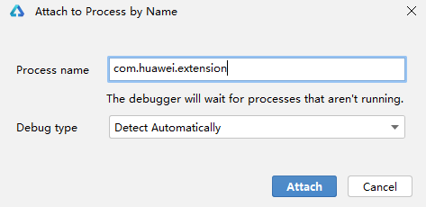
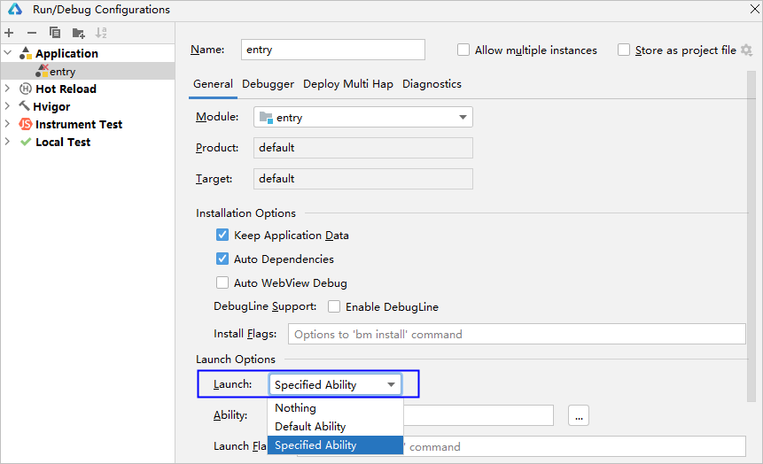
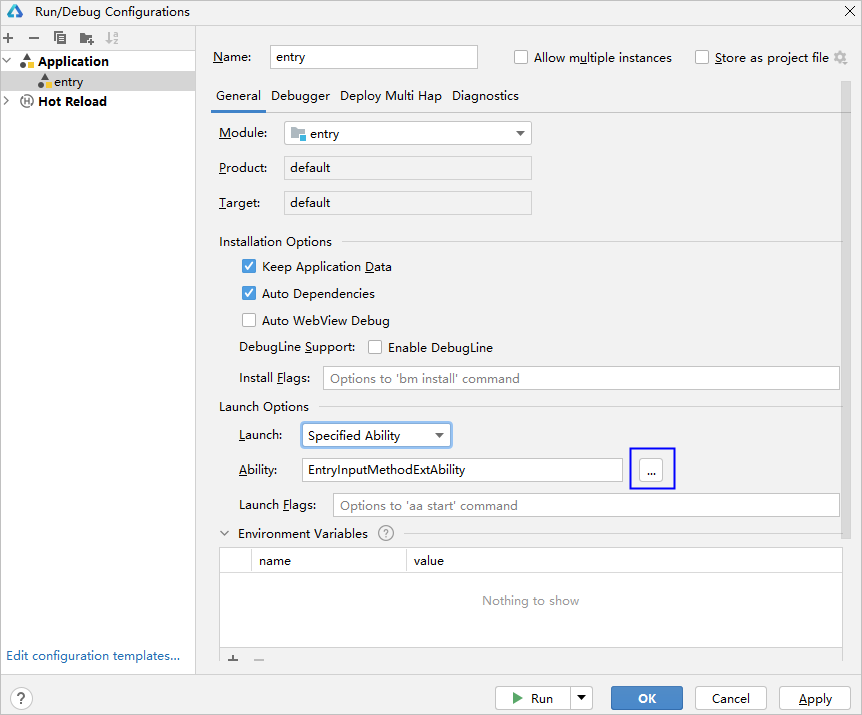

# extension调试

开发者可通过两种方式对[Extension Ability](`https://`developer.huawei.com/consumer/cn/doc/harmonyos-guides/extensionability-overview)生命周期函数进行调试。

* 应用安装到设备上后，通过等待调试方式进行调试。
* 修改运行调试配置项，指定当前运行或调试的Ability为Extension Ability。

#### 等待调试方式

1. 参考[等待调试](`https://`developer.huawei.com/consumer/cn/doc/harmonyos-guides/ide-debug-arkts-attach-to-process)对当前调试工程进行调试。

   
2. 在Extension Ability生命周期内设置断点。

   
3. 等待Extension Ability生命周期函数代码调用从而命中断点。

   

#### 修改运行配置方式

1. 在运行调试窗口，运行配置项<strong>Launch Options</strong>选择<strong>Specified Ability</strong>。

   
2. 选择需要进行调试的Extension Ability。

   
3. 点击<strong>OK</strong>保存配置后，点击调试按钮，启动调试即可命中 Extension Ability 中的生命周期函数断点。

   
