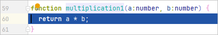

# 智能步入

当编辑器上一行存在多个函数嵌套或调用时，开发者可以通过Smart Step Into的能力来步入到想要调试的函数内，如果在调试时想跳过某些文件，也可以自定义需要跳过的文件列表。

#### 智能步入

1. 启动调试，如果断点所在的一行内存在多个方法调用，可以通过点击调试窗口的按钮或快捷键Shift + F7高亮展示可进入函数。

   
2. 点击其中一个函数即可步入。

   

   

#### 过滤脚本文件

1. 点击<strong>File &gt; Settings</strong>（macOS为<strong>DevEco Studio &gt; Preferences/Settings</strong>） <strong>&gt;</strong> <strong>Build, Execution, Deployment &gt; Debugger &gt; Stepping</strong>，勾选<strong>Do not step into ArkTS scripts</strong>， 可在调试时禁止智能步入某些脚本。使用工具栏按钮管理要跳过的脚本列表。

   
2. 单击 <strong>+</strong> 按钮可添加新的脚本过滤器。在打开的对话框中，输入要跳过的文件名称或使用通配符。例如，如果要始终跳过 JavaScript文件，请输入 \*.js。

   
