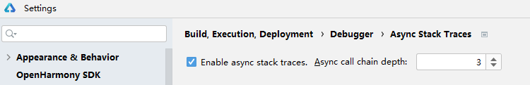
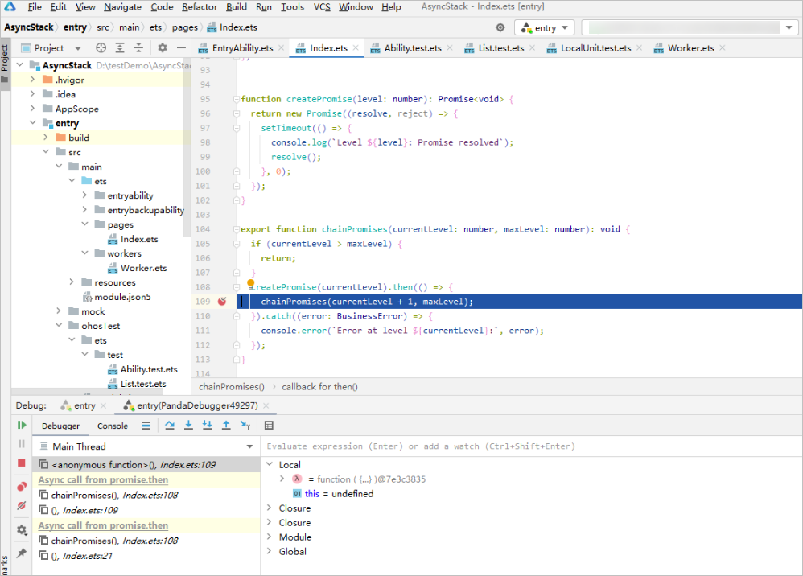

# 查看异步函数堆栈

从DevEco Studio 5.1.1 Beta1版本开始，开发者可通过打开异步堆栈跟踪开关、设置异步调用链深度来跟踪异步函数调用的顺序。

* 异步堆栈跟踪开关为全局设置，开启后所有工程都生效。
* 修改异步堆栈跟踪开关或异步调用链深度后，需要重新启动调试或启动新的调试会话才会生效。
* setTimeout函数异步堆栈不生效。
* 异步堆栈不展示变量列表。

1. 点击<strong>File &gt; Settings</strong>（macOS为<strong>DevEco Studio &gt; Preferences/Settings</strong>） <strong>&gt; Build, Execution, Deployment &gt; Debugger &gt; Async Stack Traces</strong>。
   * 勾选<strong>Enable async stack traces</strong>打开异步堆栈跟踪开关。
   * 设置异步调用链深度<strong>Async call chain depth</strong>大于0，才能在调试堆栈时展示调用链对应层数。

   
2. 在异步调用链中设置断点，启动调试，命中断点后，堆栈列表将展示对应调用链层数。如果实际的调用链层数比设置的异步调用链深度小，则只展示实际调用链层数。每个异步调用链以<strong>Async call from</strong>分隔，后面是调用函数。

   
