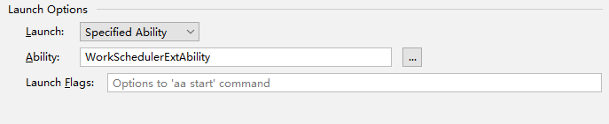
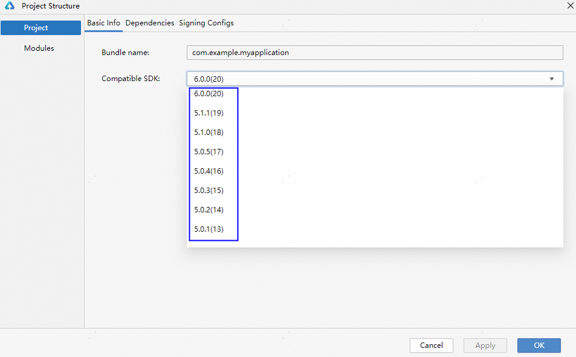
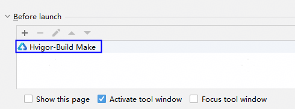

# 运行配置错误码

#### 00401000 获取包名信息失败

<strong>错误信息</strong>

The bundleName attribute does not exist.

<strong>错误描述</strong>

获取包名信息失败。

<strong>可能原因</strong>

app.json5文件的bundleName为空或者缺少bundleName配置。

<strong>处理步骤</strong>

检查下app.json5文件的bundleName是否正确。

#### 00401001 attach调试获取不到product

<strong>错误信息</strong>

The product to debug cannot be empty.

<strong>错误描述</strong>

attach调试获取不到product。

<strong>可能原因</strong>

当前模块配置的product不正确。

<strong>处理步骤</strong>

检查工程级build-profile.json5文件中对应模块的applyToProducts配置是否正确，详细配置可以参考[构建定义的目标产物](`https://`developer.huawei.com/consumer/cn/doc/harmonyos-guides/ide-customized-multi-targets-and-products-guides#section2554174114463)。

#### 00401002 attach调试获取不到target

<strong>错误信息</strong>

The target to debug cannot be empty.

<strong>错误描述</strong>

attach调试获取不到target。

<strong>可能原因</strong>

当前模块配置的target不正确。

<strong>处理步骤</strong>

检查工程级build-profile.json5文件中对应模块的applyToProducts配置是否正确，详细配置可以参考[构建定义的目标产物](`https://`developer.huawei.com/consumer/cn/doc/harmonyos-guides/ide-customized-multi-targets-and-products-guides#section2554174114463)。

#### 00401003 启动调试失败

<strong>错误信息</strong>

Failed to start debugging. Click the Debug button again to retry.

<strong>错误描述</strong>

启动调试失败。

<strong>可能原因</strong>

启动调试异常。

<strong>处理步骤</strong>

重新点击Debug按钮启动调试。

#### 00401004 SysCap能力校验不通过

<strong>错误信息</strong>

Please try to match the API version of the device and the app. The current device does not contain the following SysCap attributes in the rpcid.json file: XXX. Make sure the device supports all the SysCap attributes required for running the app.

<strong>错误描述</strong>

设备缺少SysCap能力，应用需要的XXX能力在当前连接的设备不支持。

<strong>可能原因</strong>

设备版本和应用不配套。

<strong>处理步骤</strong>

* 方式一：升级设备系统版本。
* 方式二：在hap模块的src/main目录下新建syscap.json文件，移除错误信息中不支持的SysCap。

  以SystemCapability.Security.DeviceAuth为例：

  ```
  // entry/src/main/syscap.json
  {
    "devices": {
      "general": ["phone"]  // 同module.json5中的deviceTypes
    },
    "production": {
      "removedSysCaps": [
        "SystemCapability.Security.DeviceAuth"
      ]
    }
  }
  ```

#### 00401005 未指定Ability

<strong>错误信息</strong>

Error running entry : Ability not specified.

<strong>错误描述</strong>

未指定Ability。

<strong>可能原因</strong>

在运行/调试配置面板中选择Specified Ability后，没有指定Ability。

<strong>处理步骤</strong>

打开运行/调试配置面板，在Specified Ability下面设置Ability。



#### 00401006 预览器不支持以release构建模式进行调试

<strong>错误信息</strong>

Cannot debug the project in previewer when its build mode is release.

<strong>错误描述</strong>

预览器不支持以release构建模式进行调试。

<strong>可能原因</strong>

当前使用预览器调试，并且构建模式是release。

<strong>处理步骤</strong>

修改构建模式为debug后再次启动调试。

#### 00401007 工程同步过程中不能运行/调试

<strong>错误信息</strong>

Project sync is in progress. Wait until it is complete before you start running or debugging.

<strong>错误描述</strong>

工程正在同步中，需要等待工程同步完成后再启动运行/调试。

<strong>可能原因</strong>

在工程同步过程中启动运行/调试。

<strong>处理步骤</strong>

等待工程同步完成后再启动运行/调试。

#### 00401008 运行/调试配置面板中的模块为空

<strong>错误信息</strong>

No module found. Make sure the project sync is completed successfully and the module is set in Edit Configuration &gt; General.

<strong>错误描述</strong>

当前运行/调试配置面板中的模块为空。

<strong>可能原因</strong>

工程同步失败。

<strong>处理步骤</strong>

重新同步下工程并确保同步成功。

#### 00401009 运行获取不到target

<strong>错误信息</strong>

The target can not be empty. Check the build-profile.json5 file of the project root directory and make sure the targets of the modules in configuration is set to specified product: default in applyToProducts.

<strong>错误描述</strong>

运行时target不能为空。

<strong>可能原因</strong>

当前模块配置的target不正确。

<strong>处理步骤</strong>

检查工程级build-profile.json5文件中对应模块的applyToProducts配置是否正确，详细配置可以参考[构建定义的目标产物](`https://`developer.huawei.com/consumer/cn/doc/harmonyos-guides/ide-customized-multi-targets-and-products-guides#section2554174114463)。

#### 00401010 运行获取不到product

<strong>错误信息</strong>

The product can not be empty.

<strong>错误描述</strong>

运行时product不能为空。

<strong>可能原因</strong>

product配置不正确。

<strong>处理步骤</strong>

检查工程级build-profile.json5文件中对应模块的applyToProducts配置是否正确，详细配置可以参考[构建定义的目标产物](`https://`developer.huawei.com/consumer/cn/doc/harmonyos-guides/ide-customized-multi-targets-and-products-guides#section2554174114463)。

#### 00401011 没有启动任何Ability时，无法运行或调试应用

<strong>错误信息</strong>

Cannot run or debug the app when no ability is launched. Specify an ability (the default or any specified one) to launch under Launch Options in Run/Debug Configurations, and then try again.

<strong>错误描述</strong>

当没有启动任何Ability时，无法运行或调试应用。请在运行/调试配置面板中的“启动选项”下指定一个Ability（default或任意指定一个），然后重试。

<strong>可能原因</strong>

运行/调试配置面板的Launch Options为Nothing。

<strong>处理步骤</strong>

请在运行/调试配置面板中的“启动选项”下指定一个Ability（default或任意指定一个），然后重试。

#### 00401012 预览器调试不支持ExtensionAbility

<strong>错误信息</strong>

Debugging with Previewer does not support the ExtensionAbility type.

<strong>错误描述</strong>

预览器调试不支持ExtensionAbility。

<strong>可能原因</strong>

预览器调试时，运行/调试配置面板的Specified Ability是ExtensionAbility。

<strong>处理步骤</strong>

请在运行/调试配置面板中的“启动选项”下指定一个Ability（default或指定一个非ExtensionAbility），然后重试。

#### 00401013 预览器调试不支持此应用

<strong>错误信息</strong>

Previewer does not support this app.

<strong>错误描述</strong>

预览器调试不支持此应用。

<strong>可能原因</strong>

1. 不支持FA模型工程。
2. 不支持API 10以下工程。

<strong>处理步骤</strong>

1. 使用预览器运行调试API 10及以上Stage工程。
2. 重新选择其他设备/仿真器运行调试。

#### 00401014 仿真器不支持此应用

<strong>错误信息</strong>

Simulator does not support this app.

<strong>错误描述</strong>

仿真器不支持此应用。

<strong>可能原因</strong>

应用不是Lite Wearable应用。

<strong>处理步骤</strong>

1. 如果是非Lite Wearable工程，请使用真机或者模拟器运行。
2. 如果是Lite Wearable工程，确保config.json文件的设备列表中包含liteWearable。

#### 00401015 请先选择设备

<strong>错误信息</strong>

Select a device first.

<strong>错误描述</strong>

请先选择设备。

<strong>可能原因</strong>

没有选择设备。

<strong>处理步骤</strong>

请连接设备，或者启动模拟器并选择设备，再启动运行或调试。

#### 00401016 当前操作出现异常，请重新运行

<strong>错误信息</strong>

Some exceptions occurred in this operation, please re-run.

<strong>错误描述</strong>

当前操作出现异常，请重新运行。

<strong>可能原因</strong>

当前连接设备异常。

<strong>处理步骤</strong>

拔插下设备再重新运行。

#### 00401017 安装Hap包失败

<strong>错误信息</strong>

FileTransfer Failed: Error while Deploy Hap.

<strong>错误描述</strong>

安装Hap包失败。

<strong>可能原因</strong>

当前设备连接异常。

<strong>处理步骤</strong>

* 使用真机场景：请更换数据线或PC侧USB接口后尝试。
* 使用模拟器场景：
  + 在Local Emulator的设备列表窗口，点击“Wipe User Data”清除数据，启动模拟器并重新运行工程。
  + 打开命令行终端，并进入DevEco Studio安装目录下的sdk\default\openharmony\toolchains路径，执行`hdc kill -r`命令，启动模拟器，重新运行工程。

#### 00401018 获取设备系统API版本失败

<strong>错误信息</strong>

Failed to get the device apiVersion.

<strong>错误描述</strong>

获取设备系统API版本失败。

<strong>可能原因</strong>

当前选择设备连接异常。

<strong>处理步骤</strong>

重新连接设备或者重启DevEco Studio。

#### 00401019 工程配置的最低兼容API版本和设备API版本不匹配

<strong>错误信息</strong>

compatibleSdkVersion and releaseType of the app do not match the apiVersion and releaseType on the device.

<strong>错误描述</strong>

工程配置的最低兼容API版本和设备API版本不匹配。

<strong>可能原因</strong>

当前工程配置的最低兼容版本高于设备API版本。

<strong>处理步骤</strong>

使用命令`hdc shell param get const.ohos.apiversion`查询当前设备的API 版本，并对比工程级build-profile.json5文件中的compatibleSdkVersion字段。如果版本不匹配，可以使用以下解决办法：

方法一：请升级设备系统版本以匹配当前工程版本。在系统设置界面升级设备系统。

方法二：降低工程的API版本，点击DevEco Studio右上角的，Compatible SDK选择更低的版本号，以兼容设备的API版本。



#### 00401020 没有可用的端口号

<strong>错误信息</strong>

No port available.

<strong>错误描述</strong>

没有可用的端口号。

<strong>可能原因</strong>

当前电脑端口被管控或者端口号被占用。

<strong>处理步骤</strong>

1. 排查是否有安全软件禁用端口，关闭端口管控。
2. 重启电脑。

#### 00401021 找不到可执行的ability

<strong>错误信息</strong>

No executable ability found.

<strong>错误描述</strong>

找不到可执行的ability。

<strong>可能原因</strong>

配置的ability不对，工程没同步成功。

<strong>处理步骤</strong>

重新同步工程。

#### 00401022 本地HAP包不存在

<strong>错误信息</strong>

The local package does not exist.

<strong>错误描述</strong>

本地HAP包不存在。

<strong>可能原因</strong>

1. 没有构建打包成功。
2. 运行配置取消了构建任务，本地没有HAP包。
3. 工程同步异常，没有生成构建需要的sync目录。

<strong>处理步骤</strong>

1. 点击菜单栏<strong>Build &gt; Clean Project</strong>清理缓存，再重新运行。
2. 检查运行配置是否取消了构建任务，如果取消就重新添加构建任务。

   
3. 点击菜单栏<strong>File &gt; Sync and Refresh Project</strong>重新同步工程，等待同步成功后再运行。

#### 00401023 hap包中config.json或module.json文件不存在

<strong>错误信息</strong>

The config.json or module.json file in the hap file does not exist.

<strong>错误描述</strong>

hap包中config.json或module.json文件不存在。

<strong>可能原因</strong>

编译构建生成的hap包不正确。

<strong>处理步骤</strong>

点击菜单栏<strong>Build &gt; Clean Project</strong>清理缓存，再重新运行。

#### 00401024 HAP文件数量超过100w

<strong>错误信息</strong>

Make sure the file count in the HAP does not exceed 1,000,000.

<strong>错误描述</strong>

HAP文件数量不要超过1,000,000。

<strong>可能原因</strong>

生成的HAP包里面文件数量超过了1,000,000，可能资源文件太多。

<strong>处理步骤</strong>

排查并精简下工程资源文件再重新打包。

#### 00401025 hap包中config.json或module.json文件内容为空

<strong>错误信息</strong>

The config.json or module.json file content is empty.

<strong>错误描述</strong>

hap包中config.json或module.json文件内容为空。

<strong>可能原因</strong>

编译构建生成的hap包不正确。

<strong>处理步骤</strong>

点击菜单栏<strong>Build &gt; Clean Project</strong>清理缓存，再重新运行。

#### 00401026 当前连接设备类型或apiVersion与工程配置不匹配

<strong>错误信息</strong>

The deviceType or apiVersion of the target device does not match that configured in the XXX file.

<strong>错误描述</strong>

当前连接设备的类型或apiVersion与工程配置不匹配。

<strong>可能原因</strong>

1. 工程中config.json或module.json5文件配置的设备类型和当前选择的设备不匹配。
2. 模块级build-profile.json5文件的apiVersion和当前选择的设备不匹配。

<strong>处理步骤</strong>

1. 更换匹配的设备。
2. 在config.json或module.json5文件增加当前连接的设备类型，模块级build-profile.json5文件的apiVersion增加当前设备对应的API。

#### 00401027 当前连接设备为空

<strong>错误信息</strong>

The current device cannot be empty.

<strong>错误描述</strong>

当前连接设备为空。

<strong>可能原因</strong>

未连接设备，或设备连接异常。

<strong>处理步骤</strong>

重新拔插下设备再启动调试。

#### 00401028 FA模型工程不支持DebugLine

<strong>错误信息</strong>

The FA model does not support the debugLine.

<strong>错误描述</strong>

FA模型工程不支持debugLine。

<strong>可能原因</strong>

FA工程模型不支持debugLine。

<strong>处理步骤</strong>

在运行/调试配置面板取消勾选\<strong\>[Enable DebugLine](`https://`developer.huawei.com/consumer/cn/doc/harmonyos-guides/ide-run-debug-configurations#section21619254511)</strong>。

#### 00401029 获取SDK版本失败

<strong>错误信息</strong>

Failed to obtain the SDK version. Check whether the SDK is installed.

<strong>错误描述</strong>

获取SDK版本失败，检查SDK是否安装。

<strong>可能原因</strong>

未下载SDK或者用户自定义SDK配置有问题。

<strong>处理步骤</strong>

下载对应SDK或者重新配置自定义SDK。

#### 00401030 SDK版本太低，不支持DebugLine

<strong>错误信息</strong>

The SDK version is too low to support DebugLine. Update it to 4.1.0.21 or a later version.

<strong>错误描述</strong>

SDK版本太低，不支持DebugLine，需要升级SDK版本到4.1.0.21及以上版本。

<strong>可能原因</strong>

当前SDK版本低于4.1.0.21版本。

<strong>处理步骤</strong>

在官网上重新[下载DevEco Studio](`https://`developer.huawei.com/consumer/cn/download/deveco-studio)。

#### 00401031 获取Hvigor版本失败

<strong>错误信息</strong>

Failed to obtain the Hvigor version.

<strong>错误描述</strong>

获取Hvigor版本失败。

<strong>可能原因</strong>

DevEco Studio中缺少hvigor工具。

<strong>处理步骤</strong>

检查DevEco Studio安装目录的tools目录下是否有hvigor工具，如果不存在，在官网上重新[下载DevEco Studio](`https://`developer.huawei.com/consumer/cn/download/deveco-studio)。

#### 00401032 Hvigor版本太低，不支持DebugLine

<strong>错误信息</strong>

The Hvigor version is too low to support DebugLine. Update it to 3.0.3-rc.1.s or a later version.

<strong>错误描述</strong>

Hvigor版本太低，不支持DebugLine，需要升级Hvigor版本到3.0.3-rc.1.s及以上版本。

<strong>可能原因</strong>

DevEco Studio版本太低。

<strong>处理步骤</strong>

在官网上重新[下载DevEco Studio](`https://`developer.huawei.com/consumer/cn/download/deveco-studio)。

#### 00401033 当前SDK版本不支持Tsan

<strong>错误信息</strong>

TSan is not supported by the current SDK version. Update the DevEco Studio to the latest version and make sure the API version of your project is 12 or later.

<strong>错误描述</strong>

当前SDK版本不支持Tsan，升级DevEco Studio到最新版本并且确保工程是API 12及以上版本。

<strong>可能原因</strong>

DevEco Studio版本太低或者工程低于API 12。

<strong>处理步骤</strong>

升级DevEco Studio到最新版本并且确保工程是API 12及以上版本。

#### 00401034 主模块为空

<strong>错误信息</strong>

Main module is null.

<strong>错误描述</strong>

主模块为空。

<strong>可能原因</strong>

工程未同步成功。

<strong>处理步骤</strong>

点击菜单栏<strong>File &gt; Sync and Refresh Project</strong>重新同步下工程，确保工程同步成功再运行工程。

#### 00401035 当前设备不支持线程检测

<strong>错误信息</strong>

Thread Sanitizer is not supported on the target device. Disable this feature under Run &gt; Edit Configurations &gt; Diagnostics and try again. This feature is only available on phone,tablet,2in1,tv.

<strong>错误描述</strong>

当前连接设备不支持TSan检测，在运行配置中取消勾选TSan检测再重试。TSan检测仅支持phone、tablet、2in1、tv设备。

<strong>可能原因</strong>

当前连接设备类型不是phone、tablet、2in1、tv。

<strong>处理步骤</strong>

更换支持TSan检测的设备，或者点击Run &gt; Edit Configurations &gt; Diagnostics取消勾选<strong>Thread Sanitizer</strong>。

#### 00401036 当前设备系统版本不支持TSan检测

<strong>错误信息</strong>

TSan is not supported on the current system version of the target device. Update the device system version to the latest version.

<strong>错误描述</strong>

当前设备系统版本不支持TSan检测，更新设备系统到最新版本。

<strong>可能原因</strong>

当前设备系统版本不支持TSan检测。

<strong>处理步骤</strong>

更新设备系统到最新版本。

#### 00401037 当前选择的运行配置是热重载，不支持使用预览器运行/调试

<strong>错误信息</strong>

Cannot run or debug this module in Previewer while it has hot reload configured. Remove the hot reload configuration and try again.

<strong>错误描述</strong>

当前选择的运行配置是热重载，不支持使用预览器运行/调试，请重新选择运行配置再重试。

<strong>可能原因</strong>

当前选择的运行配置是热重载，不支持使用预览器运行/调试。

<strong>处理步骤</strong>

使用真机或模拟器运行/调试，或者重新选择运行配置在预览器运行/调试。

#### 00401052 HAP包中配置文件超过10MB

<strong>错误信息</strong>

Make sure the module.json file in the HAP does not exceed 10 MB.

<strong>错误描述</strong>

确保HAP包中配置文件module.json不超过10MB。

<strong>可能原因</strong>

HAP包中module.json5配置文件超过10MB。

<strong>处理步骤</strong>

优化module.json5配置文件内容。

#### 00401060 本地HAP包不存在

<strong>错误信息</strong>

Failed to open the file. The directory or file does not exist.

<strong>错误描述</strong>

本地HAP包不存在。

<strong>可能原因</strong>

HAP包不存在，检查签名HAP包是否打包成功。

<strong>处理步骤</strong>

确保签名HAP包打包成功后再运行，签名请参考[配置调试签名](`https://`developer.huawei.com/consumer/cn/doc/harmonyos-guides/ide-signing)。

#### 00401061 权限不足无法访问HAP包所在路径

<strong>错误信息</strong>

Failed to open the file. The current directory is not accessible due to insufficient permissions.

<strong>错误描述</strong>

推包失败，权限不足无法访问HAP包所在路径。

<strong>可能原因</strong>

权限不足无法访问HAP包所在路径。

<strong>处理步骤</strong>

Windows系统建议将工程移出C盘，MAC系统设置DevEco Studio获取完全磁盘访问权限，然后重新运行。

#### 00401062 设备磁盘空间不足

<strong>错误信息</strong>

File transfer failed due to insufficient disk space on the device.

<strong>错误描述</strong>

推包失败，设备磁盘空间不足。

<strong>可能原因</strong>

设备磁盘空间不足，无法写入数据。

<strong>处理步骤</strong>

请检查设备磁盘空间。如果是模拟器，可以点击“Wipe User Data”清除模拟器数据，然后重新运行模拟器。

#### 00401063 仿真器不支持以release模式调试

<strong>错误信息</strong>

Cannot debug the project in the Simulator when its build mode is release.

<strong>错误描述</strong>

仿真器不支持以release模式调试。

<strong>可能原因</strong>

当前使用仿真器调试，并且构建模式是release。

<strong>处理步骤</strong>

修改构建模式为debug后再次启动调试。
