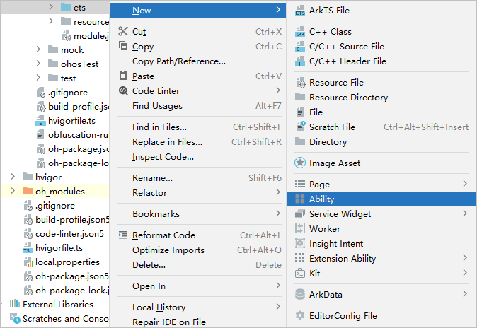
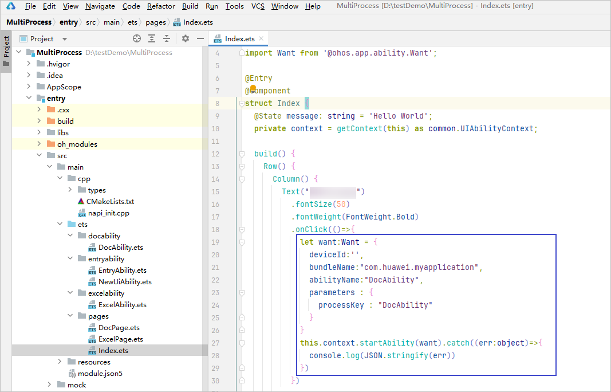
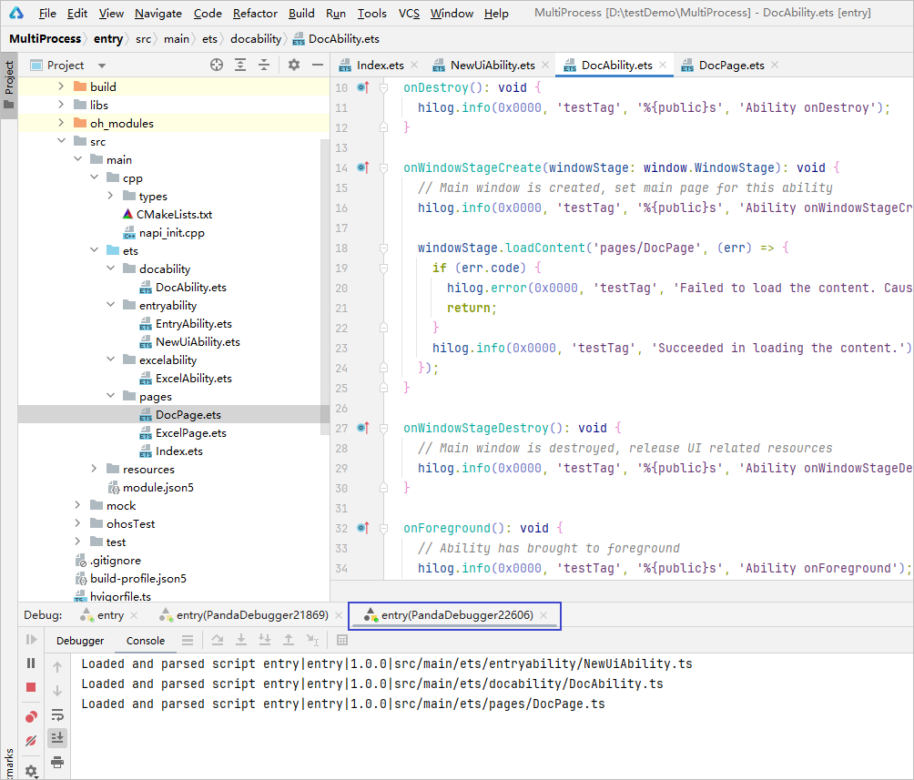

# 多进程调试

部分设备上，UIAbility支持以独立进程的方式运行并调试，详细请参考[进程模型](https://developer.huawei.com/consumer/cn/doc/harmonyos-guides/process-model-stage#其他进程类型)，可按照以下步骤对UIAbility进行调试。

#### 编译构建配置

1. 新建一个Ability，该Ability继承AbilityStage，作为独立进程的入口。

   
2. 右键ets目录，新建其它需要作为独立进程启动的UIAbility。

   
3. 修改module.json5配置文件，增加独立进程入口及isolationProcess配置项。

   

#### 调试

1. 编写跳转UIAbility的代码。

   
2. 在跳转的UIAbility中或独立进程入口处设置断点，启动调试。

   

   跳转到以独立进程启动的UIAbility时将会新启动一个调试会话窗口。

   
