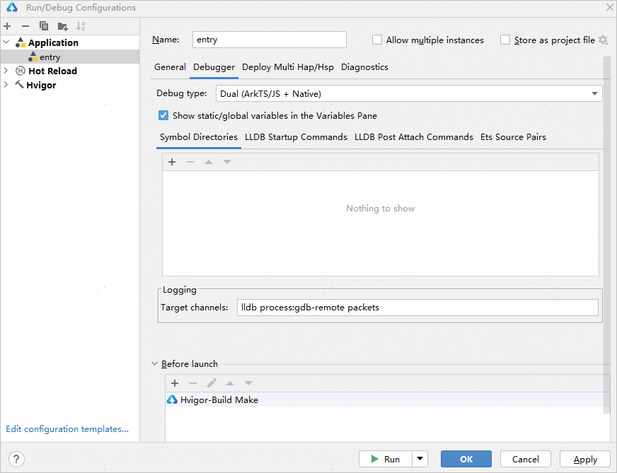

# 启动调试

Native代码调试依赖LLDB调试器，关于LLDB调试器的介绍请参考[LLDB高性能调试器](`https://`developer.huawei.com/consumer/cn/doc/harmonyos-guides/debug-lldb)。

在启动调试前，点击<strong>Run &gt; Edit Configurations</strong>打开调试配置界面，在<strong>Debugger</strong>页签选择<strong>Debug type</strong>为Dual (ArkTS/JS + Native) 、Native 或Detect Automatically，设置调试代码类型为C/C++。

* Detect Automatically类型会根据当前工程是否为native工程判断是否启动native调试。

* 如果调试时启用编译器优化，增加编译优化选项或使用[release编译模式](`https://`developer.huawei.com/consumer/cn/doc/harmonyos-guides/ide-hvigor-compilation-options-customizing-guide#section192461528194916)等，编译器会对编译后的汇编指令进行更改，从而使得代码运行更加高效。但优化后的指令难以与原始代码形成映射关系，可能会导致在调试的过程中出现异常或错误信息，例如局部变量信息被删除、无法正确跳转到期望的代码行等。因此，在调试的过程中需要关闭编译优化选项或者使用debug编译模式，避免因优化而导致的异常。

<strong>Debugger</strong>页签中还支持自定义以下配置：

* <strong>查看静态/全局变量：</strong>勾选<strong>Show static/global variables in the Variables Pane</strong>，调试过程中变量列表会展示静态/全局变量。
* <strong>符号表路径：</strong>在<strong>Symbol Directories</strong>页签，点击<strong>+</strong>，可以添加符号表路径，即带有调试信息的so库。例如，您可以先编译带有调试信息的so库，然后将其调试信息裁减掉，在设备侧运行无调试信息的so库，调试时将带有调试信息的so库路径添加在这里，可以实现对该so库的调试。
* <strong>预设调试器命令：</strong>在<strong>LLDB Startup Commands</strong>页签和<strong>LLDB Post Attach Commands</strong>页签中预设lldb命令。在<strong>LLDB Startup Commands</strong>页签中的命令会在LLDB调试器启动之后立即执行，在<strong>LLDB Post Attach Commands</strong>页签中的命令会在LLDB调试器成功attach到进程之后执行。

配置完成后可启动Native代码调试，支持debug和attach模式启动调试，详细内容可参考[debug启动调试](`https://`developer.huawei.com/consumer/cn/doc/harmonyos-guides/ide-debug-arkts-debug)或[attach启动调试](`https://`developer.huawei.com/consumer/cn/doc/harmonyos-guides/ide-debug-arkts-attach)章节。
