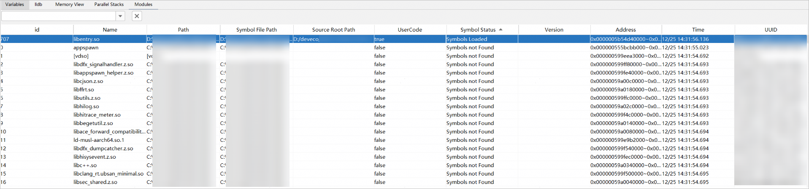

# so信息可视化

在native调试窗口中，点击<strong>Layout Settings</strong>，勾选<strong>Modules</strong>，打开模块视图。

在native调试期间，<strong>Modules</strong>窗口会列出并显示有关应用使用的so信息。点击各属性可按升序/降序来排序，支持字符串匹配搜索。

* 加载符号表文件

  如果符号未加载，可右键点击模块，选择<strong>Load Modules</strong>，加载本地携带符号信息的so文件。加载成功后，Symbol Status列会显示"Symbols Loaded"。

  如需将符号恢复为初始状态，可右键点击模块，选择<strong>Reset</strong> <strong>Modules</strong>。
* 添加源码地址映射

  加载的符号表文件路径默认是编译时的路径，若与本地的源码文件路径不一致时，需要关联源码文件。右键点击模块，选择<strong>Set Source Mapping</strong>，选择本地源码文件路径，映射成功后，Source Root Path列会显示映射后的路径。

  如需恢复为默认路径，可右键点击模块，选择<strong>Reset</strong> <strong>Source Mappings</strong>。
