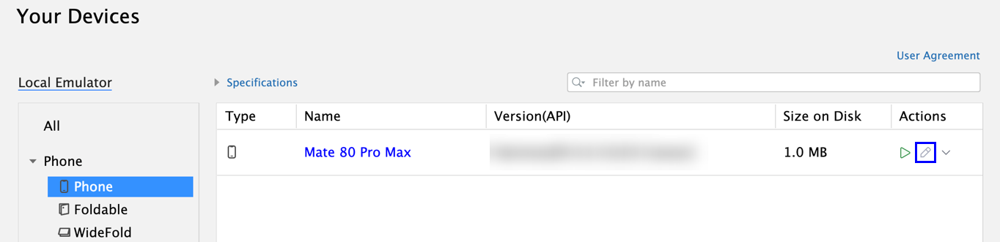
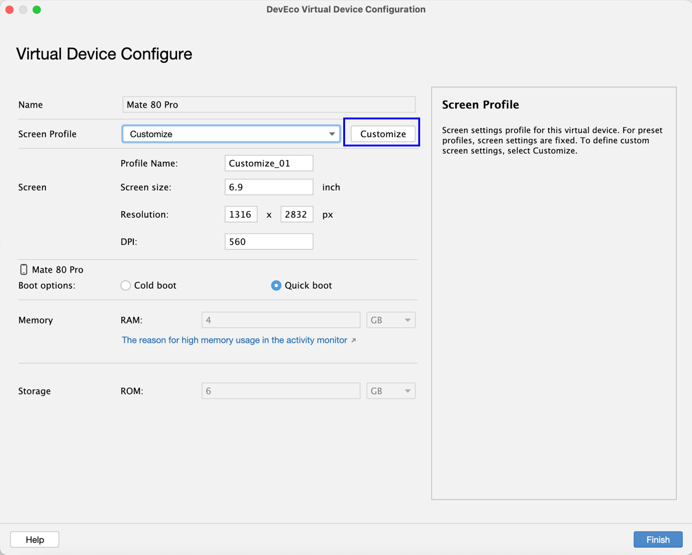

# 自定义屏幕配置

从DevEco Studio 6.0.0 Beta1版本开始，模拟器支持自定义屏幕配置，支持在创建新的模拟器时自定义，具体请参考[创建模拟器](`https://`developer.huawei.com/consumer/cn/doc/harmonyos-guides/ide-emulator-create)，或者对已创建的模拟器进行修改，具体参考以下步骤。

#### 使用约束

* phone类型的模拟器支持自定义屏幕配置。
* 从DevEco Studio 6.0.1 Beta1版本开始，新增foldable、tablet和2in1类型的模拟器支持自定义屏幕配置。

#### 操作步骤

1. 在模拟器关闭状态下，点击模拟器的修改按钮，进入Virtual Device Configure界面。

   
2. 点击<strong>Customize</strong>按钮，可以自定义设备的屏幕尺寸、分辨率和DPI配置，取值范围参考界面提示。
   * <strong>Screen size：</strong>屏幕的对角线长度，单位为inch。
   * <strong>Resolution</strong>：分辨率，宽度和高度，单位为px。
   * <strong>DPI</strong>：像素密度，DPI 越高，UI组件占用的像素点越多，从而提供更精细的显示效果。

   确认所有参数后，点击<strong>Finish</strong>完成修改，并保存为新的预置配置。

   
