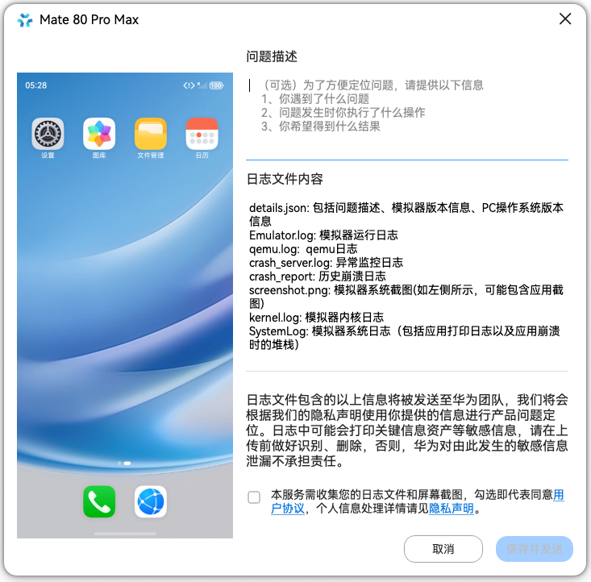
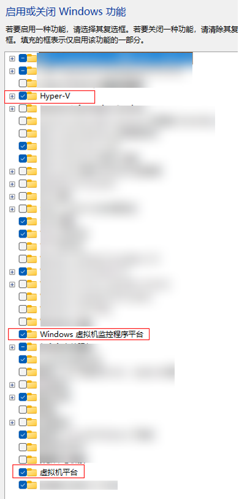
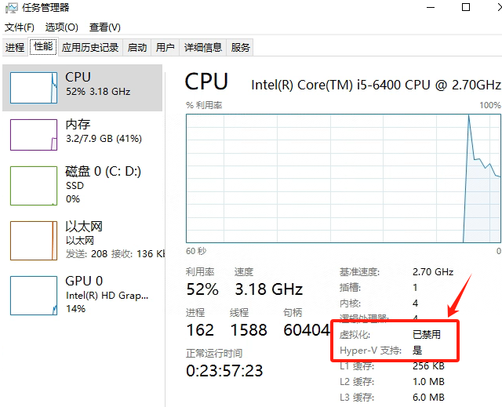
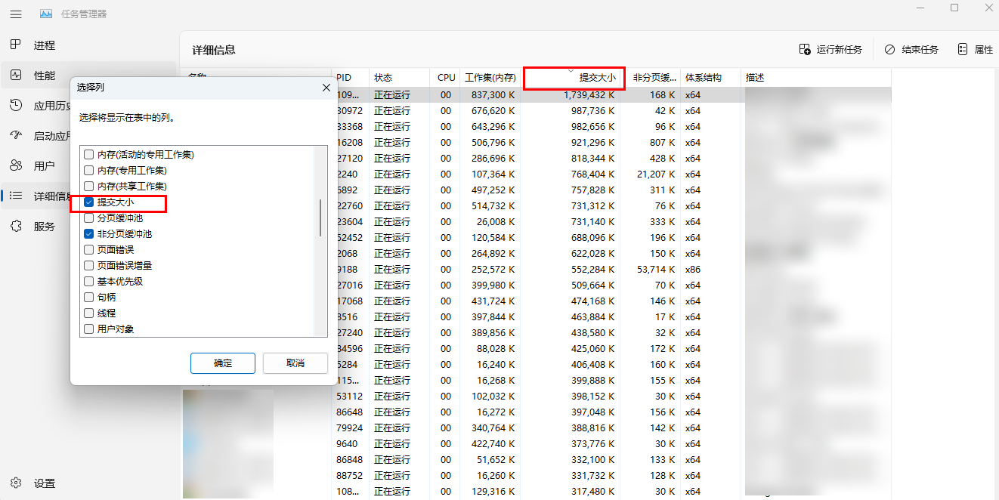

# 模拟器错误码

当模拟器运行出现错误时，您可以向我们提交错误信息。在扩展菜单栏打开<strong>Bug报告</strong>界面：

* 界面左侧展示了Bug出现时的设备截屏。
* 右侧问题描述对话框中，可以输入Bug的详细信息来帮助我们更快地解决问题。
* 在日志文件内容中，可以查看收集的日志内容。
* 在界面右下方勾选同意用户协议后，点击<strong>保存并发送</strong>按钮，即可将问题和Bug日志传递给我们。



#### 00801001 未开启Hyper-V

<strong>错误信息</strong>

Hyper-V Not Enabled.

<strong>错误描述</strong>

启动模拟器时，弹窗提示“未开启Hyper-V”。

<strong>可能原因</strong>

* 在云桌面等虚拟化Windows环境中运行模拟器，当前模拟器不支持在虚拟机系统中运行。
* Windows未开启Hyper-V功能，按以下步骤处理。

<strong>处理步骤</strong>

1. 请先确认CPU型号是否支持虚拟化技术，如果不支持，则无法使用模拟器。
2. 如果CPU支持虚拟化，打开控制面板 &gt; 程序 &gt; 程序和功能 &gt; 启动或关闭Windows功能（Windows11系统中打开系统 &gt; 可选功能 &gt; 相关设置 &gt; 更多Windows功能），检查功能“Hyper-V”、“Windows虚拟机监控程序平台”、“虚拟机平台”是否存在。
   * 如果不存在，说明系统未预装Hyper-V，请根据系统版本先安装Hyper-V。
   * 如果存在，勾选这三个功能，点击确定并重启电脑。

   
3. 若勾选后启动模拟器仍然提示该错误，需要以管理员权限打开命令行窗口执行以下命令，并重启电脑。

   ```
   bcdedit /set hypervisorlaunchtype auto
   ```
4. 如果按照上述步骤无法解决，打开<strong>任务管理器-&gt;性能</strong>，若显示虚拟化已禁用或未开启，则是BIOS中虚拟化没有开启，请根据计算机的主板型号，进入BIOS设置界面，并开启虚拟化功能。

   

更多关于Hyper-V安装请参考[在 Windows 上安装 Hyper-V](`https://`learn.microsoft.com/zh-cn/windows-server/virtualization/hyper-v/get-started/Install-Hyper-V?f=255&MSPPError=-2147217396)和[Hyper-V 系统要求](`https://`learn.microsoft.com/zh-cn/windows-server/virtualization/hyper-v/host-hardware-requirements)。

#### 00801002 磁盘不足

<strong>错误信息</strong>

The available disk space is less than the amount of space required to run the emulator.

<strong>错误描述</strong>

弹窗提示“当前磁盘空间低于启动要求，需要的磁盘空间为：XXX”。

<strong>可能原因</strong>

当前模拟器所在磁盘空间不满足模拟器启动要求。

<strong>处理步骤</strong>

1. 清理磁盘空间或更换模拟器所在磁盘位置。
2. 如果是macOS，且磁盘显示空间大于模拟器要求空间，请打开macOS磁盘工具，查看<strong>可用</strong>数据栏中，是否有可清除空间，导致磁盘实际可用空间远小于显示可用空间。如有请尝试从磁盘工具中清理无用的APFS快照文件，以及清除本地缓存文件。

#### 00801003 镜像文件路径变更

<strong>错误信息</strong>

The Image path has changed. Please clear image data before start.

<strong>错误描述</strong>

弹窗提示“镜像文件路径更改，请清除镜像数据后启动”。

<strong>可能原因</strong>

镜像文件存放的路径有变动。

<strong>处理步骤</strong>

点击<strong>确认</strong>按钮，清除镜像数据并继续启动模拟器；如果不想清除镜像数据，点击<strong>取消</strong>按钮，更换回原来的镜像路径再启动模拟器。

#### 00801004 CPU不支持AES指令

<strong>错误信息</strong>

Emulator cannot start on this computer because its CPU does not support AES instructions.

<strong>错误描述</strong>

弹窗提示“模拟器启动失败，当前CPU不支持AES指令”。

<strong>可能原因</strong>

当前CPU不支持AES指令。

<strong>处理步骤</strong>

当前计算机不支持使用模拟器，建议更换支持模拟器的计算机，详细请参考[使用环境](`https://`developer.huawei.com/consumer/cn/doc/harmonyos-guides/ide-emulator-requirements)。

#### 00801005 可申请内存不足

<strong>错误信息</strong>

Emulator failed to start due to insufficient memory.

<strong>错误描述</strong>

弹窗提示“当前系统可申请的内存不足XXGB”。

<strong>可能原因</strong>

当前系统空闲内存不满足模拟器启动内存需求。

<strong>处理步骤</strong>

1. 首先打开<strong>任务管理器&gt;详细信息</strong>，在列表表头右键<strong>&gt;选择列</strong>，找到并勾选“<strong>提交大小</strong>”，点击“<strong>提交大小</strong>”列进行排序，关闭部分提交大小占用高的进程。

   
2. 打开<strong>任务管理器&gt;性能&gt;内存</strong>页面，确保已提交内存的剩余量大于模拟器设置的RAM大小。

   

#### 00801006 Windows系统版本过低

<strong>错误信息</strong>

To avoid emulator malfunctions and unexpected computer restarts, update your PC to Windows 10 (OS build 18363 or later) and then try again.

<strong>错误描述</strong>

弹窗提示“当前Windows版本过低，可能造成模拟器使用异常或导致电脑重启，建议升级系统版本至Windows10（OS build 18363及以上）”。

<strong>可能原因</strong>

当前Windows系统版本过低。

<strong>处理步骤</strong>

升级Windows系统版本至提示的版本或以上。

#### 00801007 模拟器磁盘空间不足

<strong>错误信息</strong>

The remaining disk space of the emulator is insufficient. Please clear the emulator data and then restart the emulator.

<strong>错误描述</strong>

弹窗提示“模拟器剩余磁盘空间不足，请清除模拟器数据后再重新启动”。

<strong>可能原因</strong>

模拟器的磁盘空间不足。

<strong>处理步骤</strong>

清除模拟器数据后重新启动。

#### 00801008 镜像文件缺失

<strong>错误信息</strong>

The system-image file is missing.

<strong>错误描述</strong>

启动模拟器失败，提示“system-image文件缺失”，模拟器镜像文件缺失。

<strong>可能原因</strong>

镜像文件损坏或丢失。

<strong>处理步骤</strong>

请通过以下两种方式解决：

* 重新下载镜像，具体请参考[创建模拟器](`https://`developer.huawei.com/consumer/cn/doc/harmonyos-guides/ide-emulator-create)。
* 删除已创建的模拟器，然后重新创建模拟器。

#### 00801009 镜像版本不支持

<strong>错误信息</strong>

The current emulator image version is too low.

<strong>错误描述</strong>

弹窗提示“当前模拟器镜像版本过低，请下载最新镜像并创建新版本模拟器”。

<strong>可能原因</strong>

当前使用的镜像版本过低。

<strong>处理步骤</strong>

重新下载镜像，具体请参考[创建模拟器](`https://`developer.huawei.com/consumer/cn/doc/harmonyos-guides/ide-emulator-create)。

#### 00801010 镜像版本不匹配

<strong>错误信息</strong>

The Image version has changed. Please clear image data before start.

<strong>错误描述</strong>

弹窗提示“镜像版本变更，请清除镜像数据后启动”。

<strong>可能原因</strong>

镜像版本有变动。

<strong>处理步骤</strong>

点击<strong>确认</strong>按钮，清除镜像数据并继续启动模拟器；如果本地还存在旧版本的镜像数据，可点击<strong>取消</strong>按钮，更换回旧版本的镜像再启动模拟器。

#### 00801011 macOS版本过低

<strong>错误信息</strong>

To avoid emulator malfunctions and unexpected computer restarts, update your Mac to 12.5 or later.

<strong>错误描述</strong>

弹窗提示“当前macOS版本过低，可能造成模拟器使用异常或导致电脑重启，建议升级系统版本至12.5以上”。

<strong>可能原因</strong>

当前Mac的系统版本过低。

<strong>处理步骤</strong>

升级macOS系统版本至提示的版本或以上。

#### 00801012 模拟器配置信息文件损坏或异常

<strong>错误信息</strong>

The emulator configuration file is damaged or abnormal.

<strong>错误描述</strong>

弹窗提示“模拟器配置信息文件损坏或异常”。

<strong>可能原因</strong>

本地模拟器配置文件损坏或出现异常。

<strong>处理步骤</strong>

* 在<strong>Local Emulator</strong>的设备列表窗口，点击“<strong>Wipe User Data</strong>”清除模拟器数据，然后重新启动模拟器。
* 重新创建一个模拟器，然后启动新建的模拟器。

#### 00801013 显卡驱动版本过低

<strong>错误信息</strong>

The graphics card in use does not support OpenGL 4.1 or later. Update the graphics card driver or use another graphics card.

<strong>错误描述</strong>

弹窗提示“显卡驱动版本过低，请确认支持OpenGL 4.1及以上版本”。

<strong>可能原因</strong>

当前显卡驱动版本过低，或不支持OpenGL4.1或以上版本。

<strong>处理步骤</strong>

升级显卡驱动，如果原显卡不支持OpenGL则需要更换显卡，具体要求请参考[使用环境](`https://`developer.huawei.com/consumer/cn/doc/harmonyos-guides/ide-emulator-requirements)。

#### 00801014 SDK路径更改

<strong>错误信息</strong>

Sdk Path has been changed.

<strong>错误描述</strong>

启动模拟器失败，提示“系统识别到的新的sdk路径XXX”。

<strong>可能原因</strong>

模拟器启动时SDK路径改变。

<strong>处理步骤</strong>

可以尝试通过如下两种方式进行解决：

* 在<strong>Local Emulator</strong>的设备列表窗口，点击“<strong>Wipe User Data</strong>”清除模拟器数据，然后重新启动模拟器。
* 重新创建一个模拟器，然后启动新建的模拟器。

#### 00801015 本地模拟器不存在

<strong>错误信息</strong>

No local emulator found.

<strong>错误描述</strong>

启动模拟器失败，提示“本地模拟器不存在，请重新创建本地模拟器”。

<strong>可能原因</strong>

本地模拟器文件缺失或损坏。

<strong>处理步骤</strong>

删除并创建新模拟器使用。

#### 00801016 找不到对应设备，hdc非正常运行

<strong>错误信息</strong>

Can't find device，may be Hdc is not normal running.

<strong>错误描述</strong>

找不到对应设备，hdc非正常运行。

<strong>可能原因</strong>

hdc工具的进程存在异常或模拟器镜像和DevEco Studio版本不配套。

<strong>处理步骤</strong>

1. 执行如下命令，结束hdc的进程，然后尝试重新连接，更多关于hdc工具的使用指导请参考[hdc](`https://`developer.huawei.com/consumer/cn/doc/harmonyos-guides/hdc)。

   ```
   hdc kill
   ```
2. 若按照步骤1操作后还是不能连接，请重启DevEco Studio和模拟器，然后尝试重新连接。
3. 重新下载模拟器镜像，具体请参考[创建模拟器](`https://`developer.huawei.com/consumer/cn/doc/harmonyos-guides/ide-emulator-create)。
4. 如果已配置hdc环境变量，请检查环境变量配置是否正确。

#### 00801017 安装解析so失败

<strong>错误信息</strong>

The XXX ABI type is missing. Make sure it is configured for all .so files in the HAPs/HSPs.

<strong>错误描述</strong>

在启动调试或运行C++应用/元服务时，安装HAP出现错误，提示“HAP/HSP中集成的.so缺少XXX ABI类型”。

<strong>可能原因</strong>

设备支持的Abi类型与C++工程中配置的Abi类型不匹配。

<strong>处理步骤</strong>

* 请参考[9568347 解析本地so文件失败](`https://`developer.huawei.com/consumer/cn/doc/harmonyos-guides/bm-tool#section9568347-解析本地so文件失败)。
* 如果无法修改工程配置，可以使用云调试服务，选择HarmonyOS NEXT设备进行开发调试，具体查看[云调试](`https://`developer.huawei.com/consumer/cn/agconnect/cloud-adjust)。

#### 00801018 模拟器内存不足

<strong>错误信息</strong>

The emulator RAM is insufficient.

<strong>错误描述</strong>

模拟器默认内存为4G，运行过程中内存不足时弹框告警，可能会出现模拟器卡顿或者闪退。

<strong>可能原因</strong>

模拟器系统内存已不足500M。

<strong>处理步骤</strong>

建议在创建模拟器时增加模拟器的运行内存（RAM）大小，请参考[创建模拟器](`https://`developer.huawei.com/consumer/cn/doc/harmonyos-guides/ide-emulator-create#section1764055173710)。

#### 00801019 镜像文件校验失败

<strong>错误信息</strong>

Failed to verify the image file.

<strong>错误描述</strong>

启动模拟器失败，提示“镜像文件校验失败”。

<strong>可能原因</strong>

模拟器镜像文件与镜像签名文件不匹配。

<strong>处理步骤</strong>

重新下载镜像，具体请参考[创建模拟器](`https://`developer.huawei.com/consumer/cn/doc/harmonyos-guides/ide-emulator-create)。

#### 00801020 Windows ARM系统不支持

<strong>错误信息</strong>

Failed to start the Emulator. It does not work with Windows on Arm.

<strong>错误描述</strong>

启动模拟器失败，提示“模拟器启动失败，当前不支持Windows ARM系统”。

<strong>可能原因</strong>

模拟器不支持在Windows ARM系统上运行。

<strong>处理步骤</strong>

更换系统类型再使用模拟器，具体运行环境要求请参考[使用环境](`https://`developer.huawei.com/consumer/cn/doc/harmonyos-guides/ide-emulator-requirements)。

#### 00802001 模拟器卡死

<strong>错误信息</strong>

Emulator Freeze.

<strong>错误描述</strong>

模拟器镜像系统运行异常，弹出崩溃报告，ErrorType为Emulator Freeze。

<strong>可能原因</strong>

未知原因。

<strong>处理步骤</strong>

1. 在弹出的崩溃报告页面，点击<strong>发送报告</strong>按钮，将相关的错误日志信息发送给我们。
2. 重新启动模拟器。

#### 00802002 模拟器无响应

<strong>错误信息</strong>

Emulator Graphic Hung.

<strong>错误描述</strong>

模拟器无响应，弹出崩溃报告，ErrorType为Emulator Graphic Hung。

<strong>可能原因</strong>

图形渲染相关进程异常。

<strong>处理步骤</strong>

1. 在弹出的崩溃报告页面，点击<strong>发送报告</strong>按钮，将相关的错误日志信息发送给我们。
2. 重新启动模拟器。

#### 00802003 模拟器闪退

<strong>错误信息</strong>

Emulator Crash.

<strong>错误描述</strong>

模拟器异常闪退，弹出崩溃报告，ErrorType为Emulator Crash。

<strong>可能原因</strong>

未知原因异常退出。

<strong>处理步骤</strong>

1. 在弹出的崩溃报告页面，点击<strong>发送报告</strong>按钮，将相关的错误日志信息发送给我们。
2. 重新启动模拟器。
