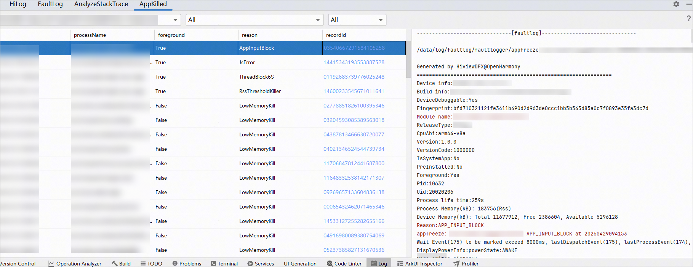

# 查看App Killed（应用终止）日志

从DevEco Studio 6.0.2 Beta1版本开始，提供<strong>AppKilled</strong>窗口，用于查看设备上应用终止的相关信息，包括应用异常退出的时间、进程名、是否前台应用、异常退出原因，点击<strong>recordId</strong>可以查看详细的FaultLog信息。支持按设备、应用和异常原因对信息进行过滤。

AppKilled窗口中支持查看的异常退出原因请参考[reason字段说明](`https://`developer.huawei.com/consumer/cn/doc/harmonyos-guides/hidumper#reason字段说明)，如需对问题进行排查处理，请参考[App Killed（应用终止）检测](`https://`developer.huawei.com/consumer/cn/doc/harmonyos-guides/appkilled-guidelines)。

2in1、Tablet设备不支持查看APP\_INPUT\_BLOCK和THREAD\_BLOCK\_6S类型的数据。

