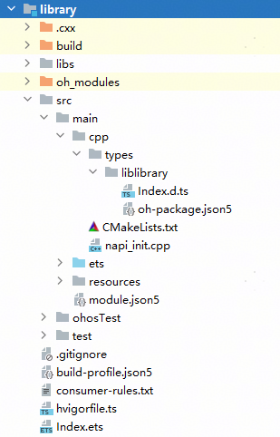
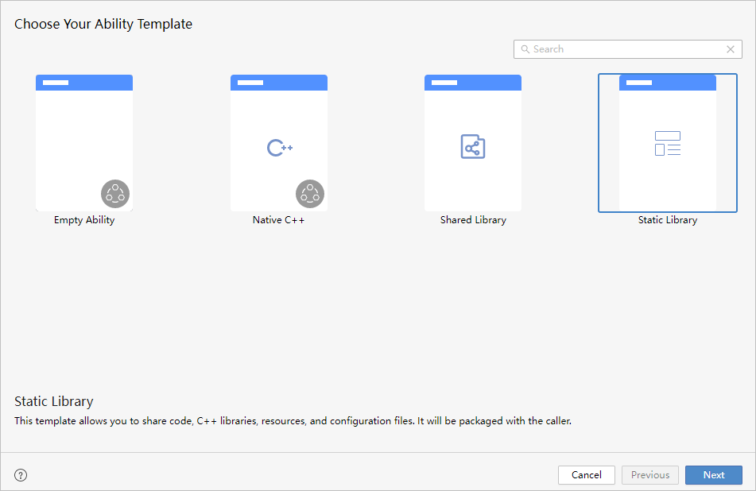
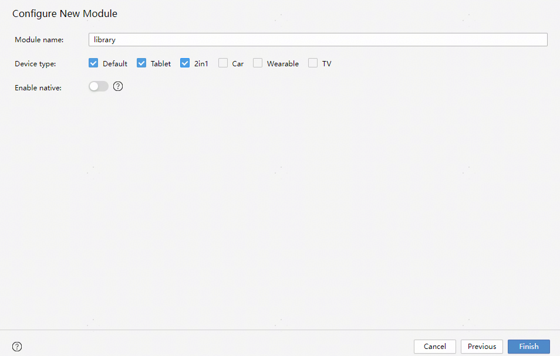
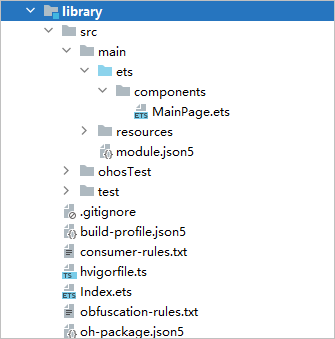
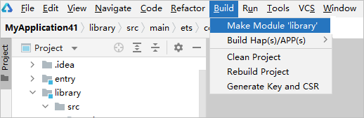
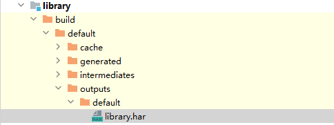

# 开发静态共享包

[HAR（Harmony Archive）](`https://`developer.huawei.com/consumer/cn/doc/harmonyos-guides/har-package)是静态共享包，可以包含代码、C++库、资源和配置文件。通过HAR可以实现多个模块或多个工程共享ArkUI组件、资源等相关代码。HAR不同于HAP，不能独立安装运行在设备上，只能作为应用模块的依赖项被引用。本文将介绍如何创建HAR模块、如何编译共享包.

HAR模块的工程结构如下图所示：

相关字段的描述如下，其余字段与Entry或Feature模块相关字段相同，可参考[工程介绍](./ide-project-overview)。

* <strong>libs</strong>：用于存放.so文件。
* <strong>src &gt; main &gt; cpp &gt; types</strong>：用于存放C++ API描述文件，子目录按照so维度进行划分。
* <strong>src &gt; main &gt; cpp &gt; types</strong> <strong>&gt; liblibrary &gt; Index.d.ts</strong>：描述C++接口的方法名、入参、返回参数等信息。
* <strong>src &gt; main &gt; cpp &gt; types</strong> <strong>&gt; liblibrary &gt; oh-package.json5</strong>：描述so三方包声明文件入口和so包名信息。
* <strong>src &gt; main &gt; cpp &gt;</strong> <strong>CMakeLists.txt</strong>：CMake配置文件，提供CMake构建脚本。
* <strong>src &gt; main &gt; cpp &gt; napi\_init.cpp</strong>：共享包C++代码源文件。
* <strong>Index.ets</strong>：共享包导出声明的入口。

从DevEco Studio 6.0.1 Beta1开始，创建HAR模块时支持选择C++版本。

## 创建HAR模块

1. 鼠标移到工程目录顶部，单击右键，选择<strong>New &gt; Module</strong>，在工程中添加模块。
2. 在<strong>Choose Your Ability Template</strong>界面中，选择<strong>Static Library</strong>，并单击<strong>Next</strong>。

   
3. 在<strong>Configure New Module</strong>界面中，设置新添加的模块信息，设置完成后，单击<strong>Finish</strong>完成创建。
   * <strong>Module name</strong>：新增模块的名称。
   * <strong>Device type</strong>：支持的设备类型。
   * <strong>Enable native</strong>：创建用于调用C++代码的模块。
   * <strong>C++ Standard：</strong>C++标准库，取值包括：Toolchain Default、C++11、C++14，仅打开Enable native时需要配置。从DevEco Studio 6.0.1 Beta1开始支持。

   

   创建完成后，会在工程目录中生成HAR模块及相关文件。

   

## 编译HAR模块

开发完HAR模块后，选中模块名，然后通过DevEco Studio菜单栏的**Build &gt; Make Module `$&#123;libraryName&#125;`**进行编译构建，生成HAR。HAR可供工程其他模块引用，或将HAR上传至ohpm仓库，供其他开发者下载使用。若部分源码文件不需要打包至HAR中，可通过[.ohpmignore文件](./ide-hvigor-build-har#li5533646204511)配置打包时要忽略的文件/文件夹。

编译构建的HAR可在模块下的build目录下获取，包格式为\*.har。

在编译构建HAR时，请注意以下事项：

* 编译构建HAR的过程中，不会将模块中的C++代码直接打包进.har文件中，而是将C++代码编译成动态依赖库.so文件放置在.har文件中的libs目录下。
* 在编译构建HAR的过程中，会生成资源文件ResourceTable.txt，以便编辑器可以对HAR中的资源文件进行联想。因此，如果不使用DevEco Studio对HAR进行构建，则DevEco Studio的编辑器会无法联想HAR中的资源。
* 如果使用的Hvigor为2.5.0-s及以上版本，在编译构建HAR的过程中，会将dependencies内处于本模块路径下的本地依赖也打包进.har文件中，如果在打包后发现缺少部分本地依赖（如cpp/types目录）请参见[FAQ](`https://`developer.huawei.com/consumer/cn/doc/harmonyos-faqs/faqs-compiling-and-building-23).
