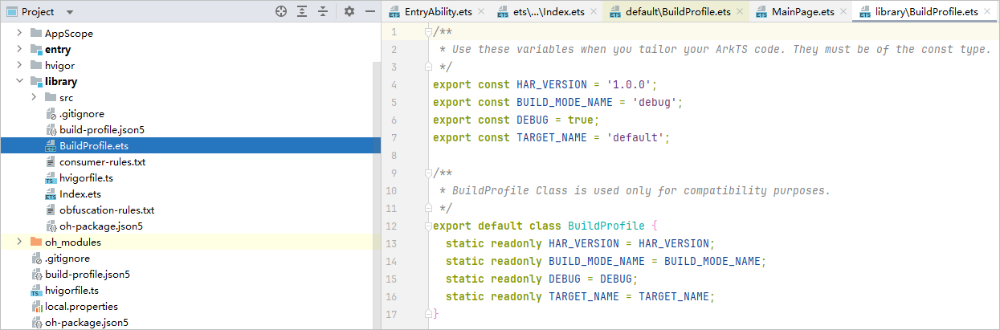
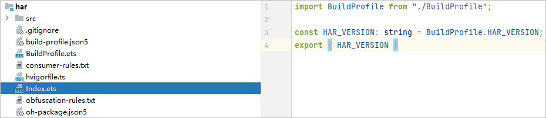

# 能力说明

在编译构建时，Hvigor会生成BuildProfile类，开发者可以通过该类在运行时获取编译构建参数，也可以在build-profile.json5中通过buildProfileFields增加自定义字段，从而在运行时获取自定义的参数。

#### 使用说明

buildProfileFields的优先级：模块级target &gt; 模块级buildOptionSet &gt; 模块级buildOption &gt; 工程级product &gt; 工程级buildModeSet

#### HAP/HSP运行时获取编译构建参数

#### 生成BuildProfile类文件

当前有以下几种方式可以生成BuildProfile类文件：

* 选中需要编译的模块，在菜单栏选择“Build &gt; Generate Build Profile $`&#123;moduleName&#125;`”。
* 在菜单栏选择“Build &gt; Build Hap(s)/APP(s) &gt; Build Hap(s)”或“Build &gt; Build Hap(s)/APP(s) &gt; Build APP(s)”。
* 在Terminal中执行如下命令：

  ```
  hvigorw GenerateBuildProfile
  ```

执行完上述操作后，将在“$`&#123;moduleName&#125;` / build / $`&#123;productName&#125;` / generated / profile / $`&#123;targetName&#125;` ”目录下生成BuildProfile.ets文件。示例如下所示：


#### 在代码中获取构建参数

生成BuildProfile类文件后，在代码中可以通过如下方式引入该文件，其中packageName是模块级oh-package.json5文件中name字段对应的值。

```
import BuildProfile from '${packageName}/BuildProfile';
```


在HSP中使用import BuildProfile from 'BuildProfile'在跨包集成HSP的时候可能会产生编译错误，推荐使用import BuildProfile from '$`&#123;packageName&#125;`/BuildProfile'。

通过如下方式获取到构建参数：

```
@State message: string = BuildProfile.BUNDLE_NAME;
```

#### 默认参数

生成BuildProfile类文件时，Hvigor会根据当前工程构建的配置信息生成一部分默认参数，开发者可以在代码中直接使用。

<strong>表1</strong> 默认参数说明

| 参数名 | 类型 | 说明 |
| --- | --- | --- |
| BUNDLE\_NAME | string | 应用的Bundle名称。 |
| BUNDLE\_TYPE | string | 应用的Bundle类型。 |
| VERSION\_CODE | number | 应用的版本号。 |
| VERSION\_NAME | string | 应用版本号的文字描述。 |
| TARGET\_NAME | string | Target名称。 |
| PRODUCT\_NAME | string | Product名称。 |
| BUILD\_MODE\_NAME | string | 编译模式。 |
| DEBUG | boolean | 应用是否可调试。 |

#### 自定义参数

开发者可以在模块级的build-profile.json5文件中增加自定义参数，在生成BuildProfile类文件后，在代码中使用自定义参数。

自定义参数可以在buildOption、buildOptionSet、targets节点下的arkOptions子节点中通过增加buildProfileFields字段实现，自定义参数通过key-value键值对的方式配置，其中value取值仅支持number、string、boolean类型。

配置示例如下所示：

```
{
  "apiType": "stageMode",
  "buildOption": {
    "arkOptions": {
      "buildProfileFields": {
        "data": "Data",
      }
    }
  },
  "buildOptionSet": [
    {
      "name": "release",
      "arkOptions": {
        "buildProfileFields": {
          "buildOptionSetData": "BuildOptionSetDataRelease",
          "data": "DataRelease"
        }
      }
    },
    {
      "name": "debug",
      "arkOptions": {
        "buildProfileFields": {
          "buildOptionSetData": "BuildOptionSetDataDebug",
          "data": "DataDebug"
        }
      }
    }
  ],
  "targets": [
    {
      "name": "default",
      "config": {
        "buildOption": {
          "arkOptions": {
            "buildProfileFields": {
              "targetData": "TargetData",
              "data": "DataTargetDefault"
            }
          }
        }
      }
    },
    {
      "name": "default1",
      "config": {
        "buildOption": {
          "arkOptions": {
            "buildProfileFields": {
              "targetData": "TargetData1",
              "data": "DataTargetDefault1"
            }
          }
        }
      }
    },
    {
      "name": "ohosTest",
    }
  ]
}
```

#### HAR运行时获取编译构建参数

#### 生成BuildProfile类文件

当前有以下几种方式可以生成BuildProfile类文件：

* 选中需要编译的模块，在菜单栏选择“Build &gt; Generate Build Profile $`&#123;moduleName&#125;`”。
* 选中需要编译的模块，在菜单栏选择“Build &gt; Make Module $`&#123;moduleName&#125;`”。
* 在Terminal中执行如下命令：

  ```
  hvigorw GenerateBuildProfile
  ```

执行完上述操作后，将在模块根目录下生成BuildProfile.ets文件（该文件可放置在.gitignore文件中进行忽略）。示例如下所示：



#### 在代码中获取构建参数

生成BuildProfile类文件后，在代码中可以通过相对路径引入该文件，如在HAR模块的Index.ets文件中使用该文件：

```
import BuildProfile from './BuildProfile';
```

通过如下方式获取到构建参数：

```
const HAR_VERSION: string = BuildProfile.HAR_VERSION;
```



#### 默认参数

生成BuildProfile类文件时，Hvigor会根据当前工程构建的配置信息生成一部分默认参数，开发者可以在代码中直接使用。

<strong>表2</strong> 默认参数说明

| 参数名 | 类型 | 说明 |
| --- | --- | --- |
| HAR\_VERSION | string | HAR版本号。 |
| BUILD\_MODE\_NAME | string | 编译模式。 |
| DEBUG | boolean | 应用是否可调试。 |
| TARGET\_NAME | string | 目标名称。 |

#### 自定义参数

开发者可以在模块级的build-profile.json5文件中增加自定义参数，在生成BuildProfile类文件后，在代码中使用自定义参数。

自定义参数可以在buildOption、buildOptionSet节点下的arkOptions子节点中通过增加buildProfileFields字段实现，自定义参数通过key-value键值对的方式配置，其中value取值仅支持number、string、boolean类型。

配置示例如下所示：

```
{
  "apiType": "stageMode",
  "buildOption": {
    "arkOptions": {
      "buildProfileFields": {
        "data": "Data",
      }
    }
  },
  "buildOptionSet": [
    {
      "name": "release",
      "arkOptions": {
        "buildProfileFields": {
          "buildOptionSetData": "BuildOptionSetDataRelease",
          "data": "DataRelease"
        }
      }
    },
    {
      "name": "debug",
      "arkOptions": {
        "buildProfileFields": {
          "buildOptionSetData": "BuildOptionSetDataDebug",
          "data": "DataDebug"
        }
      }
    }
  ],
  "targets": [
    {
      "name": "default",
    }
  ]
}
```

#### 工程级配置自定义构建参数

开发者可以在工程级的build-profile.json5文件中增加自定义参数，该自定义参数会生成到所有模块的BuildProfile类文件，在代码中使用自定义参数。

自定义参数可以在工程级products、buildModeSet中的buildOption节点下的arkOptions子节点中通过增加buildProfileFields字段实现，自定义参数通过key-value键值对的方式配置，其中value取值仅支持number、string、boolean类型。

配置示例如下所示：

```
{
  "app": {
    "signingConfigs": [],
    "products": [
      {
        "name": "default",
        "signingConfig": "default",
        "compatibleSdkVersion": "6.1.1(24)",
        "runtimeOS": "HarmonyOS",
        "buildOption": {
          "arkOptions": {
            "buildProfileFields": {
              "productValue": "defaultValue"
            }
          }
        }
      }
    ],
    "buildModeSet": [
      {
        "name": "debug",
        "buildOption": {
          "arkOptions": {
            "buildProfileFields": {
              "productBuildModeValue": "debugValue"
            }
          }
        }
      },
      {
        "name": "release"
      }
    ]
  },
  "modules": [
    {
      "name": "entry",
      "srcPath": "./entry",
      "targets": [
        {
          "name": "default",
          "applyToProducts": [
            "default"
          ]
        }
      ]
    }
  ]
}
```
