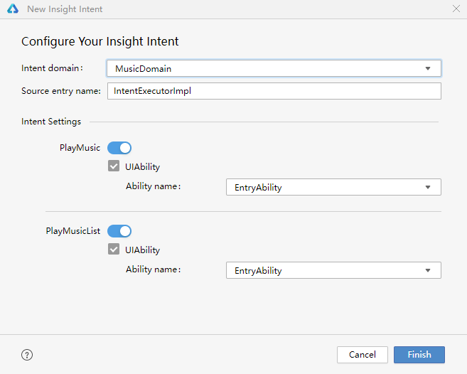
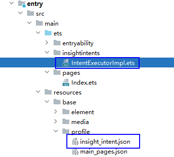

# 创建意图框架

DevEco Studio支持创建意图框架，帮助应用理解用户意图，并提供相应的服务和体验。

## 使用约束

* 支持API 11及以上工程创建意图框架；
* 仅支持在Stage工程的HAP模块中创建意图框架。

## 使用方式

1. 选中模块或模块下的文件，右键单击<strong>New &gt; Insight Intent</strong>，进入意图框架配置界面。
   * <strong>Intent domain</strong>：意图垂域。
   * <strong>Source entry name</strong>：意图框架入口代码文件名。
   * <strong>Intent Settings</strong>：意图配置。以MusicDomain为例：
     + <strong>PlayMusic：</strong>开启/关闭PlayMusic意图能力，实现播放歌曲（指定一首）<strong>。</strong>默认需要关联UIAbility，可在<strong>Ability name</strong>中下拉框选择需要关联的Ability能力。
     + <strong>PlayMusicList</strong>：开启/关闭PlayMusicList意图能力，实现播放歌单（指定一整个歌单）<strong>。</strong>默认需要关联UIAbility，可在<strong>Ability name</strong>下拉框中选择需要关联的Ability能力。

     

     PlayMusic和PlayMusicList不支持同时关闭，请至少开启一个意图。

   
2. 点击<strong>Finish</strong>，完成意图框架创建。此时将在<strong>entry &gt; src &gt; main &gt; ets &gt; insightintents</strong>目录下生成入口代码文件；在<strong>entry &gt; src &gt; main &gt; resource &gt; base &gt; profile</strong>中，生成<strong>insight\_intent.json</strong>文件，可在该文件查看当前意图框架配置的相关信息。

   
