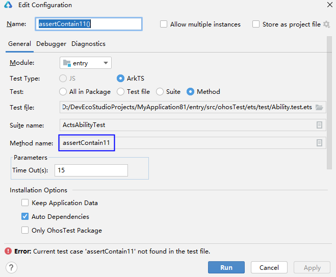

# 仪器测试错误码

#### 00501001 测试套件名称含有变量

<strong>错误信息</strong>

XXX is a Variable. Please use string as a describe name.

<strong>错误描述</strong>

XXX是变量，请使用字符串作为测试套件名称。

<strong>可能原因</strong>

测试套件名称含有变量。

<strong>处理步骤</strong>

使用字符串作为测试用例名称。

#### 00501002 仪器测试用例名称存在非法字符

<strong>错误信息</strong>

XXX is an invalid it value. Enter a value that contains only digits, letters, underscores (\_), and periods (.) or run from a higher level portal.

<strong>错误描述</strong>

仪器测试用例名称存在非法字符。用例名只能包括数字、字母、下划线或者点号，或从更高的运行入口执行。

<strong>可能原因</strong>

测试用例名称包括非法字符。

<strong>处理步骤</strong>

* 确保用例名只包括数字、字母、下划线或者点号。
* 如果测试用例名称包括非法字符，请运行测试套件、测试文件或测试目录。

#### 00501003 测试用例名称重复

<strong>错误信息</strong>

Testing failed due to the duplicate test case name XXX. The test case name must be unique in a test suite.

<strong>错误描述</strong>

测试用例名称重复。测试套件下的测试用例名称必须唯一。

<strong>可能原因</strong>

测试套件下存在重名的测试用例。

<strong>处理步骤</strong>

确保测试套件下的测试用例名称唯一。

#### 00501004 测试套件名称重复

<strong>错误信息</strong>

Testing failed due to the duplicate test suite name XXX. The test suite name must be unique in a test package.

<strong>错误描述</strong>

测试套件名称重复。测试目录下的测试套件名称必须唯一。

<strong>可能原因</strong>

测试目录下存在重名的测试套件。

<strong>处理步骤</strong>

确保测试目录下的测试套件名称唯一。

#### 00501005 仪器测试用例名称含有变量

<strong>错误信息</strong>

XXX is a Variable. Please use string as an It-name or execute from the higher running entrance.

<strong>错误描述</strong>

XXX是变量，请使用字符串作为测试用例名称，或从更高的运行入口执行。

<strong>可能原因</strong>

仪器测试用例名称含有变量。

<strong>处理步骤</strong>

* 使用字符串作为测试用例名称。
* 如果测试用例名称是变量，请运行测试套件、测试文件或测试目录。

#### 00501006 仪器测试用例名称含有变量

<strong>错误信息</strong>

XXX is a Variable. Please use string as an It-name.

<strong>错误描述</strong>

XXX是变量，请使用字符串作为测试用例名称。

<strong>可能原因</strong>

仪器测试用例名称含有变量。

<strong>处理步骤</strong>

* 使用字符串作为测试用例名称。
* 如果测试用例名称是变量，请运行测试套件、测试文件或测试目录。

#### 00501007 测试套件名称不合法

<strong>错误信息</strong>

XXX is an invalid describe value. The value entered must contain only digits, letters, underscores (\_), and periods (.) and can only start with a letter.

<strong>错误描述</strong>

测试套件名称不合法。名称只能包括数字、字母、下划线和点，以字母开头。

<strong>可能原因</strong>

测试套件名称不合法。

<strong>处理步骤</strong>

确保测试套件名称只包括数字、字母、下划线和点，以字母开头。

#### 00502001 测试文件中找不到对应测试用例

<strong>错误信息</strong>

Current test case XXX not found in the test file.

<strong>错误描述</strong>

测试文件中找不到对应的测试用例。

<strong>可能原因</strong>

测试文件中找不到对应的测试用例。

<strong>处理步骤</strong>

* 选择要运行的测试用例，重新运行。
* 在运行配置窗口修改Method name。

  

#### 00502002 找不到测试用例

No Any Test Case Found In The XXX.

<strong>错误描述</strong>

找不到任何测试用例。

<strong>可能原因</strong>

测试文件中未定义测试用例。

<strong>处理步骤</strong>

确保测试文件中存在测试用例。

#### 00502003 测试文件不存在

<strong>错误信息</strong>

File does not exist: XXX.

<strong>错误描述</strong>

测试文件不存在。

<strong>可能原因</strong>

测试文件可能被删除或者移动。

<strong>处理步骤</strong>

选择实际存在的文件进行测试。

#### 00502004 当前文件的所有函数都没有在List.test.ets文件中注册

<strong>错误信息</strong>

The current file does not have any function registered in the list file.

<strong>错误描述</strong>

当前文件的所有函数都没有在List.test.ets文件中注册。

<strong>可能原因</strong>

当前文件的所有函数都没有在List.test.ets文件中注册。

<strong>处理步骤</strong>

在List.test.ets文件中注册函数，示例如下。

#### 00502005 测试包中的所有函数都没有在List.test.ets文件中注册

<strong>错误信息</strong>

The current package does not have any function registered in the list file.

<strong>错误描述</strong>

当前测试包中的所有函数都没有在List.test.ets文件中注册。

<strong>可能原因</strong>

当前测试包中的所有函数都没有在List.test.ets文件中注册。

<strong>处理步骤</strong>

在List.test.ets文件中注册函数，示例如下。

#### 00502006 函数没有在List.test.ets文件中注册

<strong>错误信息</strong>

The function where the suite XXX is located is not registered in the ''List.test.ets'' file!

<strong>错误描述</strong>

测试套件XXX所在的函数没有在List.test.ets文件中注册。

<strong>可能原因</strong>

函数没有在List.test.ets文件中注册。

<strong>处理步骤</strong>

在List.test.ets文件中注册函数，示例如下。

#### 00502007 测试文件中找不到测试套件

<strong>错误信息</strong>

Current suite XXX not found in the test file.

<strong>错误描述</strong>

测试文件中找不到测试套件。

<strong>可能原因</strong>

测试文件中不存在测试套件。

<strong>处理步骤</strong>

* 选择要运行的测试套件，重新运行。
* 在运行配置窗口修改Suite name。

#### 00503001 HAP包名无效

<strong>错误信息</strong>

Invalid HAP file name.

<strong>错误描述</strong>

HAP包名无效。

<strong>可能原因</strong>

HAP包名中存在非法字符。

<strong>处理步骤</strong>

确保HAP包名中仅包含数字、字母、下划线（\_）、中划线（-）、点号（.）。

#### 00503002 hap包中找不到文件

<strong>错误信息</strong>

The XXX file in the hap file does not exist.

<strong>错误描述</strong>

hap包中找不到文件。

<strong>可能原因</strong>

hap包中对应文件不存在。

<strong>处理步骤</strong>

重新构建生成HAP包。

#### 00503003 文件为空

<strong>错误信息</strong>

The XXX file is empty.

<strong>错误描述</strong>

文件为空。

<strong>可能原因</strong>

hap包中的文件不存在或内容格式不正确。

<strong>处理步骤</strong>

重新构建生成hap包。

#### 00504001 未指定测试套件名称

<strong>错误信息</strong>

The 'Suite name' is not specified.

<strong>错误描述</strong>

未指定测试套件名称。

<strong>可能原因</strong>

运行配置中未选择测试套件。

<strong>处理步骤</strong>

选择一个测试套件。

#### 00504002 未指定测试包

<strong>错误信息</strong>

The 'Package' is not specified.

<strong>错误描述</strong>

未指定测试包。

<strong>可能原因</strong>

运行配置中未选择测试包。

<strong>处理步骤</strong>

选择一个测试包。

#### 00504003 未指定测试用例

<strong>错误信息</strong>

The 'Method name' is not specified.

<strong>错误描述</strong>

未指定测试用例。

<strong>可能原因</strong>

运行配置中未选择测试用例。

<strong>处理步骤</strong>

选择一个测试用例。

#### 00504004 未指定测试文件

<strong>错误信息</strong>

The 'File name' is not specified.

<strong>错误描述</strong>

未指定测试文件。

<strong>可能原因</strong>

运行配置中未选择测试文件。

<strong>处理步骤</strong>

选择一个测试文件。

#### 00505001 仪器测试运行失败

<strong>错误信息</strong>

Instrumentation run failed due to XXX.

<strong>错误描述</strong>

仪器测试运行失败。

<strong>可能原因</strong>

测试套件中存在Promise(async, await)。

<strong>处理步骤</strong>

测试套件中不允许使用Promise(async, await)。

#### 00506001 仪器测试返回数量和预期不一致

<strong>错误信息</strong>

XXX. Expected YYY tests, received ZZZ.

<strong>错误描述</strong>

仪器测试运行错误。

<strong>可能原因</strong>

仪器测试返回数量和预期不一致。

<strong>处理步骤</strong>

根据报错提示进行修改。

#### 00506002 没有测试结果

<strong>错误信息</strong>

No test results because XXX.

<strong>错误描述</strong>

没有测试结果。

<strong>可能原因</strong>

设备屏幕设置了密码并且未解锁。

<strong>处理步骤</strong>

解锁屏幕后重新测试。

#### 00506003 执行历史测试任务失败

<strong>错误信息</strong>

Build history project failed.

<strong>错误描述</strong>

执行历史测试任务失败。

<strong>可能原因</strong>

历史任务已失效，或执行环境已修改。

<strong>处理步骤</strong>

不要执行历史任务，重新构造测试任务。

#### 00507001 路径不存在

<strong>错误信息</strong>

The path XXX does not exist. Check whether the hap/hsp package is signed.

<strong>错误描述</strong>

路径不存在，请检查hap/hsp包是否已签名。

<strong>可能原因</strong>

对应hap包或hsp包未签名。

<strong>处理步骤</strong>

检查hap/hsp包是否已签名，如果未签名，请参考[配置调试签名](`https://`developer.huawei.com/consumer/cn/doc/harmonyos-guides/ide-signing)。

#### 00507002 scope参数值不合法

<strong>错误信息</strong>

scope=XXX is invalid. Enter a value that contains only digits, letters, underscores (\_), and periods (.). Use commas (,) to separate multiple test suites or test cases.

<strong>错误描述</strong>

命令行scope参数值不合法。请输入只包括数字、字母、下划线、点号的值，多个测试套件或测试用例用英文逗号隔开。

<strong>可能原因</strong>

命令行scope参数值不合法。

<strong>处理步骤</strong>

scope参数值只能包括数字、字母、下划线、点号，多个测试套件或测试用例用英文逗号隔开。

#### 00507003 解锁屏幕失败导致没有测试结果

<strong>错误信息</strong>

No test results because unlock screen failed in developer mode.

<strong>错误描述</strong>

解锁屏幕失败导致没有测试结果。

<strong>可能原因</strong>

运行设备锁屏且存在锁屏密码导致解锁失败。

<strong>处理步骤</strong>

解锁屏幕后重新测试。

#### 00507004 coverageFile包含不存在的路径

<strong>错误信息</strong>

coverageFile contains a file that does not exist.

<strong>错误描述</strong>

coverageFile包含不存在的路径。

<strong>可能原因</strong>

执行hvigorw命令时，coverageFile部分参数值路径不存在。

<strong>处理步骤</strong>

确保参数值中的路径存在。

#### 00507005 项目路径不存在

<strong>错误信息</strong>

projectPath does not exist.

<strong>错误描述</strong>

项目路径不存在。

<strong>可能原因</strong>

执行hvigorw命令时，projectPath参数值中包含不存在的路径。

<strong>处理步骤</strong>

确保参数值中的路径存在。

#### 00507006 报告路径不存在

<strong>错误信息</strong>

reportPath does not exist.

<strong>错误描述</strong>

报告路径不存在。

<strong>可能原因</strong>

执行hvigorw命令时，reportPath参数值中包含不存在的路径。

<strong>处理步骤</strong>

确保参数值中的路径存在。

#### 00507007 coverageFile路径不存在

<strong>错误信息</strong>

coverageFile does not exist.

<strong>错误描述</strong>

coverageFile路径不存在。

<strong>可能原因</strong>

执行hvigorw命令时，coverageFile参数值中包含不存在的路径。

<strong>处理步骤</strong>

确保参数值中的路径存在。

#### 00507008 获取初始覆盖率数据失败

<strong>错误信息</strong>

getInitCoverageData failed.

<strong>错误描述</strong>

获取初始覆盖率数据失败。

<strong>可能原因</strong>

init\_coverage.json文件内容错误。

<strong>处理步骤</strong>

点击菜单栏<strong>Build &gt; Clean Project</strong>清理缓存，重新执行测试。

#### 00507009 获取js覆盖率数据失败

<strong>错误信息</strong>

getjsCoverageData failed.

<strong>错误描述</strong>

获取js覆盖率数据失败。

<strong>可能原因</strong>

js\_coverage.json文件内容错误。

<strong>处理步骤</strong>

点击菜单栏<strong>Build &gt; Clean Project</strong>清理缓存，重新执行测试。

#### 00507010 合并覆盖率数据失败

<strong>错误信息</strong>

merge coverageJson failed.

<strong>错误描述</strong>

合并覆盖率数据失败。

<strong>可能原因</strong>

DevEco Studio 5.0.2版本存在变更，变更前后的覆盖率数据结构不同无法合并。

<strong>处理步骤</strong>

使用同一个DevEco Studio版本生成的覆盖率数据进行合并。

#### 00507011 include和exclude参数包含相同的路径

<strong>错误信息</strong>

The same path defined in include and exclude list in coverage-filter.json5.

<strong>错误描述</strong>

coverage-filter.json5文件中，include和exclude参数包含相同的路径。

<strong>可能原因</strong>

include和exclude参数包含相同的路径。

<strong>处理步骤</strong>

确保include和exclude参数的路径不相同。

#### 00507012 生成覆盖率报告失败

<strong>错误信息</strong>

report failed, error: XXX.

<strong>错误描述</strong>

生成覆盖率报告失败。

<strong>可能原因</strong>

生成覆盖率报告时，会将reportPath文件夹下的内容清空，清空文件夹时发生异常。

<strong>处理步骤</strong>

更换reportPath路径，或手动清空reportPath文件夹。

#### 00507013 连接设备失败

<strong>错误信息</strong>

[Fail]ExecuteCommand need connect-key? please confirm a device by help info.

<strong>错误描述</strong>

连接设备失败，请根据提示连接设备。

<strong>可能原因</strong>

1. 未连接设备，或未开启开发者选项的USB调试。
2. 通过命令行执行测试时，连接了多个设备。

<strong>处理步骤</strong>

1. 参考[使用本地真机运行应用](`https://`developer.huawei.com/consumer/cn/doc/harmonyos-guides/ide-run-device)连接设备，并打开开发者选项中的USB调试。
2. 移除多余的设备，确保只连接一个设备。

#### 00508010 覆盖率报告生成失败

<strong>错误信息</strong>

Coverage report generation failed! Please attempt to clean project first.

<strong>错误描述</strong>

覆盖率报告生成失败。请先尝试清理项目。

<strong>可能原因</strong>

无法生成覆盖率报告。

<strong>处理步骤</strong>

点击菜单栏<strong>Build &gt; Clean Project</strong>清理缓存后重试。

#### 00508013 应用启动超时

<strong>错误信息</strong>

App launch timed out. Make sure the screen is unlocked.

<strong>错误描述</strong>

应用启动超时，确保屏幕已解锁。

<strong>可能原因</strong>

屏幕被锁定。

<strong>处理步骤</strong>

解锁设备屏幕。

#### 00508014 预览器不支持此应用

<strong>错误信息</strong>

Previewer does not support this app.

<strong>错误描述</strong>

预览器不支持此应用。

<strong>可能原因</strong>

使用预览器进行仪器测试。

<strong>处理步骤</strong>

仪器测试不支持预览器，请选择真机设备或模拟器进行测试。

#### 00508015 测试文件没有以.test.ets结尾

<strong>错误信息</strong>

File XXX does not end with '.test.ets'.

<strong>错误描述</strong>

文件没有以.test.ets结尾。

<strong>可能原因</strong>

测试文件名称没有以.test.ets结尾。

<strong>处理步骤</strong>

修改测试文件后缀为.test.ets。
