# Instrument Test

#### 创建ArkTS测试用例

#### 创建默认测试用例

1. 在工程目录下打开待测试模块（支持HAP、HAR、HSP模块）下的ets文件，将光标置于代码中任意位置，单击<strong>右键 &gt; Show Context Actions</strong> <strong>&gt; Create Instrument Test</strong>或快捷键<strong>Alt+Enter</strong> <strong>（macOS为Option+Enter）&gt; Create Instrument Test</strong>创建测试类。

   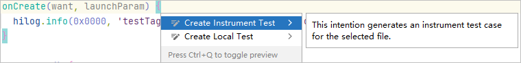
2. 在弹出的Create Instrument Test窗口，输入或选择如下参数。
   * <strong>Testing library</strong>：测试类型，默认为DECC-ArkTSUnit，JS语言默认为DECC-JSUnit。
   * <strong>ArkTS name</strong>：创建的测试文件名称，测试文件中包含了测试用例。测试文件名称要求在工程目录范围内具有唯一性，仅支持字母、数字、下划线（\_）和点（.）。
   * <strong>Destination package</strong>：测试文件存放的位置，建议存放在待测试模块的test目录下。

   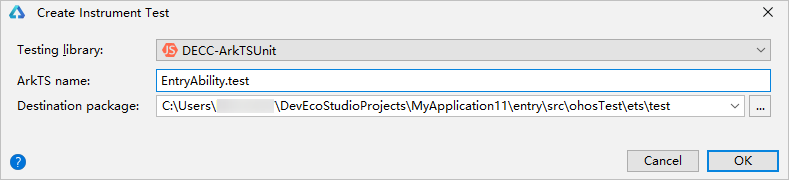
3. DevEco Studio在ohosTest/ets/test目录下自动生成对应的测试类。在测试类中，DevEco Studio会生成对应方法的用例模板，具体测试代码需要开发者根据业务逻辑进行开发，具体请参考[自动化测试框架使用指导](`https://`developer.huawei.com/consumer/cn/doc/harmonyos-guides/arkxtest-guidelines)。

   

   * 您也可以手动在ohosTest &gt; ets &gt; test文件夹下创建测试用例，手动创建后，需要在List.test.ets文件中添加创建的用例类。手动创建的工程或历史工程，ohosTest &gt; ets &gt; test文件夹下所有文件的文件名必须以.test.ets结尾，否则将在运行时弹窗提示“Error: Test files must end with '.test.ets'.”请点击<strong>Fix</strong>按钮，DevEco Studio将自动对ohosTest &gt; ets &gt; test目录下的文件名进行修改。
   * 首次在HarmonyOS设备上运行UI测试框架需要使用命令“hdc -n shell param set persist.ace.testmode.enabled 1”使能UiTest测试能力。

#### 自定义Ability和Resources

从5.0.3.403版本开始，新创建的工程/模块的ohosTest目录下默认不创建testability、testrunner和resources目录，历史工程仍保留这些目录，如果新工程需要使用ability或resources能力，需要开发者自行创建。


如果需要使用ability能力，需要同时创建testrunner目录及OpenHarmonyTestRunner.ets文件。

<strong>表1</strong> <strong>新旧版本ohosTest目录对比</strong>

|  |  |
| --- | --- |
| <strong>新版本</strong> | <strong>历史版本</strong> |
| 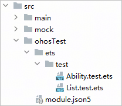 | 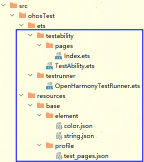 |

1. 创建以下目录或文件，文件内容示例可在[运行Instrument Test测试用例](#section1574003717165)后，在对应模块的.test/`&#123;productName&#125;`/intermediates/src/ohosTest（DevEco Studio 6.1.0 Beta1及以上版本）或build/`&#123;productName&#125;`/intermediates/src/ohosTest（DevEco Studio 6.1.0 Beta1以下版本）下查看，其中productName是当前生效的product，可以通过点击DevEco Studio右上方图标进行查看。
   * testability目录 &gt; TestAbility.ets文件
   * testability目录 &gt; pages目录 &gt; Index.ets文件
   * testrunner目录 &gt; OpenHarmonyTestRunner.ets文件
   * resources目录 &gt; base目录 &gt; element目录 &gt; color.json文件
   * resources目录 &gt; base目录 &gt; element目录 &gt; string.json文件
   * resources目录 &gt; base目录 &gt; profile目录 &gt; test\_pages.json文件
2. 在module.json5文件中补充ability配置字段mainElement、pages、abilities，关于字段的具体说明请参考[module.json5配置文件](`https://`developer.huawei.com/consumer/cn/doc/harmonyos-guides/module-configuration-file)。

   ```
   {
     "module": {
       "name": "entry_test",
       "type": "feature",
       "description": "$string:module_test_desc",
       "mainElement": "TestAbility",                                   // 对应下方abilities中的ability name。
       "deviceTypes": [
         "phone",
         "tablet",
         "2in1"
       ],
       "deliveryWithInstall": true,
       "installationFree": false,
       "pages": "$profile:test_pages",                                 // 对应resources目录 > base目录 > profile目录 > test_pages.json文件。
       "abilities": [                                                  // 添加的ability的配置信息。
         {
           "name": "TestAbility",
           "srcEntry": "./ets/testability/TestAbility.ets",
           "description": "$string:TestAbility_desc",
           "icon": "$media:icon",    // 确保引用的资源都存在
           "label": "$string:TestAbility_label",
           "exported": true,
           "startWindowIcon": "$media:icon",
           "startWindowBackground": "$color:start_window_background"
         }
       ]
     }
   }
   ```

#### 运行测试用例

#### 运行模式

使用DevEco Studio运行测试用例前，需要将设备与电脑进行连接，将工程编译成带签名信息的HAP，再安装到真机设备或模拟器上运行，具体请参考[使用本地真机运行应用](`https://`developer.huawei.com/consumer/cn/doc/harmonyos-guides/ide-run-device)或[使用模拟器运行应用](`https://`developer.huawei.com/consumer/cn/doc/harmonyos-guides/ide-run-emulator)。

可以采用运行工程目录（test）、测试文件（如Ability.test.ets）、测试套件（describe）、测试方法（it）的方式来运行测试用例：

* 在工程目录中，单击<strong>右键 &gt; Run'测试文件名称'</strong>，执行测试。

  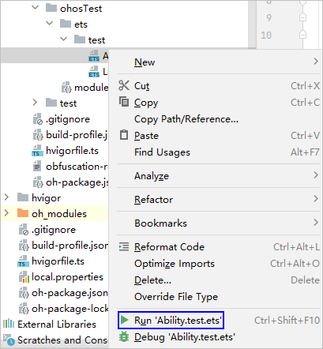
* 打开测试文件，单击测试套件左侧按钮。

  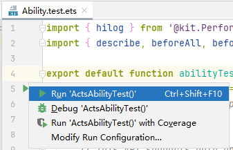
* 如果要根据自定义的配置执行Instrument Test，在[创建测试用例运行任务](#section65264166107)后，通过如下方式的其中之一，执行Instrument Test：
  + 在工具栏主菜单单击<strong>Run &gt; Run'测试名称'</strong>。
  + 在DevEco Studio的右上角，选择测试任务，然后单击右侧的按钮，执行Instrument Test。

    

执行完测试任务后，查看测试结果。

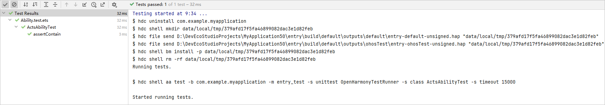

#### 调试模式

调试模式相比运行模式增加了断点管理功能。在断点命中时，可以选择单步执行、步入步出、进入下个断点等方式进行调试，另外可以使用线程堆栈可视化、变量和表达式可视化功能，快速定位问题。

以文件级别为例，在添加断点之后，在工程目录中，选中文件，单击<strong>右键 &gt; Debug'测试文件名称'</strong>，以调试模式执行测试任务。

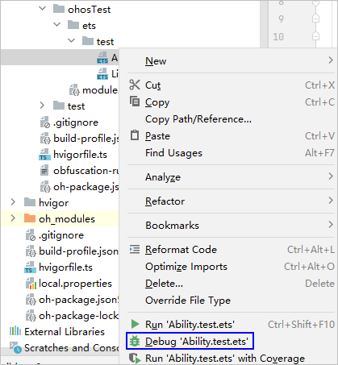

在断点命中时，下方将出现Debug窗口。开发者可在该窗口中进行断点管理与基础调试能力的可视化操作，在断点命中时可查看当前线程的变量和堆栈信息。

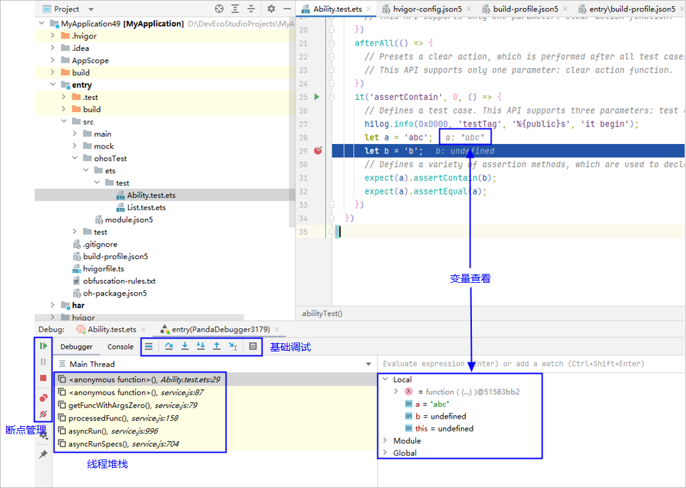

断点命中时，在代码编辑器窗口单击右键，在弹出的菜单中将出现调试模式特有功能，如计算表达式、添加变量监视等。

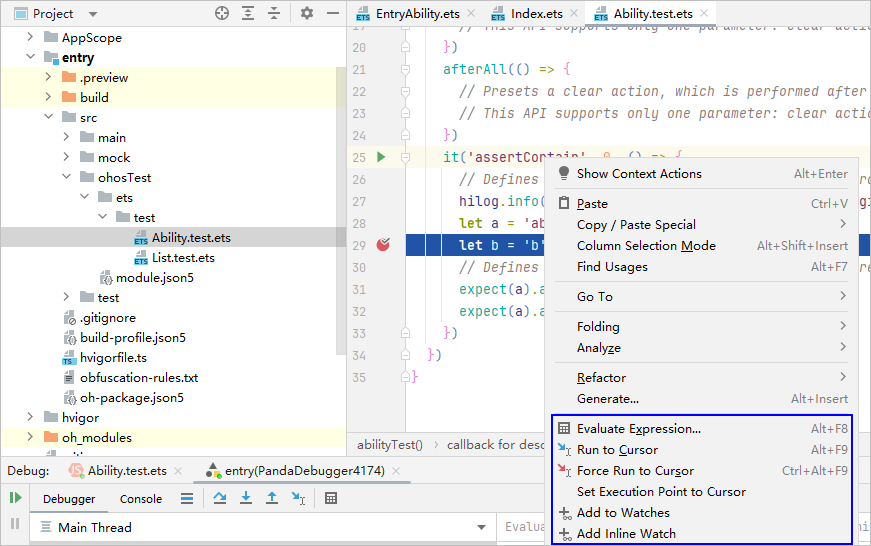

在跳出所有断点后，测试结束，与运行模式相同，在测试窗口查看测试结果。

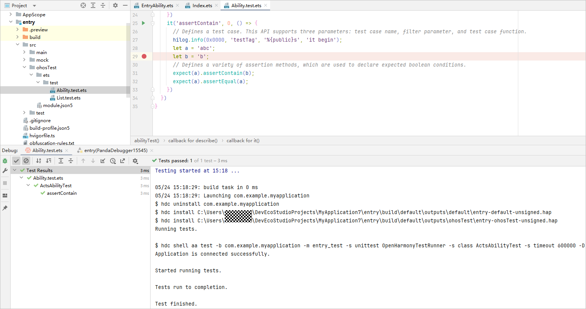


DevEco Studio支持设置调试代码类型，具体请参考[设置调试代码类型](#section0164586312)。

#### 覆盖率统计模式

在Instrument Test运行的基础上支持代码覆盖率统计。

开发者可以自定义需要参与覆盖率测试的文件，具体配置方法请参考[配置覆盖率过滤文件](`https://`developer.huawei.com/consumer/cn/doc/harmonyos-guides/ide-ui-test#section13756446154)。

可以采用运行工程目录（test）、测试文件（如Ability.test.ets）、测试套件（describe）、测试方法（it）的方式来启动代码覆盖率的统计。

以文件级别为例，有两种方式启动测试：

* 方式一：在工程目录中，选中文件，单击<strong>右键 &gt; Run '测试文件名称' with Coverage</strong>，执行测试。

  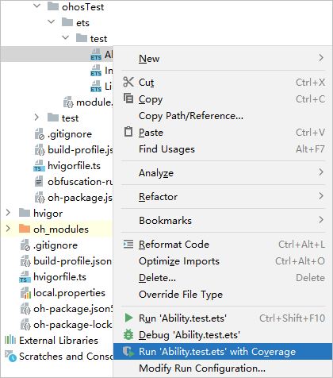
* 方式二：在DevEco Studio的右上角，选择测试任务，然后单击右侧的按钮，执行测试。

  

启动测试后，进行编译构建，底部将出现Cover窗口，构建结束后自动拉起Cover窗口，测试任务结束后，窗口中会打印测试报告的路径。

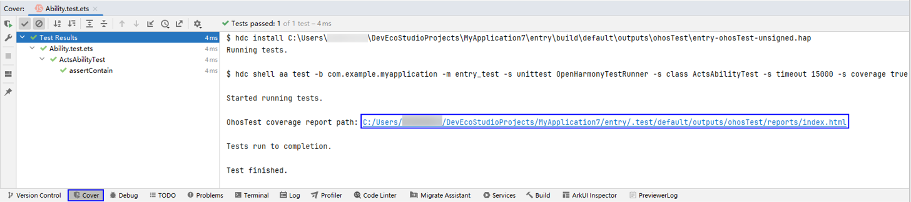

点击链接可打开报告，查看ArkTS代码覆盖率详情，关于覆盖率的计算方式请参考[查看覆盖率报告](`https://`developer.huawei.com/consumer/cn/doc/harmonyos-guides/ide-ui-test#section10394362109)。

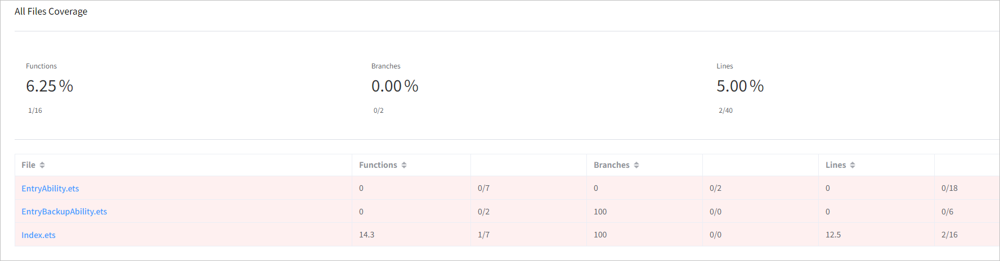

在Cover窗口中，单击rerun按钮可以按照之前的设置，重新执行覆盖率用例。

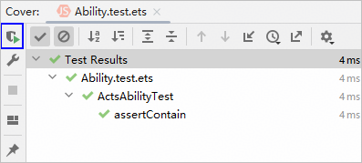

#### （可选）自定义测试用例运行任务

默认情况下，测试用例可直接运行，如果需要自定义测试用例运行任务，可通过如下方法进行设置。

1. 在工具栏主菜单单击<strong>Run</strong> &gt; <strong>Edit Configurations</strong>进入Run/Debug Configurations界面。
2. 在<strong>Run/Debug Configurations</strong>界面，单击+按钮，在弹出的下拉菜单中，单击Instrument Test。

   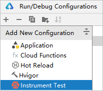
3. 根据实际情况，配置Instrument Test的运行参数。然后单击<strong>OK</strong>，完成配置。
   * 如果模块依赖共享包，请提前设置HAP安装方式，勾选“<strong>Keep Application Data</strong>”，则表示采用覆盖安装方式，保留应用/元服务缓存数据。
   * 如果工程中HAP/HSP模块直接依赖其他HSP模块（如entry模块依赖HSP模块）或间接依赖其他模块（如entry模块依赖HAR模块，HAR又依赖HSP模块）时，在测试阶段需要同时安装模块包及其所有依赖模块的包到设备中。此时，可以勾选“<strong>Auto Dependencies</strong>”，测试时会自动将所有依赖的模块都安装到设备上。该选项默认勾选。
   * 如果不涉及UI测试，勾选“<strong>Only OhosTest Package</strong>”，则只会推送OhosTest测试包到设备上，不会推送HAP/HSP包，可以缩短推包时间。

   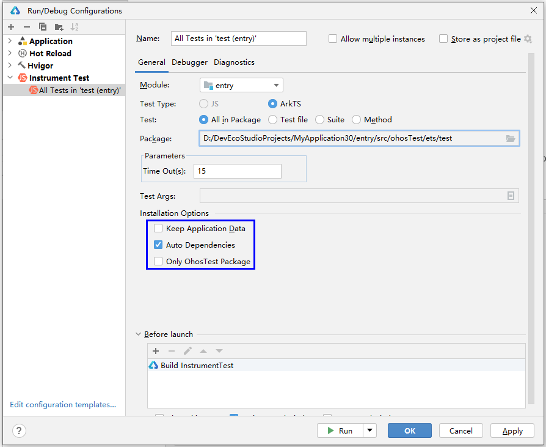

#### 使用过滤条件筛选待运行的测试用例

1. 在用例编写时，通过配置it的第二个入参，为每个用例添加过滤参数。此参数用于为测试用例添加标注，不添加则参数默认为0表示未被标注。

   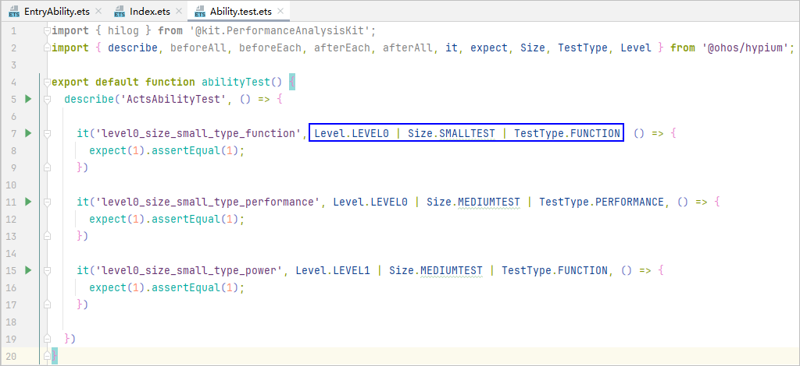
2. 打开<strong>Run/Debug Configurations</strong>窗口，点击Test Args，打开<strong>Test Args</strong>界面，添加命令行参数。

   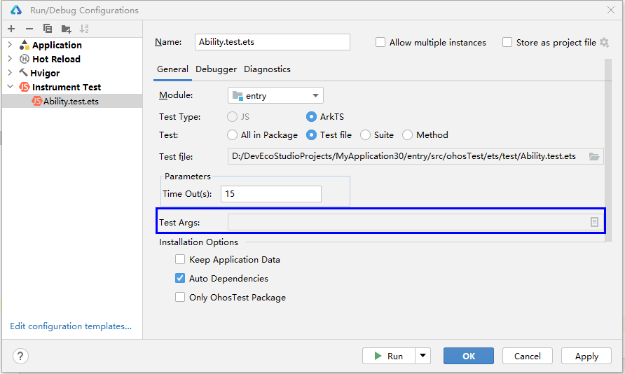

   例如将测试参数配置为level=1, size=medium

   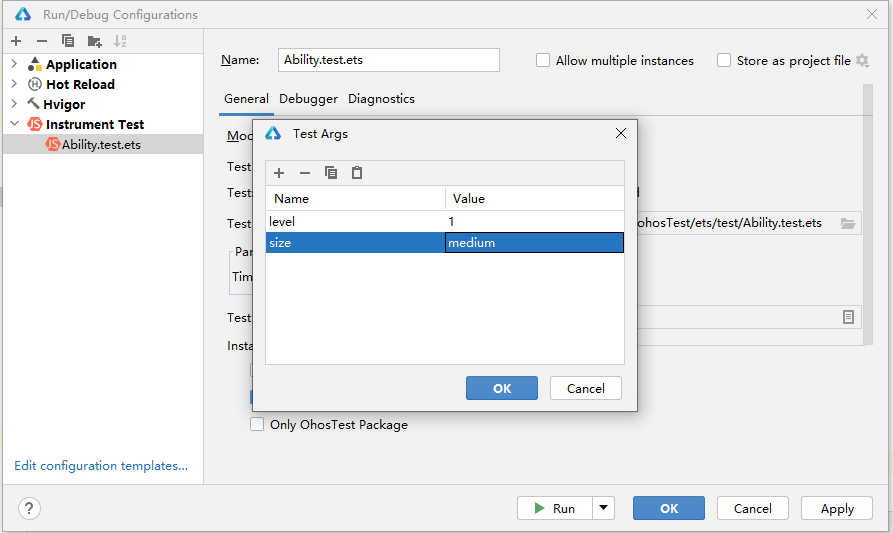

   <strong>表2</strong> 参数规则参考

   | Key | 含义说明 | Value取值范围 |
   | --- | --- | --- |
   | level | 用例级别 | "0","1","2","3","4", 例如：-s level 1 |
   | size | 用例粒度 | "small","medium","large", 例如：-s size small |
   | testType | 用例测试类型 | "function","performance","power","reliability","security","global","compatibility","user","standard","safety","resilience", 例如：-s testType function |
3. 完成以上配置后，在运行此项配置对应的测试任务时，只运行过滤后的测试用例。

   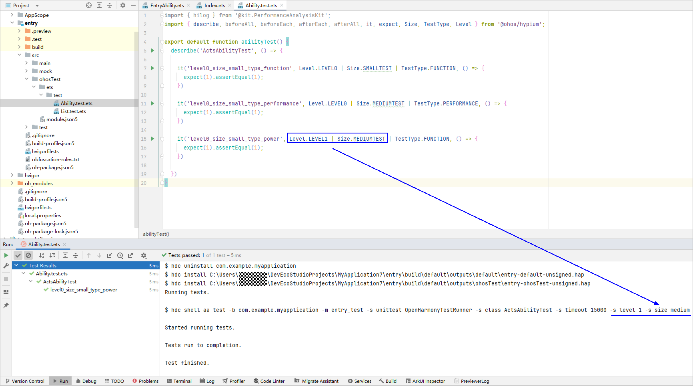

#### 设置调试代码类型

点击<strong>Run &gt; Edit Configurations</strong>，打开<strong>Run/Debug Configurations</strong>窗口，选择Instrument Test，点击<strong>Debugger</strong>页签，设置Debug type。

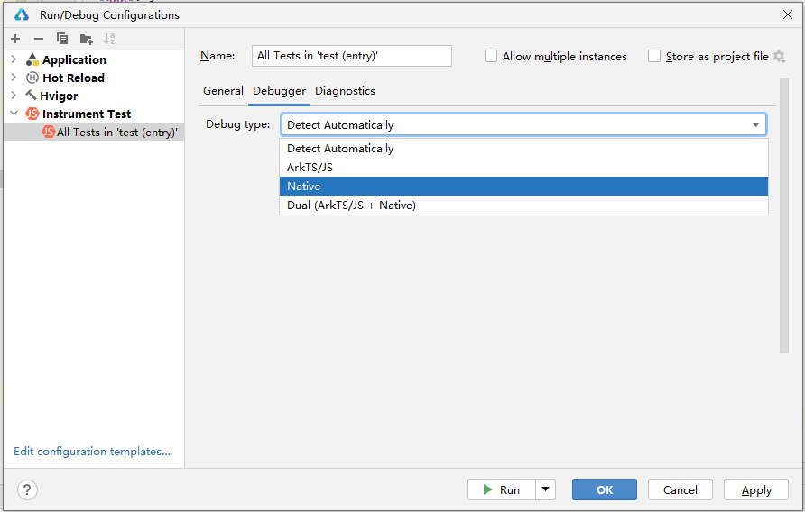

调试类型Debug type默认为Detect Automatically，关于各调试类型的说明如下表所示：

| 调试类型 | 调试代码 |
| --- | --- |
| Detect Automatically | 自动检测。根据工程模块及其依赖的模块涉及的编程语言，自动启动对应的调试器。  如果检测到是Native模块，出现两个调试窗口（PandaDebugger、Native）；如果不是Native模块，只出现PandaDebugger调试窗口。 |
| ArkTS/JS | 只调试ArkTS/JS，只出现PandaDebugger调试窗口。 |
| Native | 单独调试C++，只出现Native调试窗口。 |
| Dual(ArkTS/JS + Native) | 支持ArkTS/JS和C++混合调试，出现两个调试窗口（PandaDebugger、Native）。 |


调试C++代码时，当前模块及所有依赖的HSP模块的[Address Sanitizer配置](#section8352185341915)要保持一致，若不一致，可能无法进入C++代码的断点处。

#### ASan检测

Instrument Test针对C/C++方法提供ASan检测能力，关于ASan的介绍请参考[ASan检测](`https://`developer.huawei.com/consumer/cn/doc/harmonyos-guides/ide-asan)，当前不支持JS语言。

1. 在运行/调试配置窗口，选择对应的Instrument Test，点击<strong>Diagnostics</strong>页签，勾选<strong>Address Sanitizer</strong>选项，勾选后，测试包和源码包均开启ASan能力。

   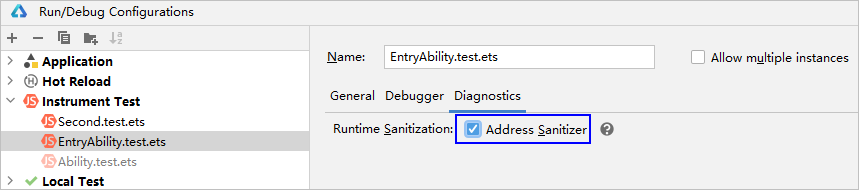
2. 如果有引用本地library，需在library模块的build-profile.json5文件中，配置arguments字段值为“-DOHOS\_ENABLE\_ASAN=ON”，表示以ASan模式编译so文件。

   
3. 运行测试用例。
4. 当程序出现内存错误时，弹出ASan log信息，点击信息中的链接即可跳转至引起内存错误的代码处。

   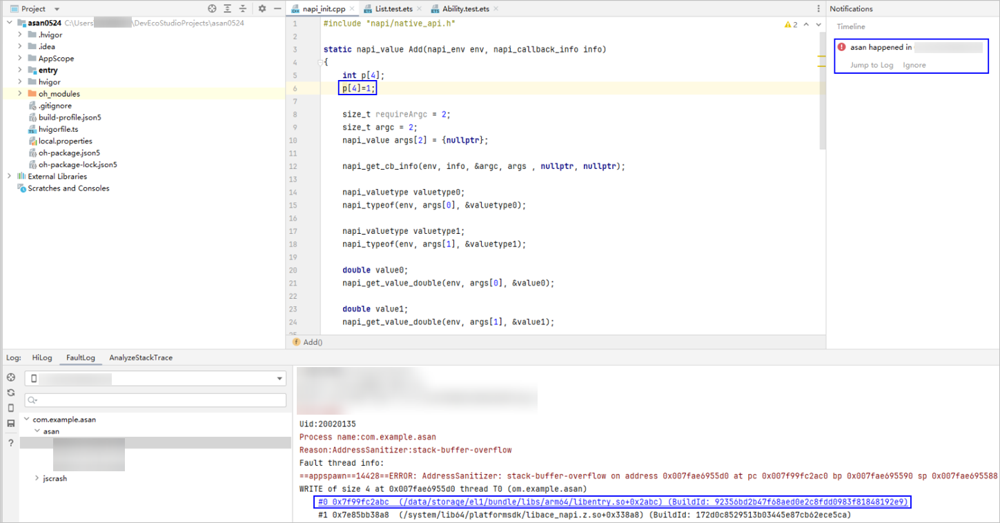

#### 测试C++代码

从DevEco Studio 6.0.0 Beta5版本开始，支持对C++代码进行测试，包括运行/调试C++测试代码、对C++代码进行覆盖率统计。

由于C++的测试so无法直接在设备上运行，需要通过Node-API的方式拉起，即通过ArkTS/JS语言拉起C/C++测试用例。

#### 运行C++测试代码

1. 创建cpp测试目录，鼠标右键单击ohosTest目录，选择<strong>New &gt; C/C++ File(Napi)</strong>，在ohosTest下生成cpp测试目录，以entry模块为例，目录结构如下。
   * <strong>src &gt; ohosTest &gt; cpp &gt; types</strong>：用于存放C++的API接口描述文件。
   * <strong>src &gt; ohosTest &gt; cpp &gt; types</strong> <strong>&gt; libentry\_test &gt; index.d.ts</strong>：描述C++ API接口行为，如接口名、入参、返回参数等。
   * <strong>src &gt; ohosTest &gt; cpp &gt; types</strong> <strong>&gt; libentry\_test &gt; oh-package.json5</strong>：配置.so三方包声明文件的入口及包名。
   * <strong>src &gt; ohosTest &gt; cpp &gt; CMakeLists.txt</strong>：CMake配置文件，提供CMake构建脚本。
   * <strong>src &gt; ohosTest &gt; cpp &gt; napi\_init.cpp：</strong>定义C++ API接口的文件<strong>。</strong>

   

   DevEco Studio生成的cpp测试目录中不包含C++测试框架，需要开发者自行选择开源测试框架使用。

   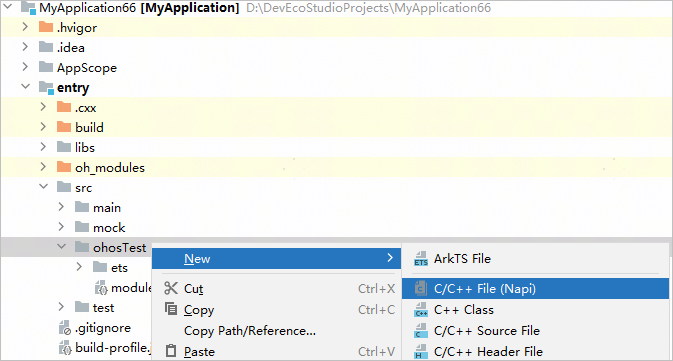
2. 通过ArkTS测试用例拉起C++测试，示例如下。

   ```
   // ArkTS测试文件Ability.test.ets
   import entryTest from 'libentry_test.so';
   export default function abilityTest() {
     describe('ActsAbilityTest', () => {
       ...
       it('testNative', 0, () => {
         hilog.info(0x0000, 'testTag', '%{public}s', 'testNative it begin');
         let result = entryTest.runNativeTest();
         hilog.info(0x0000, 'testTag', '%{public}s', result)
         expect(result).assertContain("ended");
       })
     })
   }
   ```
3. 运行testNative测试用例，查看测试结果。

   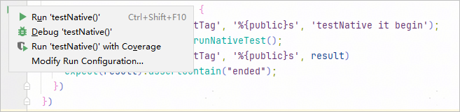

#### 收集代码覆盖率

DevEco Studio默认不收集C++代码覆盖率，需要通过以下方式开启。

1. 在测试目录下的CMakeLists.txt中添加以下代码，开启覆盖率编译插桩能力。

   ```
   // DevEco Studio 6.0.2 Beta1之前版本
   set(CMAKE_CXX_FLAGS "${CMAKE_CXX_FLAGS} -fprofile-instr-generate -fcoverage-mapping")
   set(CMAKE_C_FLAGS "${CMAKE_C_FLAGS} -fprofile-instr-generate -fcoverage-mapping")

   // DevEco Studio 6.0.2 Beta1及以上版本，OHOS_TEST_COVERAGE在覆盖率模式下为true，在调试/运行模式下为false
   if(OHOS_TEST_COVERAGE)
     set(CMAKE_CXX_FLAGS "${CMAKE_CXX_FLAGS} -fprofile-instr-generate -fcoverage-mapping")
     set(CMAKE_C_FLAGS "${CMAKE_C_FLAGS} -fprofile-instr-generate -fcoverage-mapping")
   endif()
   ```
2. 在napi\_init.cpp文件的RunNativeTest方法中，调用\_\_llvm\_profile\_write\_file方法，将覆盖率数据保存到设备的/data/storage/el2/base路径下的c++\_coverage.profraw文件中，该路径和文件名不可修改，示例代码如下。

   ```
   extern "C" {
       void __llvm_profile_set_filename(char *);
       int __llvm_profile_write_file(void);
   }

   static napi_value RunNativeTest(napi_env env, napi_callback_info info)
   {
       char filename[256];
       snprintf(filename, sizeof(filename), "/data/storage/el2/base/c++_coverage.profraw"); // 覆盖率报告文件路径和文件名，不可修改
       __llvm_profile_set_filename(filename);
       // 开启测试
       ...
       // 结束测试，保存数据
        __llvm_profile_write_file();
       ...
   }
   ```
3. 运行覆盖率测试，选中ArkTS测试文件，单击<strong>右键 &gt;</strong> <strong>Run '测试文件名称' with Coverage</strong>，执行测试。

   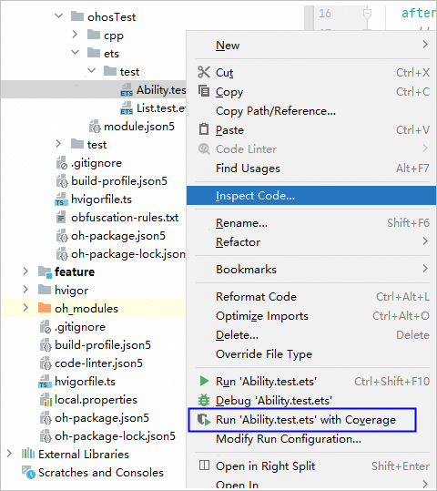

   启动测试后，进行编译构建，底部将出现Cover窗口，构建结束后自动拉起Cover窗口，测试任务结束后，窗口中会打印测试报告的路径。

   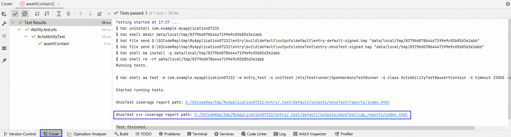

   点击链接可打开报告，查看C++代码覆盖率详情。

   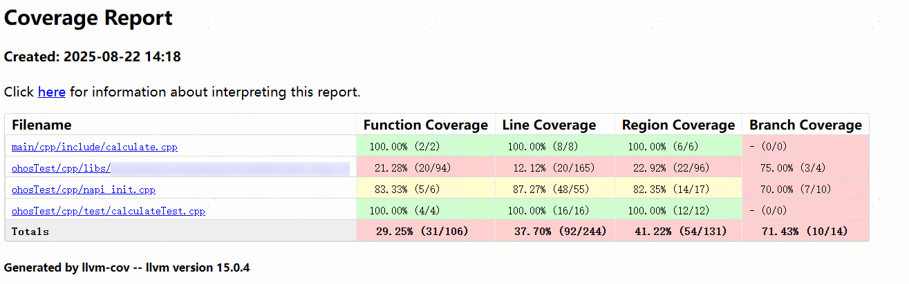

#### 使用命令行执行测试Instrument Test

通过命令行方式执行Instrument Test，在工程根目录下执行命令：

```
hvigorw onDeviceTest -p module={moduleName} -p coverage={true|false} -p scope={suiteName}#{methodName} -p ohos-debug-asan={true|false}
```

* module：执行测试的模块，缺省默认是执行所有模块的用例。
* coverage：是否生成覆盖率报告，缺省默认是true，在&lt;module-path&gt;/.test/default/outputs/ohosTest/reports路径下生成两份报告，一份是html格式（index.html），一份是json格式（coverageReport.json），具体参考[查看覆盖率报告](`https://`developer.huawei.com/consumer/cn/doc/harmonyos-guides/ide-ui-test#section10394362109)。

  如果开启了C++代码覆盖率测试，会生成C++代码的覆盖率报告，路径：&lt;module-path&gt;/.test/default/outputs/ohosTest/cpp\_reports/index.html
* scope：格式为`&#123;suiteName&#125;`#`&#123;methodName&#125;`或`&#123;suiteName&#125;`，分别表示测试用例级别或测试套件级别的测试，缺省默认是执行当前模块的所有用例。
* ohos-debug-asan：是否启用ASan检测，缺省默认是false。从DevEco Studio 5.1.1 Beta1版本开始支持。

  ASan日志路径：&lt;module-path&gt;/.test/default/intermediates/ohosTest/coverage\_data


* 通过命令行执行测试时，不支持配置product，默认为default。
* 多个module和scope之间用逗号隔开。

测试结果文件：&lt;module-path&gt;/.test/default/intermediates/ohosTest/coverage\_data/test\_result.txt
