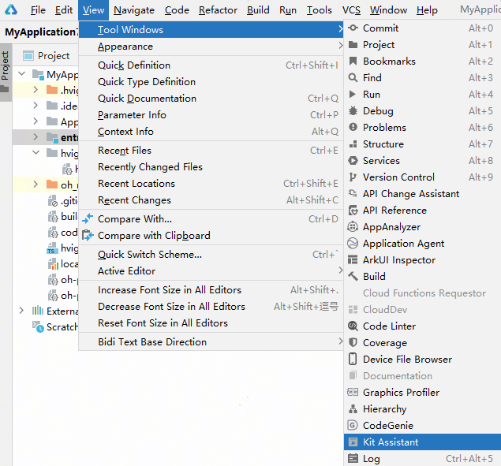
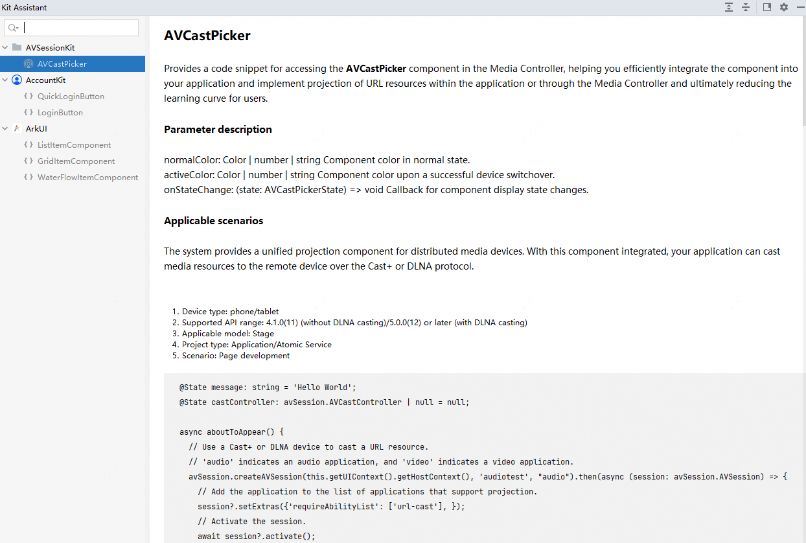

# 快速插入场景化代码片段

DevEco Studio提供Kit Assistant能力，支持通过拖拽方式将基础的场景化的控件/代码片段插入ArkTS工程中，减少高频场景代码的编写时间。

1. 在菜单栏点击<strong>View &gt; Tool Windows &gt; Kit Assistant</strong>，或使用快捷键<strong>Alt + K</strong>（macOS为<strong>Option + K</strong>），进入Kit Assistant页面。

   
2. 在左侧目录中支持搜索、查看不同Kit提供的场景化控件或代码片段。Kit Assistant面板右侧展示该控件的使用约束、适用场景等详细信息。

   
3. 在目录中点击选中需要的控件或功能代码，并拖拽至.ets文件中适当位置，即可在当前位置插入相应的代码片段。

   

   若当前编辑器打开的文件或所在的模块，存在某些Kit能力不支持的设备类型/API版本/工程模型，或某些Kit能力或控件不支持在元服务工程中使用，则Kit Assistant目录中该Kit能力或控件将置灰并无法成功拖拽。
