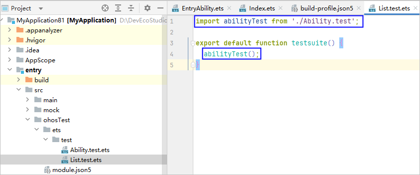
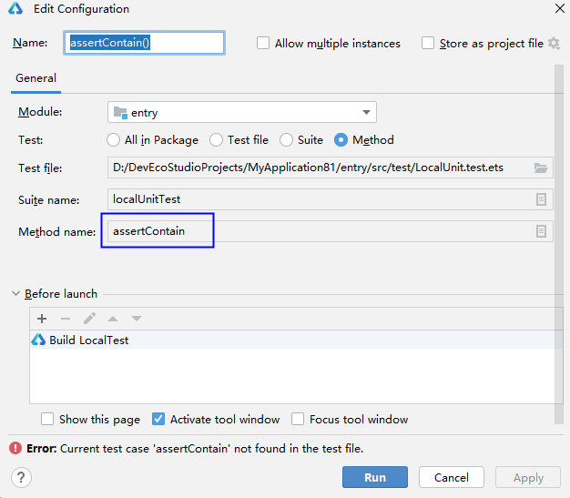

# 本地测试错误码

#### 00521001 测试用例名称存在非法字符

<strong>错误信息</strong>

XXX is an invalid it value. Enter a value that contains only digits, letters, underscores (\_), and periods (.) or run from a higher level portal.

<strong>错误描述</strong>

测试用例名称存在非法字符。用例名只能包括数字、字母、下划线或者点号，或从更高的运行入口执行。

<strong>可能原因</strong>

本地测试的测试用例名称存在非法字符。

<strong>处理步骤</strong>

* 确保用例名只包括数字、字母、下划线或者点号。
* 如果测试用例名称包括非法字符，请运行测试套件、测试文件或测试目录。

#### 00521002 测试套件名称存在非法字符

<strong>错误信息</strong>

XXX is an invalid describe value. The value entered must contain only digits, letters, underscores (\_), and periods (.), and can only start with a letter.

<strong>错误描述</strong>

测试套件名称不合法。名称只能包括数字、字母、下划线和点，以字母开头。

<strong>可能原因</strong>

本地测试套件名称存在非法字符。

<strong>处理步骤</strong>

确保测试套件名称只包括数字、字母、下划线和点，以字母开头。

#### 00521003 本地测试套件名称含有变量

<strong>错误信息</strong>

XXX is a Variable. Please use string as a describe name.

<strong>错误描述</strong>

XXX是变量，请使用字符串作为测试套件名称。

<strong>可能原因</strong>

本地测试套件名称含有变量。

<strong>处理步骤</strong>

使用字符串作为测试套件名称。

#### 00521004 本地测试用例名称含有变量

<strong>错误信息</strong>

XXX is a Variable. Please use string as an It-name.

<strong>错误描述</strong>

XXX是变量，请使用字符串作为测试用例名称。

<strong>可能原因</strong>

本地测试用例名称含有变量。

<strong>处理步骤</strong>

* 使用字符串作为测试用例名称。
* 如果测试用例名称是变量，请运行测试套件、测试文件或测试目录。

#### 00521005 本地测试用例名称含有变量

<strong>错误信息</strong>

XXX is a Variable. Please use string as an It-name or execute from the higher running entrance.

<strong>错误描述</strong>

XXX是变量，请使用字符串作为测试用例名称，或从更高的运行入口执行。

<strong>可能原因</strong>

本地测试用例名称含有变量。

<strong>处理步骤</strong>

* 使用字符串作为测试用例名称。
* 如果测试用例名称是变量，请运行测试套件、测试文件或测试目录。

#### 00521006 测试用例名称重复

<strong>错误信息</strong>

Testing failed due to the duplicate test case name XXX. The test case name must be unique in a test suite.

<strong>错误描述</strong>

测试用例名称重复导致测试失败。

<strong>可能原因</strong>

一个测试套件下存在相同名称的测试用例。

<strong>处理步骤</strong>

检查测试用例名称，确保不重复。

#### 00521007 测试套件名称重复

<strong>错误信息</strong>

Testing failed due to the duplicate test suite name XXX. The test suite name must be unique in a test package.

<strong>错误描述</strong>

测试套件名称重复导致测试失败。

<strong>可能原因</strong>

一个测试包下存在相同名称的测试套件。

<strong>处理步骤</strong>

检查测试套件名称，确保不重复。

#### 00522001 函数未在List.test.ets文件中注册

<strong>错误信息</strong>

The function where the method XXX is located is not registered in the 'List.test.ets' file!

<strong>错误描述</strong>

方法XXX所在的函数未在List.test.ets文件中注册。

<strong>可能原因</strong>

函数未在List.test.ets文件中注册。

<strong>处理步骤</strong>

在List.test.ets文件中注册函数，示例如下。

#### 00522002 函数未在List.test.ets文件中注册

<strong>错误信息</strong>

The function where the suite XXX is located is not registered in the ''List.test.ets'' file!

<strong>错误描述</strong>

测试套件所在的函数未在List.test.ets文件中注册。

<strong>可能原因</strong>

函数未在List.test.ets文件中注册。

<strong>处理步骤</strong>

在List.test.ets文件中注册函数，示例如下。

#### 00522005 文件中所有函数都没有在List.test.ets文件中注册

<strong>错误信息</strong>

None of the functions in the file XXX have been registered in the 'List.test.ets' file!

<strong>错误描述</strong>

文件中所有的函数都没有在List.test.ets文件中注册。

<strong>可能原因</strong>

文件中所有函数都未注册。

<strong>处理步骤</strong>

在List.test.ets文件中注册函数，示例如下。

#### 00522006 测试文件中找不到测试用例

<strong>错误信息</strong>

Current test case XXX not found in the test file.

<strong>错误描述</strong>

测试文件中找不到测试用例。

<strong>可能原因</strong>

测试文件中找不到测试用例。

<strong>处理步骤</strong>

* 选择要运行的测试用例，重新运行。
* 在运行配置窗口修改Method name。

  

#### 00522007 找不到任何测试用例

<strong>错误信息</strong>

No Any Test Case Found In The XXX.

<strong>错误描述</strong>

找不到任何测试用例。

<strong>可能原因</strong>

测试文件中未定义测试用例。

<strong>处理步骤</strong>

确保测试文件中存在测试用例。

#### 00523001 本地测试不支持C/C++方法

<strong>错误信息</strong>

Testing on C/C++ methods not supported.

<strong>错误描述</strong>

本地测试不支持C/C++方法。

<strong>可能原因</strong>

本地测试不支持C/C++方法。

<strong>处理步骤</strong>

使用仪器测试。

#### 00523002 SDK中缺少必要的组件

<strong>错误信息</strong>

Required components are missing in the HarmonyOS SDK. Reinstall DevEco Studio again.

<strong>错误描述</strong>

SDK中缺少必要的组件，请重装DevEco Studio。

<strong>可能原因</strong>

SDK中缺少必要的组件。

<strong>处理步骤</strong>

重新[安装DevEco Studio](`https://`developer.huawei.com/consumer/cn/download/deveco-studio)。

#### 00523003 找不到modules.abc文件

<strong>错误信息</strong>

Failed to start local test, please check the XXX path!

<strong>错误描述</strong>

找不到构建产物modules.abc，无法启动本地测试。

<strong>可能原因</strong>

1. 构建打包失败。
2. 运行配置取消了构建任务，本地没有modules.abc文件。

<strong>处理步骤</strong>

1. 点击菜单栏<strong>Build &gt; Clean Project</strong>清理缓存，再重新执行测试。
2. 检查运行配置是否取消了构建任务，如果取消就重新添加构建任务。

   

#### 00523004 内存不足

<strong>错误信息</strong>

Test failed due to lack of memory. Please clean up other heavy processes or restart the computer.

<strong>错误描述</strong>

内存不足导致测试失败，请清理其他程序或者重启电脑。

<strong>可能原因</strong>

内存不足。

<strong>处理步骤</strong>

清理内存，或者重启电脑。

#### 00523005 执行历史测试任务失败

<strong>错误信息</strong>

Build history project failed.

<strong>错误描述</strong>

执行历史测试任务失败。

<strong>可能原因</strong>

历史任务已失效，或执行环境已修改。

<strong>处理步骤</strong>

不要执行历史任务，重新构造测试任务。

#### 00526007 运行错误

<strong>错误信息</strong>

运行时报错，具体报错视情况而定。

<strong>错误描述</strong>

运行时报错。

<strong>可能原因</strong>

未知。

<strong>处理步骤</strong>

根据报错信息进行排查。

#### 00526008 运行配置模块为空

<strong>错误信息</strong>

No module found.

<strong>错误描述</strong>

当前运行/调试配置面板中的模块为空。

<strong>可能原因</strong>

工程同步失败。

<strong>处理步骤</strong>

重新同步下工程并确保同步成功。

#### 00526009 运行获取不到product

<strong>错误信息</strong>

The product can not be empty.

<strong>错误描述</strong>

运行时product不能为空。

<strong>可能原因</strong>

product配置不正确。

<strong>处理步骤</strong>

检查工程级build-profile.json5文件中对应模块的applyToProducts配置是否正确，详细配置可以参考[构建定义的目标产物](`https://`developer.huawei.com/consumer/cn/doc/harmonyos-guides/ide-customized-multi-targets-and-products-guides#section2554174114463)。

#### 00526010 运行时获取不到target

<strong>错误信息</strong>

The target can not be empty. Check the build-profile.json5 file of the project root directory and make sure the targets of the modules in configuration is set to specified product: default in applyToProducts.

<strong>错误描述</strong>

运行时target不能为空。

<strong>可能原因</strong>

当前模块配置的target不正确。

<strong>处理步骤</strong>

检查工程级build-profile.json5文件中对应模块的applyToProducts配置是否正确，详细配置可以参考[构建定义的目标产物](`https://`developer.huawei.com/consumer/cn/doc/harmonyos-guides/ide-customized-multi-targets-and-products-guides#section2554174114463)。
