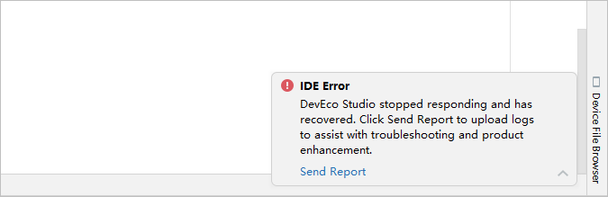

# 日志上传

该功能仅支持中国境内（香港特别行政区、澳门特别行政区、中国台湾除外）。

若开发过程中遇到DevEco Studio卡顿、卡死或其他故障时，可点击IDE Error问题弹窗中Send Report，点击OK后向DevEco Studio回传日志信息。

或通过菜单栏<strong>Help &gt; Collect Logs and Diagnostic Data</strong>，选择并上传相关日志，帮助DevEco Studio提升稳定性体验。

若开发者后续需要关闭数据采集功能，请在<strong>File &gt; Settings</strong>（macOS为<strong>DevEco Studio &gt; Preferences/Settings</strong>）<strong>&gt; Appearance & Behavior &gt; System Settings &gt; Data Sharing</strong>设置界面，取消勾选<strong>Send usage statistics</strong>关闭数据采集开关。

