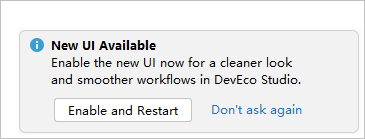
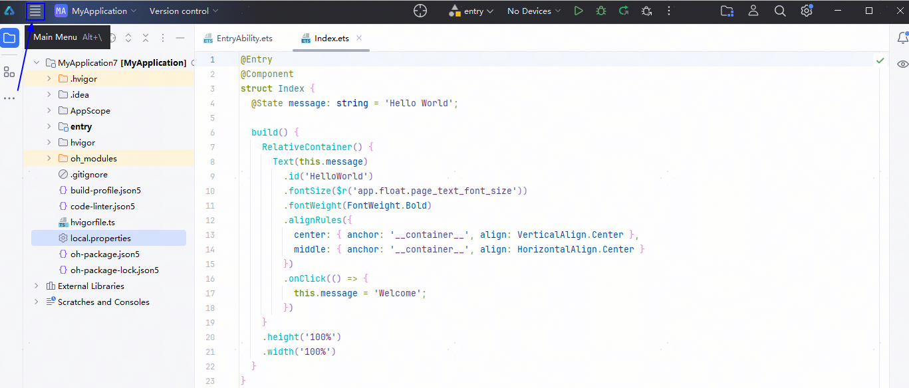
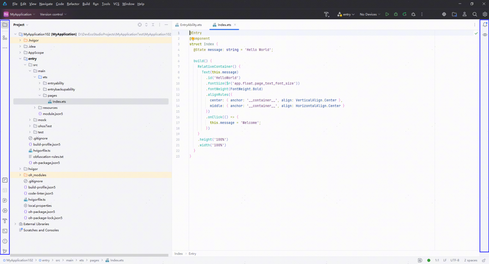

# 使用新UI

从DevEco Studio 6.0.0 Beta1版本开始，IntelliJ 2024.3.3底座升级，提供全新的用户界面（User Interface，简称UI），简化工具布局，优化图标、窗口等显示效果，带来更简洁的外观及开发体验。

## 开启或关闭新UI

启动DevEco Studio时，将有弹窗提示是否启用新用户界面。点击<strong>Enable and Restart</strong>，将重启DevEco Studio开始体验新UI。

此外，可以在菜单栏进入<strong>File &gt; Settings...</strong>（macOS系统为<strong>DevEco Studio &gt; Preferences/Settings...</strong>）<strong>&gt; Appearance & Behavior &gt; New UI</strong>，勾选<strong>Enable new UI</strong>，点击<strong>Apply</strong>，在弹窗中点击<strong>Restart</strong>重启完成后体验新UI。

如需切换回原有的经典UI，在界面左上角点击图标，进入<strong>File &gt; Settings...</strong> （macOS系统为<strong>DevEco Studio &gt; Preferences/Settings...</strong>）<strong>&gt; Appearance & Behavior &gt; New UI</strong>，取消勾选<strong>Enable new UI</strong>，点击<strong>Apply</strong>，在弹窗中点击<strong>Restart</strong>重启即可完成切换。

## 菜单栏体验变化

原有固定于界面上方的菜单栏，在新UI中收起到页面左上角工具栏中Main Menu主菜单图标内。点击图标即可展开菜单，继续选择需要执行的功能或操作。

如需将菜单栏展开并固定在主界面，可以在菜单栏进入<strong>File &gt; Settings... &gt; Appearance & Behavior &gt; Appearance</strong> &gt; <strong>UI Options</strong>中，勾选<strong>Show main menu in a separate toolbar</strong>，点击<strong>Apply</strong>在主界面固定显示菜单栏。

## 工具窗口优化

主窗口两侧的工具窗口提供更丰富的功能选择。与经典UI相比，ArkUI Inspector、Services、Terminal、Problems、Version Control等功能图标在左侧工具窗口中呈现。点击工具窗口中Project图标，显示当前工程目录。

在菜单栏进入<strong>File &gt; Settings... &gt; Appearance & Behavior &gt; Appearance</strong> &gt; <strong>Tool Windows，</strong>勾选<strong>Show tool window names</strong>后点击<strong>Apply</strong>，或将鼠标放置于工具窗口区域右键选择<strong>Show Tool Window Names</strong>，选择在界面中展示各功能图标的名称。

## 文件路径展示位置变化

在新UI中，当前编辑的文件所在的工程路径将展示在页面左下方。

更多新用户界面变化详情，请参见[new UI](`https://`www.jetbrains.com.cn/en-us/help/idea/2024.3/new-ui.html).
