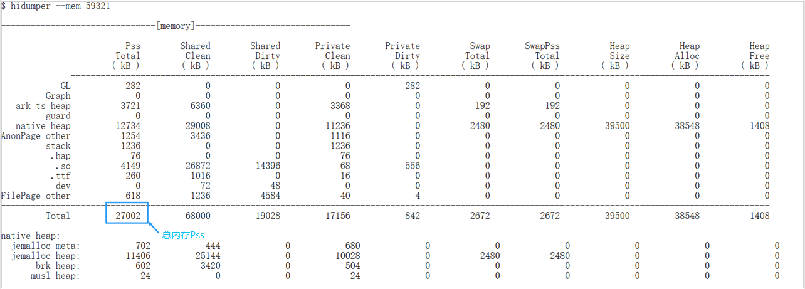

# 动态内存峰值占用

#### 规则详情

应用/元服务完成操作后，各类应用在后台的内存占用峰值应≤ 1300MB；应用完成操作后切换到后台，静置3min以后采集内存占用。

#### 检测逻辑

1. 执行hdc shell。
2. 执行hidumper --mem &lt;进程pid&gt;命令，获取如图Pss字段。

#### 计算逻辑

执行多轮测试，取最大Pss值为占用峰值，内存占用须小于1300M。
