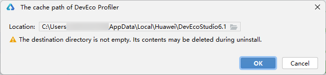

# 会话区

DevEco Profiler左侧为会话区，可以分为三个部分：

① 调优目标选择区域：选择设备、需要分析的应用和应用进程。

② 会话列表区域：

* 记录当前已创建的调优分析会话，默认显示实时监控（Realtime Monitor）任务，每个会话包含：会话名称（图例中的"Launch"）、当前状态（图例中的"Recorded"）、录制时长（图例中的"7s 605ms"）；单击列表中会话后，右侧数据区将显示具体的数据内容；会话支持拖拽方式调整顺序。
* <strong>录制/删除会话</strong>：将鼠标悬停在图标上，会话要观测的调优对象的基本信息会以Tooltip形式展示。点击右侧的/按钮，开启/停止会话录制，开发者可以操作应用复现性能劣化场景；录制完成出现图标，表示数据处于解析状态，请等待解析完成。点击将删除该会话。

* 仅成功录制或导入的session可长期存留在任务列表中；录制失败或未启动录制的session，在设备/应用切换时自动从任务列表中清除。

* <strong>数据导出</strong>：待数据解析完成后，会话便会进入数据展示状态，将数据可视化展示到右侧的数据区中。此时可以点击会话面板中出现的数据导出按钮，将录制到的数据导出到本地进行保存，借助这个能力，开发者可以方便的在团队内共享录制到的性能数据，也可以防止采集到的性能数据丢失。
* <strong>智慧调优</strong>：提供[智慧调优](`https://`developer.huawei.com/consumer/cn/doc/harmonyos-guides/ide-ai-profiler)功能，支持通过自然语言交互，分析并解释当前实例或项目中存在的性能问题，帮助开发者快速定位影响性能的具体原因，目前支持对Launch、Frame、Allocation、Snapshot模板进行智慧调优分析。
* <strong>查看会话：</strong>会话区存在活跃会话和历史会话两种，活跃会话可直接看到，历史会话需要点击<strong>View Successful Sessions</strong>查看，两种会话总数量不超过15个。开发者主动选择新的调优目标后，相关会话进入历史会话。历史会话中支持删除会话和数据导出。

③ 场景化模板选择区域：

* <strong>创建会话：</strong>DevEco Profiler提供[Frame](`https://`developer.huawei.com/consumer/cn/doc/harmonyos-guides/ide-insight-session-frame)、[Launch](`https://`developer.huawei.com/consumer/cn/doc/harmonyos-guides/ide-launch-overview)、[Snapshot](`https://`developer.huawei.com/consumer/cn/doc/harmonyos-guides/ide-insight-session-snapshot)、[Allocation](`https://`developer.huawei.com/consumer/cn/doc/harmonyos-guides/ide-insight-session-allocations)、[ArkUI](`https://`developer.huawei.com/consumer/cn/doc/harmonyos-guides/ide-arkui-analysis)、[ComMemory](`https://`developer.huawei.com/consumer/cn/doc/harmonyos-guides/ide-commemory)、[Energy](`https://`developer.huawei.com/consumer/cn/doc/harmonyos-guides/ide-profiler-energy)、[ArkWeb](`https://`developer.huawei.com/consumer/cn/doc/harmonyos-guides/ide-profiler-arkweb)、[Network](`https://`developer.huawei.com/consumer/cn/doc/harmonyos-guides/ide-profiler-network)、[Concurrency](`https://`developer.huawei.com/consumer/cn/doc/harmonyos-guides/ide-parallel-concurrency-analysis)、[GPU](`https://`developer.huawei.com/consumer/cn/doc/harmonyos-guides/ide-profiler-gpu)、[Time](`https://`developer.huawei.com/consumer/cn/doc/harmonyos-guides/ide-insight-session-time)、[CPU](`https://`developer.huawei.com/consumer/cn/doc/harmonyos-guides/ide-insight-session-cpu)等场景化分析模板，提供对不同性能问题场景的数据分析方案，选中任意模板图标，点击下方<strong>Create Session</strong>按钮，即可创建出一个全新的会话。

  ：Frame卡顿丢帧场景化模板。

  ：Launch冷启动场景化模板。

  ：Snapshot ArkTS内存泄漏场景化模板。

  ：Allocation Native内存泄漏场景化模板。

  ：ArkUI卡顿丢帧场景化模板。

  ：ComMemory UI组件内存泄漏场景化模板。

  ：Energy能耗诊断场景化模板。

  ：ArkWeb加载丢帧场景化模板。

  ：Network网络诊断场景化模板。

  ：Concurrency并行并发场景化模板。

  ：GPU活动场景化模板。

  ：Time函数耗时场景化模板。

  ：CPU调度场景化模板。

* <strong>数据导入</strong>：点击<strong>Open File</strong>按钮，即可选择数据进行导入。当前支持导入.insight，.htrace， .ftrace，.heapsnapshot，.rawheap, .sys，.perfdata，.data，.nas（包含Native Allocation数据的文件），.txt（包含Native Allocation数据的文件），.acm文件。
* <strong>配置Profiler缓存路径</strong>：在③场景化模板选择区域，点击左上方设置按钮，设置Profiler缓存文件的保存路径。

  
