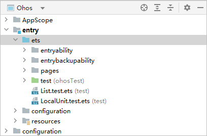

---
title: "工程介绍"
format: md
original_url: https://developer.huawei.com/consumer/cn/doc/harmonyos-guides-V5/ide-project-overview---

# 工程介绍

## 应用程序包基础知识

开发应用前，请先了解应用程序包相关基础知识，具体请参考[应用程序包概述](`https://`developer.huawei.com/consumer/cn/doc/harmonyos-guides/application-package-overview).

## 切换工程视图

DevEco Studio工程目录结构提供工程视图和Ohos视图。工程视图（Project）展示工程中实际的文件结构，Ohos视图会隐藏一些编码中不常用到的文件，并将常用到的文件进行重组展示，方便开发者查询或定位所需编辑的模块或文件。

工程创建或打开后，默认显示工程视图，如果要切换到Ohos视图，在左上角单击<strong>Project</strong> &gt; <strong>Ohos</strong>进行切换<strong>。</strong>

