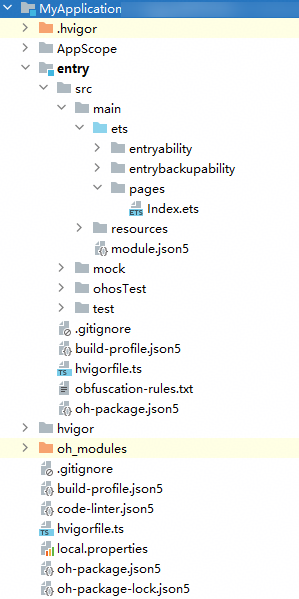
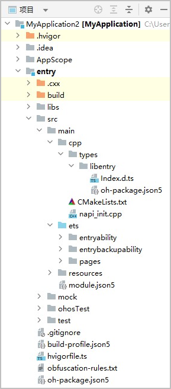
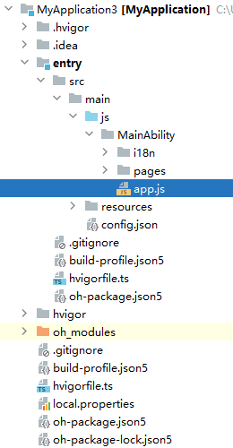

---
title: "工程目录结构介绍"
format: md
original_url: https://developer.huawei.com/consumer/cn/doc/harmonyos-guides-V5/ide-project-structure---

# 工程目录结构介绍

## ArkTS工程目录结构（Stage模型）

ArkTS Stage模型支持API Version 10及以上版本，其工程目录结构如下图所示：

* <strong>AppScope &gt; app.json5</strong>：应用的全局配置信息。
* <strong>entry：</strong>应用/元服务模块，编译构建生成一个HAP。
  + <strong>src &gt; main &gt; ets</strong>：用于存放ArkTS源码。
  + <strong>src &gt; main &gt; ets &gt; entryability</strong>：应用/元服务的入口。
  + <strong>src &gt; main &gt; ets &gt; entrybackupability</strong>：用于提供扩展[备份恢复](../../../docs/dev/app-dev/application-framework/core-file-kit/app-file/app-file-backup-restore/app-file-backup-extension)能力。
  + <strong>src &gt; main &gt; ets &gt; pages</strong>：应用/元服务包含的页面。
  + <strong>src &gt; main &gt; resources：</strong>用于存放应用/元服务模块所用到的资源文件，如图形、多媒体、字符串、布局文件等。关于资源文件的详细说明请参考[资源分类与访问](`https://`developer.huawei.com/consumer/cn/doc/harmonyos-guides/resource-categories-and-access).

    | 资源目录 | 资源文件说明 |
    | --- | --- |
    | base&gt;element | 包括字符串、整型数、颜色、样式等资源的json文件。每个资源均由json格式进行定义，例如：  - boolean.json：布尔型 - color.json：颜色 - float.json：浮点型 - intarray.json：整型数组 - integer.json：整型 - pattern.json：样式 - plural.json：复数形式 - strarray.json：字符串数组 - string.json：字符串值 |
    | base&gt;media | 多媒体文件，如图形、视频、音频等文件，支持的文件格式包括：<strong>.png</strong>、<strong>.gif</strong>、<strong>.mp3</strong>、<strong>.mp4</strong>等。 |
    | rawfile | 用于存储任意格式的原始资源文件。rawfile不会根据设备的状态去匹配不同的资源，需要指定文件路径和文件名进行引用。 |
  + <strong>src &gt; main &gt; module.json5</strong>：Stage模型模块配置文件，主要包含HAP的配置信息、应用在具体设备上的配置信息以及应用的全局配置信息。具体请参考[module.json5配置文件](`https://`developer.huawei.com/consumer/cn/doc/harmonyos-guides/module-configuration-file).
  + <strong>src &gt; mock：</strong>配置测试框架的Mock能力。具体请参考[Mock能力](./ide-test-mock)。
  + <strong>src &gt; ohosTest：</strong>存放Instrument Test测试类。具体请参考[Instrument Test](./ide-instrument-test)。
  + <strong>src &gt; test：</strong>存放Local Test创建测试类。具体请参考[Local Test](./ide-local-test)。
  + <strong>build-profile.json5：</strong>当前的模块信息、编译信息配置项，包括buildOption、targets配置等。
  + <strong>hvigorfile.ts</strong>：模块级编译构建任务脚本。
  + <strong>obfuscation-rules.txt</strong>：混淆规则文件。混淆开启后，在使用Release模式进行编译时，会对代码进行编译、混淆及压缩处理，保护代码资产。详见[混淆加固](./ide-build-obfuscation)。
  + <strong>oh-package.json5</strong>：描述三方包的包名、版本、入口文件（类型声明文件）和依赖项等信息。
* <strong>oh\_modules</strong>：用于存放三方库依赖信息，包含应用/元服务所依赖的第三方库文件。
* <strong>build-profile.json5：</strong>应用级配置信息，包括签名、产品配置等。
* <strong>code-linter.json5：</strong>配置代码检查规则，包括代码检查范围、生效的规则等。
* <strong>hvigorfile.ts：</strong>应用级编译构建任务脚本。
* <strong>oh-package.json5：</strong>描述全局配置，如：依赖覆盖（overrides）、依赖关系重写（overrideDependencyMap）和参数化配置（parameterFile）等。
* <strong>oh-package-lock.json5：</strong>用于锁定应用级依赖的版本，以及缓存依赖的元数据信息。

## C++工程目录结构（Stage模型）

C++ Stage模型支持API Version 10以上版本，支持使用ArkTS和C++进行开发，其工程目录结构如下图所示。

* <strong>entry</strong>：应用模块，编译构建生成一个HAP。
  + <strong>src &gt; main &gt; cpp &gt; types</strong>：用于存放C++的API接口描述文件
  + <strong>src &gt; main &gt; cpp &gt; types</strong> <strong>&gt; libentry &gt; index.d.ts</strong>：描述C++ API接口行为，如接口名、入参、返回参数等。
  + <strong>src &gt; main &gt; cpp &gt; types</strong> <strong>&gt; libentry&gt; oh-package.json5</strong>：配置.so三方包声明文件的入口及包名。
  + <strong>src &gt; main &gt; cpp &gt; CMakeLists.txt</strong>：CMake配置文件，提供CMake构建脚本。
  + <strong>src &gt; main &gt; cpp &gt; napi\_init.cpp：</strong>定义C++ API接口的文件<strong>。</strong>
  + <strong>src &gt; main &gt; ets：</strong>用于存放ArkTS源码。
  + <strong>src &gt; main &gt; resources：</strong>用于存放应用所用到的资源文件，如图形、多媒体、字符串、布局文件等。关于资源文件的详细说明请参考[资源分类与访问](`https://`developer.huawei.com/consumer/cn/doc/harmonyos-guides/resource-categories-and-access).

    | 资源目录 | 资源文件说明 |
    | --- | --- |
    | base&gt;element | 包括字符串、整型数、颜色、样式等资源的json文件。每个资源均由json格式进行定义，例如：  - boolean.json：布尔型 - color.json：颜色 - float.json：浮点型 - intarray.json：整型数组 - integer.json：整型 - pattern.json：样式 - plural.json：复数形式 - strarray.json：字符串数组 - string.json：字符串值。 |
    | base&gt;media | 多媒体文件，如图形、视频、音频等文件，支持的文件格式包括：<strong>.png</strong>、<strong>.gif</strong>、<strong>.mp3</strong>、<strong>.mp4</strong>等。 |
    | rawfile | 用于存储任意格式的原始资源文件。rawfile不会根据设备的状态去匹配不同的资源，需要指定文件路径和文件名进行引用。 |
  + <strong>src &gt; main &gt; module.json5：</strong>Stage模块配置文件，主要包含HAP的配置信息、应用在具体设备上的配置信息以及应用的全局配置信息。具体请参考[module.json5配置文件](`https://`developer.huawei.com/consumer/cn/doc/harmonyos-guides/module-configuration-file).
  + <strong>build-profile.json5：</strong>当前的模块信息、编译信息配置项，包括buildOption、targets配置等。
  + <strong>hvigorfile.ts：</strong>模块级编译构建任务脚本。
  + <strong>obfuscation-rules.txt</strong>：混淆规则文件。混淆开启后，在使用Release模式进行编译时，会对代码进行编译、混淆及压缩处理，保护代码资产。详见[混淆加固](./ide-build-obfuscation)。
  + <strong>oh-package.json5</strong>：描述三方包的包名、版本、入口文件（类型声明文件）和依赖项等信息。
  + <strong>oh-package-lock.json5：</strong>用于锁定当前模块依赖的版本，以及缓存依赖的元数据信息。
* <strong>oh\_modules</strong>：用于存放三方库依赖信息，包含应用/元服务所依赖的第三方库文件。
* <strong>build-profile.json5：</strong>应用级配置信息，包括签名、产品配置等。
* <strong>code-linter.json5：</strong>配置代码检查规则，包括代码检查范围、生效的规则等。
* <strong>hvigorfile.ts：</strong>应用级编译构建任务脚本。
* <strong>oh-package.json5：</strong>描述全局配置，如：依赖覆盖（overrides）、依赖关系重写（overrideDependencyMap）和参数化配置（parameterFile）等。
* <strong>oh-package-lock.json5：</strong>用于锁定应用级依赖的版本，以及缓存依赖的元数据信息。

## JS工程目录结构（FA模型）

JS工程只支持FA模型，其工程目录结构如下图所示：

* <strong>entry：</strong>应用/元服务模块，编译构建生成一个HAP。
  + <strong>src &gt; main &gt; js</strong>：用于存放js源码。
  + <strong>src &gt; main &gt; js &gt; MainAbility</strong>：应用/元服务的入口。
  + <strong>src &gt; main &gt; js &gt; MainAbility &gt; i18n</strong>：用于配置不同语言场景资源内容，比如应用文本词条、图片路径等资源。
  + <strong>src &gt; main &gt; js &gt; MainAbility &gt; pages</strong>：MainAbility包含的页面。
  + <strong>src &gt; main &gt; js &gt; MainAbility &gt; app.js</strong>：承载Ability生命周期。
  + <strong>src &gt; main &gt; resources：</strong>用于存放应用/元服务所用到的资源文件，如图形、多媒体、字符串、布局文件等。关于资源文件的详细说明请参考[资源分类与访问](`https://`developer.huawei.com/consumer/cn/doc/harmonyos-guides/resource-categories-and-access).

    | 资源目录 | 资源文件说明 |
    | --- | --- |
    | base&gt;element | 包括字符串、整型数、颜色、样式等资源的json文件。每个资源均由json格式进行定义，例如：  - boolean.json：布尔型 - color.json：颜色 - float.json：浮点型 - intarray.json：整型数组 - integer.json：整型 - pattern.json：样式 - plural.json：复数形式 - strarray.json：字符串数组 - string.json：字符串值 |
    | base&gt;media | 多媒体文件，如图形、视频、音频等文件，支持的文件格式包括：<strong>.png</strong>、<strong>.gif</strong>、<strong>.mp3</strong>、<strong>.mp4</strong>等。 |
    | rawfile | 用于存储任意格式的原始资源文件。rawfile不会根据设备的状态去匹配不同的资源，需要指定文件路径和文件名进行引用。 |
  + <strong>src &gt; main &gt; config.json</strong>：模块配置文件，主要包含HAP的配置信息、应用在具体设备上的配置信息以及应用的全局配置信息。
  + <strong>build-profile.json5：</strong>当前的模块信息、编译信息配置项，包括buildOption、targets配置等。
  + <strong>hvigorfile.ts</strong>：模块级编译构建任务脚本。
  + <strong>oh-package.json5</strong>：配置三方包声明文件的入口及包名。
* <strong>build-profile.json5：</strong>应用级配置信息，包括签名、产品配置等。
* <strong>hvigorfile.ts：</strong>应用级编译构建任务脚本。
