# 发布应用

HarmonyOS通过数字证书与Profile文件等签名信息来保证应用/元服务的完整性，应用/元服务上架到AppGallery Connect（AGC）必须通过签名校验。因此，您需要使用发布证书和Profile文件对应用/元服务进行签名后才能发布。

从DevEco Studio 6.1.0 Beta2版本开始，准备签名文件时生成密钥和证书请求文件界面发生变更，以及上传软件包页面新增Build Version字段。

#### 发布流程

开发者完成HarmonyOS应用/元服务开发后，需要将应用/元服务打包成App Pack（.app文件），用于上架到AppGallery Connect。发布应用/元服务的流程如下图所示：

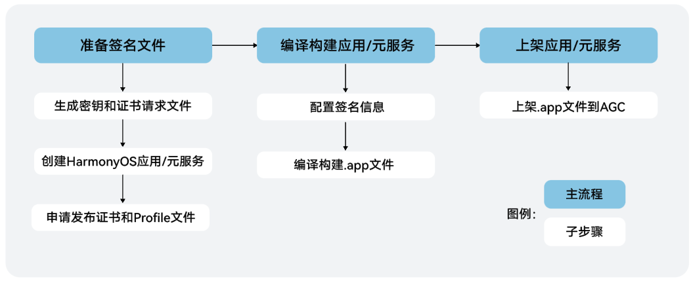

关于以上流程的详细介绍，请继续查阅本章节内容。

#### 准备签名文件

HarmonyOS应用/元服务通过数字证书（.cer文件）和Profile文件（.p7b文件）来保证应用/元服务的完整性。在申请数字证书和Profile文件前，需要提前生成密钥（存储在格式为.p12的密钥库文件中）和证书请求文件（.csr文件）。

<strong>基本概念</strong>

* <strong>密钥</strong>：包含非对称加密中使用的公钥和私钥，存储在密钥库文件中，格式为.p12，公钥和私钥对用于数字签名和验证。
* <strong>证书请求文件</strong>：格式为.csr，全称为Certificate Signing Request，包含密钥对中的公钥和公共名称、组织名称、组织单位等信息，用于向AppGallery Connect申请数字证书。
* <strong>数字证书</strong>：格式为.cer，由AppGallery Connect颁发。
* <strong>Profile文件</strong>：格式为.p7b，包含HarmonyOS应用/元服务的包名、数字证书信息、描述应用/元服务允许申请的证书权限列表，以及允许应用/元服务调试的设备列表（如果应用/元服务类型为Release类型，则设备列表为空）等内容，每个应用/元服务包中均必须包含一个Profile文件。

#### 生成密钥和证书请求文件

当前支持通过DevEco Studio和[CertificateTool](#section72897415171)两种方式生成密钥和证书请求文件。

CertificateTool生成密钥和证书请求文件的操作界面与DevEco Studio 6.1.0 Beta2及之后版本一致，文档以DevEco Studio进行说明。

使用CertificateTool生成时，操作界面中各选项的含义和填写要求请参考DevEco Studio 6.1.0 Beta2及之后版本。

<strong>DevEco Studio 6.1.0 Beta2及之后版本</strong>

1. 在主菜单栏单击<strong>Build &gt; Generate Key</strong> <strong>and CSR</strong>。

   

   如果本地已有对应的密钥，无需新生成密钥，可以在<strong>Generate Key</strong>界面中单击下方的Skip跳过密钥生成过程，直接使用已有密钥生成证书请求文件。
2. 填写密钥库文件，若已有的密钥库文件（存储有密钥的.p12文件），单击<strong>Select an existing key</strong>进行选择。下面以新创建密钥库文件为例进行说明。

   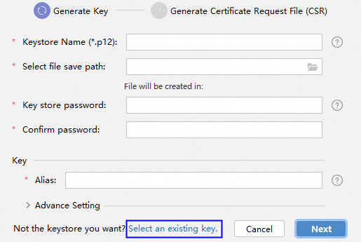
3. 在<strong>Generate Key</strong>窗口，填写密钥库信息后，点击<strong>Next</strong>。
   * <strong>Keystore Name</strong>：填写p12文件名称，仅允许包含字母、数字、下划线（\_）、中划线（-）、句点（．）。
   * <strong>Select file save path</strong>：设置密钥库文件存储路径。
   * <strong>Key store Password</strong>：设置密钥库密码，必须由大写字母、小写字母、数字和特殊符号中的两种以上字符的组合，长度至少为8位。请记住该密码，后续签名配置需要使用。
   * <strong>Confirm password</strong>：再次输入密钥库密码。
   * <strong>Alias</strong>：密钥别名。请记住该别名，后续签名配置需要使用。
   * <strong>Advance Setting</strong>：密钥库文件的高级设置，选填。
     + <strong>Validity(years)：</strong>选填，证书有效期，建议设置为25年及以上，覆盖应用/元服务的完整生命周期。
     + <strong>First and last name：</strong>选填，通用名称，可填写应用名称或开发者姓名等。
     + <strong>Organizational unit</strong>：选填，组织单位，可填写部门名称或个人开发等。
     + <strong>Organization：</strong>选填，组织名称，可填写公司全称或开发者姓名等。
     + <strong>City or locality：</strong>选填，城市或地区。
     + <strong>State or province：</strong>选填，州或省。
     + <strong>Country code(XX)：</strong>选填，[国家码](`https://`developer.huawei.com/consumer/cn/doc/app/agc-help-connect-api-appendix-countrycode-0000002236201362)。

     

     First and last name、Organizational unit、Organization、City or locality、State or province填写要求小于64个字符，不可使用双引号（"）、单引号（`）、斜杠（\）。

   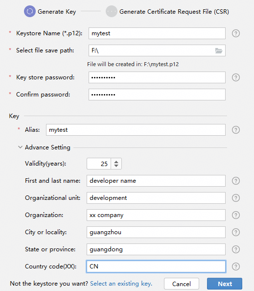
4. 在<strong>Generate</strong> <strong>Certificate Request File (CSR)</strong>窗口，设置CSR文件名和CSR文件存储路径后，点击<strong>Finish</strong>。
   * <strong>CSR File Name</strong>：填写CSR文件名称，仅允许包含字母、数字、下划线（\_）、中划线（-）、句点（．）。
   * <strong>Select file save path</strong>：设置CSR文件存储路径。

   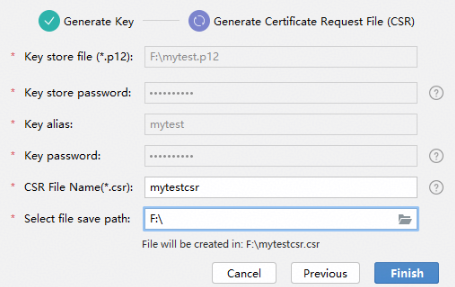
5. 创建CSR文件成功，可以在存储路径下获取生成的密钥库文件（.p12）、证书请求文件（.csr）。

   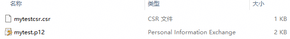

<strong>DevEco Studio 6.1.0 Beta2之前版本</strong>

1. 在主菜单栏单击<strong>Build &gt; Generate Key</strong> <strong>and CSR</strong>。

   

   如果本地已有对应的密钥，无需新生成密钥，可以在<strong>Generate Key</strong>界面中单击下方的Skip跳过密钥生成过程，直接使用已有密钥生成证书请求文件。
2. 在<strong>Key Store File</strong>中，可以单击<strong>Choose Existing</strong>选择已有的密钥库文件（存储有密钥的.p12文件）；如果没有密钥库文件，单击<strong>New</strong>进行创建。下面以新创建密钥库文件为例进行说明。

   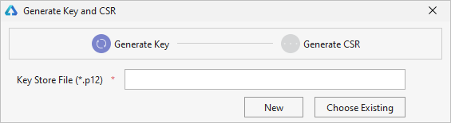
3. 在<strong>Create Key Store</strong>窗口中，填写密钥库信息后，单击<strong>OK</strong>。
   * <strong>Key Store File</strong>：设置密钥库文件存储路径，并填写p12文件名。
   * <strong>Password</strong>：设置密钥库密码，必须由大写字母、小写字母、数字和特殊符号中的两种以上字符的组合，长度至少为8位。请记住该密码，后续签名配置需要使用。
   * <strong>Confirm Password</strong>：再次输入密钥库密码。

   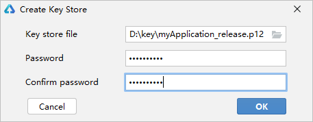
4. 在<strong>Generate Key</strong> <strong>and CSR</strong>界面中，继续填写密钥信息后，单击<strong>Next</strong>。
   * <strong>Alias</strong>：必填，别名，用于标识密钥名称。请记住该别名，后续签名配置需要使用。
   * <strong>Password</strong>：必填，密码，与密钥库密码保持一致，无需手动输入。
   * <strong>Validity(years)：</strong>选填，证书有效期，建议设置为25年及以上，覆盖应用/元服务的完整生命周期。
   * <strong>First and last name：</strong>选填，通用名称，可填写应用名称或开发者姓名等。字符长度为（0，64），且不可使用（双引号）"、（斜杠）\、（反引号）`。
   * <strong>Organizational unit</strong>：选填，组织单位，可填写部门名称或个人开发等。字符长度为（0，64），且不可使用（双引号）"、（斜杠）\、（反引号）`。
   * <strong>Organization：</strong>选填，组织名称，可填写公司全称或开发者姓名等。字符长度为（0，64），且不可使用（双引号）"、（斜杠）\、（反引号）`。
   * <strong>City or locality：</strong>选填，城市或地区。字符长度为（0，64），且不可使用（双引号）"、（斜杠）\、（反引号）`。
   * <strong>State or province：</strong>选填，州或省。字符长度为（0，64），且不可使用（双引号）"、（斜杠）\、（反引号）`。
   * <strong>Country code(XX)：</strong>选填，[国家码](`https://`developer.huawei.com/consumer/cn/doc/app/agc-help-connect-api-appendix-countrycode-0000002236201362)。

   

   First and last name、Organizational unit、Organization、City or locality、State or province要求：字符长度为（0，64），且不可使用（双引号）"、（斜杠）\、（反引号）`。

   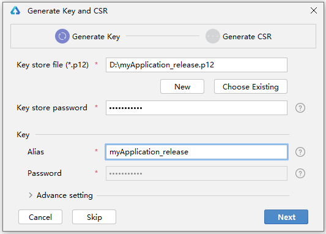
5. 在<strong>Generate Key</strong> <strong>and CSR</strong>界面，设置CSR文件存储路径和CSR文件名。

   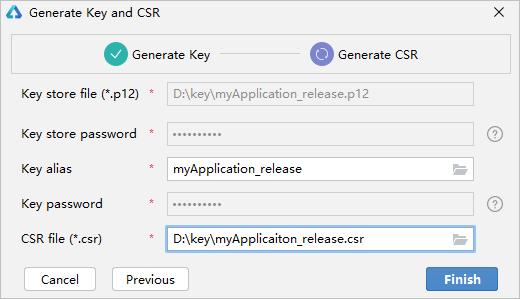
6. 单击<strong>OK</strong>按钮，创建CSR文件成功，可以在存储路径下获取生成的密钥库文件（.p12）和证书请求文件（.csr）。

   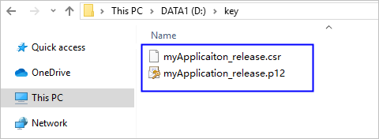

#### 申请发布证书和发布Profile文件

1. 创建HarmonyOS应用/元服务。在AGC中创建一个HarmonyOS应用/元服务，用于申请发布证书和Profile文件，具体请参考[创建HarmonyOS应用](`https://`developer.huawei.com/consumer/cn/doc/app/agc-help-create-app-0000002247955506)和[创建元服务](`https://`developer.huawei.com/consumer/cn/doc/app/agc-help-create-atomic-service-0000002247795706)。
2. 申请发布证书和发布Profile文件。在AGC中申请、下载发布证书和Profile文件，具体请参考[申请发布证书](`https://`developer.huawei.com/consumer/cn/doc/app/agc-help-release-cert-0000002283336729)和[申请发布Profile](`https://`developer.huawei.com/consumer/cn/doc/app/agc-help-release-profile-0000002248341090)。
3. 申请完发布证书和发布Profile文件后，请在DevEco Studio中进行签名，具体请参考[配置签名信息](#section280162182818)。

   

   * 如果申请元服务的签名证书，在“创建应用”操作时，“是否元服务”选项请选择“<strong>是</strong>”。
   * 使用发布证书和发布Profile文件进行手动签名，只能用来打包应用上架，不能用来运行调试工程。

#### 配置签名信息

使用制作的私钥（.p12）文件、在AppGallery Connect中申请的证书（.cer）文件和Profile（.p7b）文件，在DevEco Studio配置工程的签名信息，构建携带发布签名信息的APP。

在<strong>File &gt;</strong> <strong>Project Structure &gt;</strong> <strong>Project &gt; Signing Configs</strong> <strong>&gt; default</strong>界面中，取消勾选“Automatically generate signature”和“Associate with registered application”，分别配置密钥(.p12文件)、Profile(.p7b文件)和数字证书(.cer文件)的路径等信息。

* <strong>Store File</strong>：选择密钥库文件，文件后缀为.p12。
* <strong>Store Password</strong>：输入密钥库密码。
* <strong>Key Alias</strong>：输入密钥的别名信息。
* <strong>Key Password</strong>：输入密钥的密码。
* <strong>Sign Alg</strong>：签名算法，固定为SHA256withECDSA。
* <strong>Profile File</strong>：选择申请的发布Profile文件，文件后缀为.p7b。
* <strong>Certpath File</strong>：选择申请的发布数字证书文件，文件后缀为.cer。

设置完签名信息后，单击<strong>OK</strong>进行保存，然后使用DevEco Studio生成APP，请参考[编译构建.app文件](#section1992513343374)。

#### （条件必选）更新公钥指纹

当应用需要使用以下开放能力的一种或多种时，发布应用前，需在[AppGallery Connect](`https://`developer.huawei.com/consumer/cn/service/josp/agc/index.html)中将调试应用的指纹更新为发布证书指纹。具体操作请参见[配置公钥指纹](`https://`developer.huawei.com/consumer/cn/doc/app/agc-help-cert-fingerprint-0000002278002933)。

* Account Kit（华为账号服务）
* Game Service Kit（游戏服务）
* Health Service Kit（运动健康服务）
* IAP Kit（应用内支付服务）
* Map Kit（地图服务）
* Payment Kit（华为支付服务）
* Wallet Kit（钱包服务）

#### 编译构建.app文件

应用上架时，要求应用包类型为Release类型。

打包APP时，DevEco Studio会将工程目录下的所有HAP/HSP模块打包到APP中，因此，如果工程目录中存在不需要打包到APP的HAP/HSP模块，请手动删除后再进行编译构建生成APP。

1. 单击<strong>Build &gt; Build Hap(s)/APP(s) &gt; Build APP(s)</strong>，等待编译构建完成已签名的应用包。

   

   当未指定[构建模式](`https://`developer.huawei.com/consumer/cn/doc/harmonyos-guides/ide-hvigor-compilation-options-customizing-guide#section192461528194916)时，构建APP包，默认Release模式；构建HAP/HSP/HAR包，默认Debug模式。

   即<strong>Build APP(s)</strong>时，默认构建的APP包为Release类型，符合上架要求，开发者无需进行另外设置。
2. 编译构建完成后，可以在工程目录<strong>build &gt; outputs &gt; default</strong>下，获取带签名的应用包。

   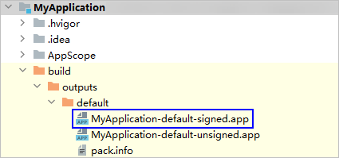

#### 上传软件包

DevEco Studio 5.0.5.200版本开始，支持在DevEco Studio内上传应用软件包。上传软件包前，请先[创建应用](`https://`developer.huawei.com/consumer/cn/doc/app/agc-help-create-app-0000002247955506)。

#### 约束与限制

* 该功能仅支持中国境内（香港特别行政区、澳门特别行政区、中国台湾除外）。
* 该功能将会把您的应用包传至App Gallery Connect用于测试或上架。为了您的信息安全，请勿上传带有个人敏感信息的数据（如密码、源代码、私钥、调试安装包、业务日志等信息）。
* 仅Build Mode为Release的应用支持上传软件包，且确保软件包已配置Release签名。
* 同时支持通过[App Gallery Connect上传软件包](`https://`developer.huawei.com/consumer/cn/doc/app/agc-help-release-app-upload-pkg-0000002277983368)。

#### 操作步骤

1. 在DevEco Studio菜单栏，点击<strong>Build &gt; Upload Product。</strong>若未登录，请点击<strong>Sign in</strong>登录华为开发者账号。

   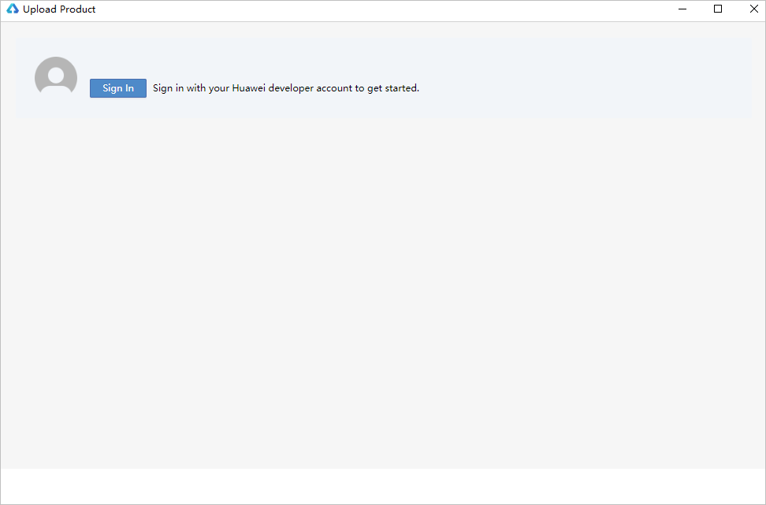
2. 登录成功后，返回DevEco Studio进入软件包上传界面。确认当前工程的product信息，选择需要上传的软件包类型，点击<strong>OK</strong>开始上传。
   * 若当前上传的软件包仅做测试发布，请选择<strong>Generate app package and upload it to AppGallery Connect for test</strong>。
   * 若软件包需要在全网正式发布，请选择<strong>Generate app package and upload it to AppGallery Connect for test and publish</strong>。

   

   * 如需上传符号表信息，请勾选<strong>Upload your app's symbols</strong>选项。
   * 上传的product可以通过点击DevEco Studio编辑区域右上方图标进行查看及切换。
   * 可通过app.json5中bundleName/versionName字段修改当前product对应的包名/版本号信息。必须使用当前开发者账号下已在AppGallery注册且真实存在的包名。
   * Build Version值由AGC计算后回传填入。

   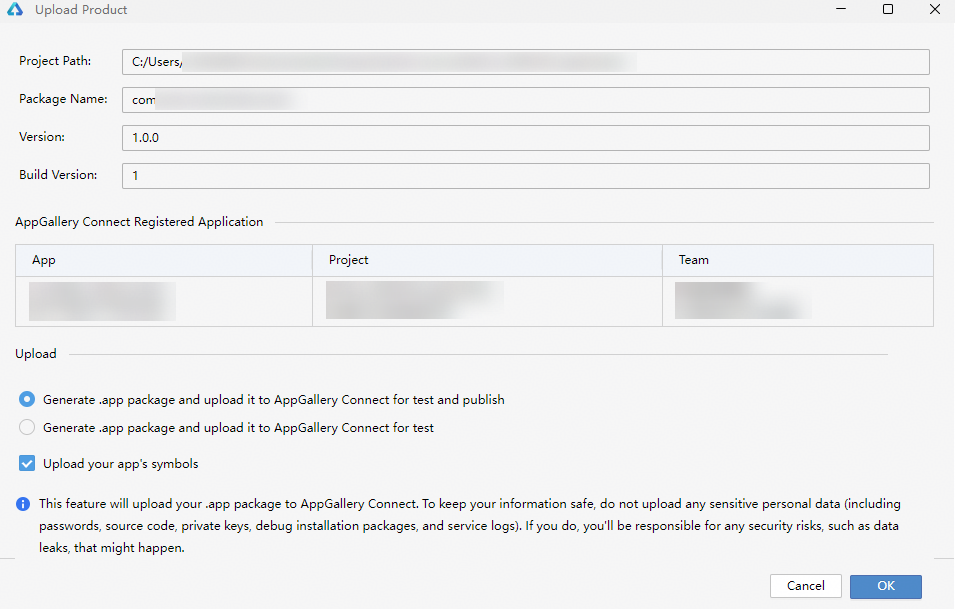
3. 上传完成后，出现云测试的结果，点击<strong>View Full result in AppGallery Connect</strong>可进入AGC查看软件包上传记录和检测结果，具体请参考[上传软件包](`https://`developer.huawei.com/consumer/cn/doc/app/agc-help-release-app-upload-pkg-0000002277983368)。点击<strong>Close</strong>关闭上传页面。

   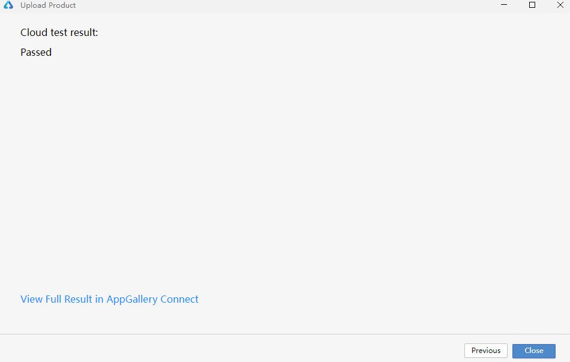

#### 发布.app文件到应用市场

将HarmonyOS应用/元服务打包成.app文件后上架到应用市场，发布详细操作指导请参考[发布HarmonyOS应用](`https://`developer.huawei.com/consumer/cn/doc/app/agc-help-release-app-0000002271695230)或[发布元服务](`https://`developer.huawei.com/consumer/cn/doc/app/agc-help-release-atomic-0000002327731065)。

#### 附录

#### CertificateTool下载

| 平台 | 包名 | 版本号 | SHA256校验码 | 更新时间 |
| --- | --- | --- | --- | --- |
| Windows(64-bit) | [certificate-tool-windows-x64-1.0.0.1.zip](`https://`contentcenter-vali-drcn.dbankcdn.cn/pvt_2/DeveloperAlliance_package_901_9/92/v3/aqVWHUspRTO9BJKZ-5NULQ/certificate-tool-windows-x64-1.0.0.1.zip?HW-CC-KV=V1&HW-CC-Date=20260420T021601Z&HW-CC-Expire=315360000&HW-CC-Sign=71B0174C33B7E64463BA3D3E0530998CF4FDEB56D80C6F177BAED3E8E7488750) | 1.0.0.1 | dee6c2ae3b300fd7450bbeb2aadd96f1099ee5235ae627afcfad9b3ed3ded7da | 2026/04/20 |
| Mac(64-bit) | [certificate-tool-mac-x64-1.0.0.1.zip](`https://`contentcenter-vali-drcn.dbankcdn.cn/pvt_2/DeveloperAlliance_package_901_9/bc/v3/l9egptIHRIyxS4tM_SPzuQ/certificate-tool-mac-x64-1.0.0.1.zip?HW-CC-KV=V1&HW-CC-Date=20260420T021701Z&HW-CC-Expire=315360000&HW-CC-Sign=A3B7F4BA42F7790DDA25A916B3EEFDDA52C905DCCE85D362AF4A576F152FFC67) | 1.0.0.1 | 8afc53e6714cb7e8840114065012b5f706c265c056491c240e5433be311bf084 | 2026/04/20 |
| Mac(ARM64) | [certificate-tool-mac-arm64-1.0.0.1.zip](`https://`contentcenter-vali-drcn.dbankcdn.cn/pvt_2/DeveloperAlliance_package_901_9/90/v3/TeaUV0NbSvSx15zqhZRY0Q/certificate-tool-mac-arm64-1.0.0.1.zip?HW-CC-KV=V1&HW-CC-Date=20260420T021801Z&HW-CC-Expire=315360000&HW-CC-Sign=604E5AA8AFCCE2FF2127308E0F94B0830DB8E52C24DFF0AA5E0118E55EAAA878) | 1.0.0.1 | 07283684624b11c2db0c2ce2654729b5114b3085df68736a43967eda247a7b4e | 2026/04/20 |
