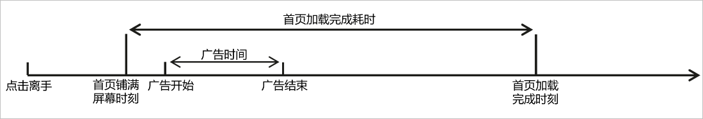

# 启动加载完成快

#### DevEco Studio 6.0.1 Beta1及以上版本

#### 规则详情

各类应用的冷启动首帧完成时延应 ≤ 1100ms；时间起点：桌面图标点击离手；时间终点：应用首页铺满全屏并且所有占位符加载完成。

#### 检测逻辑

启动后，缓存本次冷启动过程中的截图，检测启动过程中的广告页面和加载完成页面。广告页面通过使用真实应用训练的广告检测AI模型进行检测，页面加载检测逻辑参考[DevEco Studio 6.0.1 Beta1及以上版本的点击操作完成快](`https://`developer.huawei.com/consumer/cn/doc/harmonyos-guides/ide-quick-completion-for-click-0404#section15922054151911)。

如果首页内容加载需要网络请求，请确保网络连接已开启。

#### 计算逻辑

以首帧页面铺满屏幕作为开始时刻，冷启动完成时延等于应用首页加载完成耗时减去广告时间。若冷启动完成时延小于等于1100ms，则检测通过；若大于1100ms，小于等于6300ms，则检测告警；若大于6300ms，则检测失败。

#### DevEco Studio 6.0.1 Beta1以下版本

#### 规则详情

各类应用的冷启动首帧完成时延应 ≤ 1100ms；时间起点：桌面图标点击离手；时间终点：应用首页铺满全屏并且所有占位符加载完成。

#### 检测逻辑

启动后，缓存本次冷启动过程中的截图，检测启动过程中的广告页面和加载完成页面。广告页面通过使用真实应用训练的广告检测AI模型进行检测，页面加载检测逻辑参考[DevEco Studio 6.0.1 Beta1以下版本的点击操作完成快](`https://`developer.huawei.com/consumer/cn/doc/harmonyos-guides/ide-quick-completion-for-click-0404#section191984031815)。

#### 计算逻辑

以首帧页面铺满屏幕作为开始时刻，冷启动完成时延等于应用首页加载完成耗时减去广告时间。若冷启动完成时延小于等于1100ms，则检测通过；若大于1100ms，小于等于6300ms，则检测告警；若大于6300ms，则检测失败。
