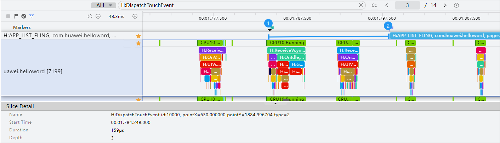

# 滑动操作响应快

#### 规则详情

应用内滑动操作响应时延应≤ 80ms；时间起点：手指滑动；时间终点：界面发生变化。

#### 检测逻辑

* 开始时间：滑动开始点，Y坐标开始变化的第一个点，如图标记1；关键字：H:DispatchTouchEvent，其中type=2。
* 结束时间：滑动泳道H:APP\_LIST\_FLING的开始点，如图标记2。

  如图展示的是H:APP\_LIST\_FLING泳道，其他滑动类泳道标记如下：

  H:APP\_SWIPER\_SCROLL

  H:APP\_TABS\_SCROLL

  H:WEB\_LIST\_FLING
* 备注：由于trace的响应时延小于用户实际感知的时延，所以目前滑动类算法会补偿30ms。

#### 计算逻辑

时延=结束时间-开始时间，小于等于80ms。
